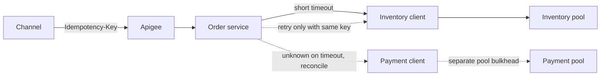

# API design and resilience

Checkout fails in the gaps between timeouts, retries, and a client that sends the request twice. The API has to make those gaps survivable. This note is the contract and the client behavior for services you would call through Feign and publish through Apigee.

## REST that matches the domain

Use resources and state transitions, not a single `POST /doCheckout` that hides every step, and not a chatty API that forces the client to be the transaction manager. Useful resources: cart, cart line, checkout, order, reservation, return. A command that is not a CRUD update (`submit`, `cancel`, `refund`) can be a `POST` on a sub-resource. That is maturity in the sense of resources and hypermedia-optional links, not a contest to reach a textbook level. Clients in this estate will not discover every URL at runtime. They will version an OpenAPI contract. Spend the design effort on nouns, idempotency, and errors.

Represent state explicitly. `payment_pending` is a value the client can branch on. Do not overload HTTP 200 with a body that sometimes means declined.

## Idempotency keys

Unsafe retries require an idempotency key on any operation that charges, reserves, or creates an order. The client generates a unique key per attempt to purchase, and reuses that same key when it retries. The server stores key, request hash, and response. Same key and same body returns the stored response. Same key and a different body returns a conflict. Retention covers the client retry window and the payment reconciliation window.

Payment-provider calls get their own key, stable for that order, so your retry and their webhook agree. A Feign interceptor that generates a new UUID per attempt destroys the guarantee. The key belongs in the request the caller owns, not in a blind retry filter.

## Pagination and partial collections

List endpoints page. Cursor pagination is the right default for orders and audit rows because offset pagination skips and repeats when new rows arrive. Return a stable order (created time plus id) and a next cursor. Cap the page size. A catalog browse that must jump to page 50 is a search problem, not a reason to run `OFFSET` 5000 on the primary.

Partial failure of a batch is not a 200 with a silent hole. Return per-item status or reject the batch. Accessories "add all" that adds half and reports success will desync the cart.

## Error model

Use a small, stable body: code, message safe for logs, correlation id, and whether the call is retryable. Map causes deliberately. Validation is 400. Authentication is 401. Authorization is 403. Missing order is 404. Conflict and idempotency mismatch are 409. Business decline (card declined, out of stock) is a domain code on 422 or 409, and it is not retryable as-is. Overload is 429 with `Retry-After` when you can say when. Dependency failure is 503 or 504, retryable only when the method is idempotent or the client still holds the original idempotency key.

Do not return 200 for an error. Do not leak SQL or a stack into the Apigee response. Log the detail with the correlation id inside the service.

## Timeouts, retries, breaker, bulkhead

Set timeouts on every remote call, including the database. The client's timeout is shorter than the caller's timeout so a dying downstream does not pile up threads. Payment gets a timeout aligned with the provider, and the outcome of a timeout is "unknown," which leads to reconcile, not to an immediate second charge.

Retry only idempotent calls, or calls carrying the same idempotency key. Bound the attempts. Back off with jitter so a fleet does not retry in lockstep. Do not retry 400, 401, 403, 404, 409, or a business decline.

A circuit breaker opens when a dependency is failing fast enough that more calls only add latency. While open, fail immediately or serve a degraded response (cached catalog, "try again"). Half-open lets a probe through. The breaker is per dependency, not one global switch. A breaker around a non-idempotent payment call still leaves the unknown-outcome problem; it only stops you from opening more unknowns.

A bulkhead isolates pools. Catalog Feign clients and payment Feign clients do not share one connection pool and one thread pool. A slow merchandising service must not consume every thread the checkout path needs. In a JVM service this is separate executor and a small pool per client. At the platform layer it is a separate deployment so a bad release of recommendations cannot scale into the order database.

## Feign

Feign makes a Java interface look like a method call. That is the pitfall. It is still HTTP. You must set connect and read timeouts. You must decide which status codes throw and which return a body. A default that treats every non-200 as an exception, combined with a retryer, will retry a 409 and a 422. Turn retries off in Feign and put retry policy in one place that knows idempotency.

Propagate a correlation id and a deadline. Do not propagate an unbounded `Authorization` header to a third party. Log URL and status, not the cart body if it contains personal data. Hystrix is obsolete in this conversation; use the resilience library your platform actually runs, and be ready to explain breaker state in an interview without naming a dead library as the design.

Decode errors explicitly. A 503 HTML page from a proxy will fail JSON decoding and look like a client bug. Treat decode failure of an error status as a dependency failure.

## Gateway

Apigee, or any gateway in front of these services, terminates edge concerns: TLS, client credentials, quotas, spike arrest, and a stable external URL. It should not contain cart business rules. A quota protects the platform. It does not replace the service's own admission control when a single client is within quota and still too hot for one SKU.

The gateway is another latency hop and another place a timeout can be longer than the service. Align them. Map internal errors to the external model so partners do not see your package names. Version the external API at the gateway. Keep internal service versions free to move faster as long as the gateway contract holds.

## Versioning and compatibility

Prefer backward compatible changes: new optional fields, new enum values the client treats as unknown, new endpoints. Do not reuse a field for a new meaning. Do not change a JSON type. If you must break, publish a new version and run both for a window you name. Mobile clients ship slowly; store associates may sit on a build longer than web. The compatibility burden is on the server.

Database migrations follow the same rule. The new service version must tolerate the old and new schema during the rollout, because two versions of the pod will run together. Expand, deploy, backfill, contract.

Consumers of events are the same story. Adding a field is fine. Removing or renaming is a break. Include a schema version. Unknown fields are ignored. Unknown event types are parked, not poison-pilled forever without a human-visible queue.

## What you measure

For each dependency: rate, latency, timeout count, retry count, breaker state, and saturation of its pool. An alert on error ratio without saturation sends you looking at the wrong graph. New Relic or Kibana should let you pivot from correlation id to the downstream span. A resilience design you cannot see in production is a guess.

Solid edges are the required call path. Dotted edges are the careful ones: payment, whose timeout is an unknown result rather than a simple retry, and retries, which exist only when the idempotency key is stable. Separate pools are the bulkhead. One shared pool would let the dotted payment latency consume the inventory path.
