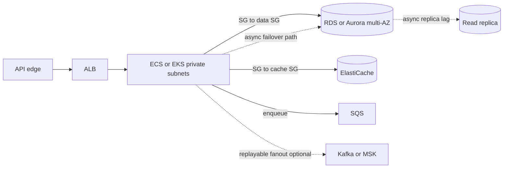

# AWS architecture at principal depth

This is a refresh for someone who already holds the Solutions Architect Associate level and now has to defend a design: failure domains, identity, data gravity, and cost. It is not a service catalog. The running example is a POS estate — browse, cart, checkout, inventory, integrations — deployed in a VPC with private data stores.

## Network

A VPC is the address space and the blast-radius boundary. Production and non-production do not share a VPC just because peering is convenient. Subnets are AZ-scoped. Public subnets have a route to an internet gateway and hold only what must be reachable: a load balancer, a NAT gateway, a bastion if you still have one. Application tasks and databases sit in private subnets. Private subnets reach AWS APIs through a NAT gateway or, better for S3 and similar, a gateway or interface endpoint so catalog images and backups do not hairpin through NAT and its per-gigabyte cost.

Two AZs are the minimum for a claim of high availability. A single AZ subnet group is a planned outage waiting for a power event. Spread tasks and multi-AZ data nodes across AZs, and make sure the client is not pinned to one.

Security groups are stateful virtual firewalls on the elastic network interface. A rule that allows the application security group on port 5432 is the database allow-list. Network ACLs are stateless subnet filters, evaluated in order, and a blunt instrument. Use them for coarse denies (a known bad range, a compliance requirement), not for per-service policy. The common outage is a NACL that allows the inbound port and forgets the ephemeral return range. Prefer security groups for day-to-day segmentation: edge, app, data, integration. Do not open `0.0.0.0/0` on the database security group because a lambda was annoying to wire.

## Edge and compute

An Application Load Balancer terminates TLS, routes by path or host, and health-checks targets. Put it in front of checkout and browse APIs. It does not replace an API gateway's API-key, quota, and threat policy; Apigee or a managed API gateway still belongs at the partner and channel edge if that is the standard. The ALB is the cloud load balancer behind or beside that gateway.

ECS on Fargate is the lower operational surface when the unit of deploy is a container and you do not need the Kubernetes control plane. EKS is justified when the platform team already runs it, you need custom controllers, or portability of scheduling primitives is a real requirement. "We might need Kubernetes later" is not a reason to operate etcd now. Either way, the principal questions are the same: rolling deploy, pod or task disruption budget, requests and limits, and a horizontal scale signal that is not CPU-only if the bottleneck is the database pool. A checkout task that scales on CPU while its threads block on a saturated pool makes the outage worse.

Lambda fits bursty, short, event-shaped work: file arrival, a small transform, a scheduled reconciliation kick. It is a poor home for a latency-sensitive cart API with a heavy JDBC pool, because cold starts, connection storms, and VPC attachment still surprise teams. If you use it against Postgres, use a proxy and a concurrency cap.

## Data services

RDS for Oracle or PostgreSQL is managed compute, storage, backup, and patching. You still own schema, SQL, pooling, and parameter groups. Multi-AZ keeps a standby and fails over the endpoint; failover is minutes, not zero, and in-flight transactions die. Clients must reconnect. Read replicas are for scale-out reads and lag. Do not point checkout read-your-writes at them.

Aurora (PostgreSQL or MySQL) splits storage from compute, replicates storage across AZs, and fails over faster than classic RDS in the common case. It costs more and behaves slightly differently (storage, backups, some SQL and parameter edges). Choose Aurora when failover time, read scale, and storage growth dominate. Choose RDS when the engine must be Oracle, or when a smaller Postgres footprint does not need Aurora's price. Choose self-managed on EC2 only when you need a control the managed service blocks and you accept patching, backup, and AZ failure as your job. "We always ran it ourselves" is not that need.

ElastiCache for Redis is the managed cache. Multi-AZ with automatic failover still has async replication and a failover window. Cluster mode gives you slots and shard scale. Size memory for the working set plus eviction policy, and alarm on evictions, replication lag, and CPU. Redis single-threadedness means one hot key (a national hero SKU) saturates a shard even when the cluster looks idle.

S3 holds statements, images, exports, and ALB logs. Bucket policy and block-public-access are the default. Versioning and lifecycle move old exports to cheaper classes. S3 is the right place for a large catalog media object; the page cache in Redis stores metadata and a URL, not the binary. Encryption at rest is table stakes. Access is through IAM roles on the task, not long-lived keys in the image.

## Integration

SQS is a regional queue: retention, visibility timeout, dead-letter queue, and at-least-once delivery. Use it for payment callbacks, inventory release, email, and outbox publish when the consumer is a worker you control and ordering across the whole system is unnecessary. FIFO queues add order and deduplication inside a message group and lower throughput. Standard queues are the default for independent jobs.

Kafka (MSK or an existing platform) fits a replayable log: many consumers, a merchandising stream, change data that search and the warehouse both read. You operate topics, partitions, retention, and consumer lag. Do not introduce Kafka because a single worker needs a retry. Do not use SQS when a new consumer must re-read ninety days of device updates. The outbox in the transactional database can feed either. The choice is fan-out and retention, not fashion.

## Identity and least privilege

Task roles, not instance-wide admin. The catalog task can read its parameter prefix and its buckets. The checkout task can send to specific queues. No role gets `s3:*` or `rds-db:*` on `*`. IAM policies should name the resource ARN. Separate deploy roles from runtime roles. Secrets Manager or Parameter Store holds datasource credentials; the task role can read that secret and nothing else. Rotate. Short-lived credentials beat access keys in a developer laptop. A principal review of a design asks which role can read the payment table's secret and from which network path.

Human access to production data is break-glass, logged, and time-bound. A shared SQL user in a wiki is an incident.

## Multi-AZ, backups, and well-architected tradeoffs

Multi-AZ covers an AZ loss, not a region loss, not a bad migration, and not a dropped table. Backups and point-in-time recovery cover data corruption within the backup window. A second region covers a regional event and costs real money: data residency, active-active conflict on inventory, and DNS. For many retail workloads the honest design is multi-AZ active-passive in one region, with backups copied to another region, and a written decision that regional failover is hours and inventory is reconciled, not magical.

Well-Architected is a vocabulary for tradeoffs you already face. Reliability versus cost: a third AZ and Aurora global database are purchases, not slogans. Performance versus cost: cache the browse path so the database stays small. Security versus operability: a private subnet with endpoints is harder to debug and is still the right default. Operational excellence: one golden path for deploy, health checks that mean "can take traffic," and alarms a human can act on. Sustainability and cost show up as over-provisioned Redis and idle Kafka brokers. A principal writes the tradeoff down: RPO, RTO, monthly run cost, and what you refused to build.

Solid arrows are the request and the synchronous write. Dotted arrows are optional or lagging: a second integration bus you add only for fan-out, a replica that must not serve checkout, and failover, which is not on the steady-state latency budget but must be in the client retry budget.
