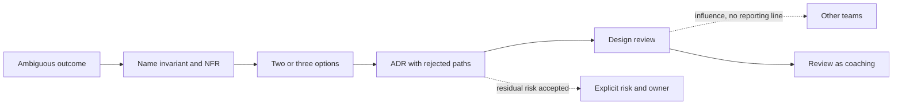

# Principal architect craft

A senior tech lead owns a system and a team. A principal owns a problem that crosses teams, a technical strategy that will still make sense after the current release, and the quality of decisions made when nobody has the full picture. The job is not a larger backlog. It is a different kind of scope.

## Scope and ambiguity

A tech lead turns a known feature into a design, a plan, and a reviewable change. A principal is handed an outcome: "store and digital must not oversell the same device, and we will not double our database license to do it." Requirements conflict. Legal, store operations, and digital each hold a piece. The work is to name the decision, the options, and the risk of waiting. You write the missing problem statement instead of estimating a solution that was never specified.

Ambiguity is not an excuse to stay abstract. You leave the room with a boundary: which service owns allocatable inventory, what the customer sees when the count is stale, and what you will not solve this quarter. You also leave with the open questions, each with an owner.

## Influence without authority

The teams that must change do not report to you. Influence is a precise design, a risk that is concrete, and a path that respects their constraints. You do not win by title. You win by making the cost of the current path visible: pool exhaustion, a manual reconcile, a pager that fires on every sale event. You offer a sequence they can ship, not a target architecture slide.

Disagree in the design review, then support the decision once it is made, unless the decision creates an ethical or production-safety problem. Relitigating in side conversations burns the trust you need for the next call. When you lack authority over a vendor platform (ordering middleware, Apigee, a shared Oracle cluster), your lever is the interface contract and the escalation path, written down.

## Technical strategy

Strategy is a small set of rules that keep teams from re-deciding the same question. Examples that fit this background: one transactional owner for an order; cache is not a ledger; new services default to Postgres unless the data already lives in Oracle; synchronous calls inside checkout have a timeout shorter than the caller; every external side effect has an idempotency key. Strategy is not a framework mandate. If a rule does not change a design review, drop it.

You revisit rules when the constraint changes. A rule that existed to protect a single database instance may be wrong after a split. Say what evidence would change your mind.

## ADRs

An architecture decision record is a short note: context, decision, consequences, and what you rejected. It is written when the decision is expensive to reverse: database choice, consistency model, sync versus async with the payment provider, key structure in a partition store. It is not a transcript of every meeting.

A useful ADR names the non-functional requirement that drove it (RPO, latency budget, license, team skill) and the operational burden (who runs repair, who pays for the cluster). Link the ADR from the service README. If the decision changes, supersede the record. Do not edit history.

## Risk

Risk is a specific failure, a likelihood, and a blast radius. "Redis might be down" is vague. "If the catalog cache is empty, browse QPS lands on the primary and checkout latency crosses its budget" is a risk you can mitigate: a fallback limit, a stale serve, a load test. You distinguish ship-now risk from structural risk. A missing index on a new column is ship-now. Two services writing allocatable quantity is structural.

You keep a short list. You do not maintain a risk register nobody reads. Each item has an owner and a trigger that would make you stop a rollout.

## Mentoring

Mentoring at this level is design review as teaching. You ask the engineer to state the invariant, the failure, and the metric before you offer the pattern. You let a tech lead run the incident, and you take the cross-team calls so they can stay on the timeline. You review ADRs written by others more often than you author every design. The measure is whether the team makes the next similar decision without you, not whether your name is on the document.

Staffing a review with only seniors trains nobody. Pair a mid-level engineer on the data model and let them present it.

## Build versus buy

Buy when the capability is not differentiating and a vendor already meets the control bar: payments, SMS, edge API management if Apigee is the company standard, a managed database. Build when the workflow is the business: plan compatibility, cart rules, reservation policy. The expensive mistake is building a worse queue, a worse identity system, or a worse cache client, and the other expensive mistake is buying a platform and then wrapping it until you own its bugs anyway.

A buy decision includes exit cost, data export, and what happens when the vendor's latency regresses. A build decision includes the on-call rota. "Open source so it is free" is not a build decision. Cassandra in particular is a build of operational skill even though the software is free.

## Non-functional requirements, cost, operability

Functional scope is what the screen does. Non-functional scope is what keeps the business open: latency for browse versus checkout, availability target, RPO and RTO, consistency, audit retention, and peak shape (a device launch is not average Tuesday). Write numbers as budgets the design can be tested against. If the business cannot give a number, propose one and label it as an assumption.

Cost is an architecture attribute. A cross-AZ chatty call, a NAT path for backup traffic, a Redis cluster sized for a key you could have paged from S3, an Oracle license tier driven by a reporting query that belongs on a replica. You should be able to point at the two or three line items the design creates.

Operability is whether a new engineer can tell, at 2 a.m., what is wrong. That means a correlation id from the channel through Feign to the database, a dashboard that separates dependency time from service time (New Relic or the equivalent), logs that do not contain secrets, and a runbook that says which knob is safe to turn. A design that needs a hero to restart processes in order is not done.

## STAR skeletons

Use these as structure. Fill the brackets with your own Verizon or TCS work. Do not invent metrics. If you do not remember the number, say what moved and leave the figure out.

**Incident and ownership.** Situation: [system, channel, customer impact you actually saw]. Task: you were [on-call / lead / the person who stepped in], and the immediate job was [restore X without making Y worse]. Action: [the check you ran, the change you stopped, the person you pulled in]. Result: [what recovered, what you changed the next day so it would page earlier].

**Influence without authority.** Situation: [team A and team B disagreed on ownership of a flow you can name]. Task: you needed a decision on [boundary] and you did not manage both teams. Action: [the option paper, the risk you quantified, the forum you used]. Result: [the decision, and what shipped because of it].

**Tradeoff.** Situation: [build versus buy, sync versus async, or Oracle versus a new store]. Task: [the constraint: date, license, skill, consistency]. Action: [what you rejected and the ADR or review]. Result: [what you accepted as residual risk].

**Mentoring.** Situation: [engineer or team and the design gap]. Task: raise the quality of [reviews / on-call / data model] without taking the work back. Action: [how you coached]. Result: [what they led afterward].

**Strategy.** Situation: [repeated incident or repeated design argument]. Task: stop re-deciding [topic]. Action: [the rule you wrote and how you socialized it]. Result: [a later project that followed it, and any exception you allowed].

Solid edges are the work product you owe. Dotted edges are influence and accepted risk: they are real, and they are not the same as a direct order or a closed mitigation.
