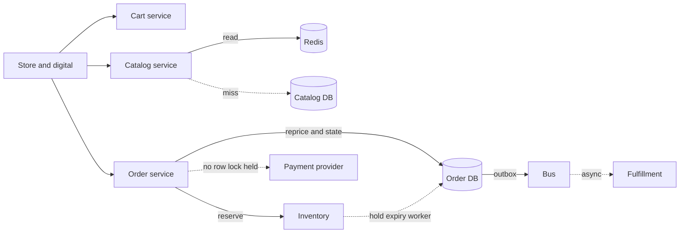

# System design: omnichannel POS

The prompt you should be ready to drive: design the path from browsing a device, through plan and accessories, cart, checkout, payment handoff, inventory reservation, shipping, and returns, for store and digital channels that share one stock pool. A principal loop cares less about boxes and more about ownership, failure, and idempotency.

## What you clarify first

Channels: store associate, web, mobile. One stock pool or store-local plus ship-from-store. Catalog size as a variable `N_sku`. Peak browse rate `R_browse` and peak checkout rate `R_checkout`, with `R_browse` much larger than `R_checkout`. Payment is an external provider with its own timeout `T_pay`. Reservation hold time `T_hold`. Regions and whether a customer can buy in one region and return in another.

State assumptions out loud. Example shape, not fake capacity: browse is cacheable; checkout is not; a hero SKU can take a large fraction of `R_checkout` for a short window; the database primary is multi-AZ; Redis failure must not create a second ledger.

## Browse and configure

A catalog service reads merchandising data. Device pages are cache-aside in Redis, keyed by SKU and content version, backed by the system of record. Plan customization is a rules evaluation: device, line, promotions, trade-in. If the rule result is deterministic from published inputs, cache it with the publish version in the key. If it depends on the customer's credit, do not cache it across customers.

Compatibility (which accessory fits which device) is a graph. Serve the hot slice from cache. The source of truth is relational. Search and facet browsing, if in scope, is a derived index fed asynchronously. Do not make checkout depend on the search index.

Store and digital hit the same catalog APIs. Channel-specific price or assortment is a predicate on the read model, not a forked service, unless the deploy cycles truly differ. One writer publishes price. Both channels invalidate the same key.

## Cart

The cart service owns the cart. Identity is a cart id, plus customer id when known. Anonymous carts expire. Lines reference SKU, plan id, and quantity. The cart does not decrement on-hand inventory. Reprice at checkout from the system of record so a stale cache cannot sell the wrong price. Merging a store cart and a digital cart is an explicit operation with a deterministic winner when both contain the same SKU.

Capacity: `R_browse` is served mostly from Redis. The relational read rate is `R_browse * miss_ratio`. You size the database for the miss storm, not for a 100% hit rate. `R_checkout` is the write rate that matters for the order table.

## Checkout, payment, reservation

Checkout is a state machine on the order: created, reserved, payment pending, paid, fulfilled, cancelled, failed. Transitions are conditional updates (`WHERE state = ?`) so a retry does not double-apply.

Sequence that keeps the transactional boundary small:

1. Validate cart and reprice on the primary.
2. Reserve inventory in the inventory service, or in the same database if you have not split it. Reservation is a conditional decrement of allocatable quantity, or an insert into a reservation table with a unique key, plus a hold expiry `T_hold`.
3. Create the order in `payment_pending` with an idempotency key supplied by the client.
4. Hand off to the payment provider. Do not hold a database row lock during `T_pay`.
5. On authorization, mark paid and confirm the reservation. On decline or timeout, release the reservation.

If inventory and order are different databases, this is a saga. The reservation id is stored on the order. A timeout worker releases reservations whose hold expired and whose order is not paid. That worker is required, not optional. Without it, abandoned checkouts leak stock until a human notices.

Idempotency: the client sends `Idempotency-Key` on submit. The order service stores the key and the response. A retry returns the same order id and does not reserve twice. The payment call uses its own idempotency key derived from the order id so a retry does not authorize twice. Provider webhooks are events with a unique event id; processing them is idempotent.

## Shipping and store fulfillment

Once paid, an outbox row is committed with the order. A publisher emits "order paid." Fulfillment consumes it and creates a shipment or a store pick. Allocation (which warehouse or which store) is a decision you can recompute; record the result. Shipping updates come back as events and move fulfillment state. The order service does not poll the carrier on the customer's request thread.

Store pickup is the same state machine with a different fulfillment type. The associate UI reads the order from the primary so it does not miss a just-paid order on a replica.

## Reverse logistics

Returns are a new aggregate, not an in-place edit that forgets history. A return references order lines and quantities already returned, so two partial returns cannot exceed what was sold. Refund is another payment-provider call with its own idempotency key. Restock is a separate decision: graded inventory may not become allocatable automatically. That rule belongs in the inventory service.

Chargebacks and offline payment exceptions need a case state. Do not overload order status with every finance exception or the state machine becomes untestable.

## Data ownership

| Fact | Owner | Others |
| --- | --- | --- |
| Price of record, assortment | Catalog / merchandising | Cache, search as projections |
| Cart | Cart service | Channels call it; they do not write its store |
| Allocatable quantity, reservations | Inventory | Checkout calls reserve and release |
| Order and payment attempts | Order / payment | Fulfillment receives events |
| Shipment | Fulfillment | Order keeps a summary status |

No service updates another service's tables. Cross-service reads for the customer order history go through an API or a purpose-built read model, not through a shared schema login.

## Failure modes

Payment timeout: you do not know whether the provider authorized. You reconcile with an inquiry by idempotency key. You do not blindly retry a non-idempotent charge. Inventory reserved, payment declined: release. Inventory reserved, process crashed: the expiry worker releases. Redis down: browse degrades, checkout still prices from the primary. Primary down: stop checkout; do not take orders into a queue that lacks constraints. Duplicate submit: idempotency key. Duplicate webhook: event id. Hero SKU: reservation rows contend on one parent quantity. Mitigate with a reservation table that inserts holds and sums them, or accept serialization on that SKU and shed load. Say which one you are choosing.

## Capacity reasoning without fake numbers

Write the inequalities. Checkout database writes per second are on the order of `R_checkout` times a small constant (order, lines, reservation, outbox), not `R_browse`. Browse database reads are `R_browse * miss_ratio`. Connection count is `pods * pool_size`, and it must sit under the database limit with headroom for failover. Payload and Redis memory are `hot_keys * entry_size`. A launch day multiplies `R_browse` and the hero SKU's share of `R_checkout` for a window you ask the business to estimate. If they cannot, you still name the variable and design the hotspot. Test with JMeter or the platform tool at `R_checkout` and at a miss ratio you choose, not only at a warm cache.

Latency budget: browse is cache hit plus a tight tail. Checkout's budget includes `T_pay`, so the internal work must be much smaller than `T_pay` or the customer timeout fires first. Timeouts shrink as you go downstream.

Solid edges commit state or answer the user. Dotted edges are the cache miss, the payment call you must not pin a transaction across, fulfillment after commit, and the expiry worker that repairs abandoned holds.
