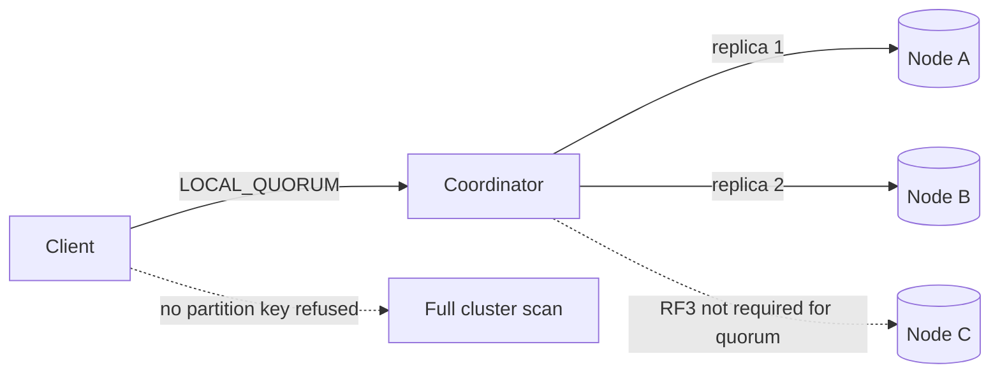

# Cassandra, used only where the access path fits

Cassandra is a partitioned wide-column store. It is fast when every read and write names a partition key and touches a bounded slice of that partition. It is the wrong database when you need ad hoc filters, multi-row transactions, or a financial ledger with serializable balances. Several resumes list Cassandra next to Oracle and Postgres. A principal is expected to say when it should not be in the design.

## Partition key and clustering key

The primary key splits into the partition key and zero or more clustering columns. The partition key is hashed (Murmur3 in modern clusters) to a token. The token ring, plus the replication factor and the snitch, decides which replicas store that partition. All rows that share a partition key live together on those replicas. Clustering columns sort rows inside the partition and form the on-disk order.

A query that supplies the full partition key is a targeted read. A query that supplies only a clustering column, or a non-key filter, is a cluster-wide scatter or a local index lookup. `ALLOW FILTERING` is a signal the table does not match the query. Secondary indexes are local to each node and fan out. Storage-attached indexes in newer versions improve some of this and still do not turn Cassandra into a relational engine. Model a table per query. If the POS UI loads "orders for this customer by time," the partition key is the customer and the clustering key is order time descending. If another screen loads "order by id," that is a second table, maintained by the writer, not a join.

## Wide partitions

A partition is the unit of locality and the unit of pain. Millions of clustering rows, or large cells, make compaction expensive, make repairs heavy, and make a single read allocate too much on the coordinator and the replica. Operational guidance commonly cited by practitioners is to keep partitions well under about 100 MB and far from unbounded growth. That figure is a heuristic, not an engine constant. Time-series events partitioned only by device id grow forever. Bucket the partition: device id plus day, or customer id plus month. A query for a longer range reads a fixed number of buckets, not the entire history in one partition.

Collections (`list`, `set`, `map`) are stored in the partition and can create a wide partition by themselves. A set of every store that ever stocked a SKU will not stay small. Cap it or model the relationship as rows in a table whose partition key is the SKU and whose clustering key is the store, with a query that pages.

## Consistency levels

Replication factor is how many copies exist. Consistency level is how many of those copies a given operation waits for. They are different knobs.

- `ONE` waits for a single replica. Lowest latency, highest chance of a stale or divergent read, and a write can be acknowledged by a node that later dies before streaming to others.
- `QUORUM` waits for a majority of replicas across all data centers: `floor(RF/2)+1` of the total RF. In a multi-DC cluster this can wait on the remote DC.
- `LOCAL_QUORUM` waits for a majority in the coordinator's local DC. This is the usual choice for a multi-DC POS deployment that must stay up when the other region is slow.
- `ALL` waits for every replica. One down node fails the operation. Rarely right for online traffic.
- `EACH_QUORUM` requires a quorum in every DC. Strong and coupled to the worst region.

If writes use `W` and reads use `R`, and `R + W` is greater than RF, a read overlaps a write's acknowledged copies and you get a form of immediate consistency for that partition, assuming no clock games inside the replica set and a single partition. `LOCAL_QUORUM` on both sides, with RF 3 per DC, is the standard pairing. It does not give you a transaction across partitions. Lightweight transactions use Paxos, touch one partition, cost several round trips, and are for rare compare-and-set (unique username), not for checkout throughput.

Tunable consistency is not "eventually consistent so we ignore bugs." At `ONE`, a device-availability flag can flap. At `LOCAL_QUORUM`, you still have no cross-partition atomicity. Inventory that must never oversell does not belong here unless the contention domain is a single partition and you have designed the conditional write honestly.

## Tombstones

A delete writes a tombstone. It does not remove the cell immediately. Reads must reconcile tombstones with older data so a deleted row does not reappear. Tombstones are dropped only after `gc_grace_seconds` (ten days by default) and only if repairs have had time to propagate the delete. Shortening the grace window without repairing resurrects data. Range deletes and deletes of collections create range tombstones that are more expensive to read than a single cell tombstone.

Queues in Cassandra fail this way: insert, process, delete, and the partition fills with tombstones. The read of "next item" scans them and times out. Do not use Cassandra as a work queue. TTL on a cell also becomes a tombstone at expiry. A table with a short TTL and a read of a wide slice will spend its budget on expired data. Time-window compaction helps tables that are pure time series with TTLs. It does not fix a random-delete queue.

## Queries you must refuse

No unbounded `SELECT` without a partition key. No "give me all orders in the country." That is an analytics export, a Spark job, or a different database. Page with a clustering range and a bounded page size. Avoid `IN` clauses that explode into many partition lookups on the coordinator. Counters are a special column type with different reconciliation and weaker isolation; do not use them for a balance you will audit.

Logged batches are atomic in the sense that the batch log will retry the mutations. They are not isolated, and a logged batch that spans partitions is a performance foot-gun. Unlogged batches are an optimization for mutations to the same partition. Neither is a SQL transaction.

## When not to use it

Do not use Cassandra for the order aggregate, payment state, or any invariant that spans customer, inventory, and payment. Do not use it because "we might have web scale" on a catalog that fits in Postgres with a Redis cache. Do not use it for flexible search; that is a search index. A defensible POS use is high-volume append-mostly telemetry: store-device heartbeats, clickstream for merchandising, audit events keyed by entity id plus time bucket, read back by that same key. The team must be willing to run repairs, watch tombstones, and treat the data model as part of the API review.

Solid edges are the replicas the quorum waits on. The third replica is dotted because `LOCAL_QUORUM` with RF 3 can succeed without it; repair and read repair are how it catches up, and that catch-up is not on the request deadline. The scatter edge is dotted because it is the path you do not ship: a query without a partition key.
