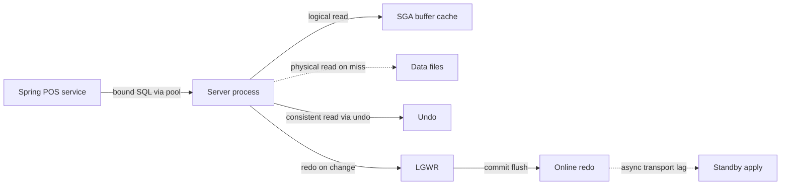

# Oracle for a principal architect

This is a judgment refresh for someone who has already run Oracle behind POS-style flows: device catalog, plans, cart, checkout. The target is principal scope. Syntax is assumed. The question in the room is which invariants belong in the database, which workload is allowed to touch the primary, and which failure the application must absorb.

## Instance memory and processes

An Oracle instance is memory plus background processes attached to one database. The System Global Area is shared. The pieces that change design decisions:

- **Buffer cache.** Copies of data blocks. A logical read hits memory. A checkout statement that looks small in rows can still thrash the cache if it scans wide tables, or if a connection storm multiplies identical work.
- **Shared pool.** Library cache (cursors, SQL text, plans) and dictionary cache. Hard parses allocate here. Services that concatenate store id or SKU into SQL text latch this pool under load.
- **Redo log buffer.** Change vectors. LGWR flushes them to online redo on commit and on a few other triggers. Commit latency is LGWR plus storage, not the Java thread pool.
- **Large pool.** Shared server, parallel execution messages, RMAN. Size it so those clients do not steal from the shared pool.

The Program Global Area is private to each server process: session memory, sort and hash areas, bitmap merge area. A plan that spills is a PGA and temporary-tablespace problem. OLTP checkout should not sort large sets.

Name the background processes without reciting a poster. DBWn writes dirty buffers. LGWR writes redo. CKPT coordinates checkpoints. SMON recovers and coalesces. PMON cleans dead sessions. ARCn copies online redo when the database is in `ARCHIVELOG` mode. Point-in-time recovery is archive logs plus backups. The principal question is the recovery point objective: last commit (standby redo transport, sync or async) or last backup.

Dedicated server is the default for a microservice pool: one server process per pooled connection. Shared server multiplexes sessions onto fewer processes and fights a Hikari-style pool that already multiplexes. Match `processes` and session limits to pool size times instance count, plus headroom for admin and jobs.

## Read consistency

Default isolation is `READ COMMITTED`, and it is statement-level. The server rebuilds a block as of the statement SCN by applying undo. Ordinary readers do not block writers, and writers do not block readers. A long catalog extract can run beside checkout DML until someone takes `SELECT FOR UPDATE`, leaves a foreign key unindexed on the child (so the parent row is locked), or uses a bitmap index.

`SERIALIZABLE` gives transaction-level consistency and can fail with `ORA-08177` when another transaction changes a block you need. For cart and checkout, prefer short read-committed transactions and an application version column. Holding serializable across a payment call burns undo and fails closed at the worst moment.

`UNDO_RETENTION` and the undo tablespace bound how far a consistent read or flashback query can see. `ORA-01555` snapshot-too-old means the query outlived undo. Fix the query or the retention. Do not retry forever from Feign.

## SQL and PL/SQL

Put a rule in the database when the invariant cannot be enforced safely elsewhere: unique constraint, check, foreign key, or a small procedure that updates a balance and writes an outbox row in one transaction. Do not hide a pricing engine in packages. Plan and promotion rules change faster than database releases, and they are harder to test, to trace in Kibana or New Relic, and to scale out.

Constraints are part of the API. A unique key on payment-attempt id or reservation id is what makes a Feign retry safe. PL/SQL earns its place for set-based maintenance and controlled cutovers. A cursor loop over devices is usually a missing set operation. `BULK COLLECT` and `FORALL` are the escape hatch when iteration is real, not the default style.

## Indexes

B-tree is the OLTP default. It serves equality, range, and an `ORDER BY` that matches the leading columns. Build the index for the predicate you run: store plus SKU, not a five-column index no query can enter.

Bitmap indexes store one bitmap per distinct value. They suit low-cardinality warehouse columns under batched DML. They are hostile to concurrent OLTP. DML can lock a range of rowids that share a bitmap piece, so two sessions updating different rows still collide. Do not bitmap `order_status` on a checkout table.

Function-based indexes match wrapped predicates (`UPPER(email)`, `TRUNC(ordered_at)`). Invisible indexes let you measure a new index in one session before the optimizer uses it for everyone. Reverse-key indexes spread sequence-like inserts across leaf blocks and destroy range scans. Prefer a honest partition or a natural key before reverse keys.

## Binds and plans

Bind variables let executions share a cursor. Almost every OLTP statement in this domain should be bound. A literal is justified when skew is so severe that one plan cannot serve both shapes, and even then adaptive cursor sharing may be enough. Concatenated SQL is a shared-pool incident waiting for a sale event.

`EXPLAIN PLAN` is the optimizer's estimate and does not run the statement. `DBMS_XPLAN.DISPLAY_CURSOR` with runtime statistics shows actual rows against estimates. Cardinality misses — stale stats, correlated predicates, a peeked bind — are why a nested loop becomes a hash join over the catalog. Read the plan from the driving row source outward: access method, join method, and whether the filter happens before the big join. A full scan of a narrow partition can beat random index reads. "Full scan" is not automatically a defect.

## Sequences and partitioning

Sequences are the normal surrogate. `CACHE` cuts dictionary contention and allows gaps after a crash or an unused cache. Gaps are fine for internal ids. They are not fine if a customer-facing invoice must be consecutive. A gap-free counter is a serialized hotspot. Say that out loud before you build it.

Hibernate's `allocationSize` must match the sequence `INCREMENT BY`. If the sequence steps by 1 and the pooled optimizer assumes 50, nodes collide or leave large holes. Use pooled or pooled-lo with matching increment. Identity columns force a key fetch that defeats JDBC batching; a named sequence is easier for operations to see.

Range partitioning on event time, list on region, or hash on customer enables pruning and a lifecycle that drops or exchanges a partition instead of deleting millions of rows. A query that does not constrain the partition key scans every partition. Local indexes follow the partition. Global indexes go unusable across maintenance unless you maintain them explicitly. Partitioning does not replace a selective index.

## Hibernate on Oracle

N+1 is the default failure. Load orders, then touch each collection, and you get one query per order. Fix the use case with a join fetch, an entity graph, or `@BatchSize`. Marking every association `EAGER` makes the device page worse.

Locking must match the critical section. `@Version` fits a cart line: a stale write fails, the client reloads. `PESSIMISTIC_WRITE` fits a short inventory decrement and will queue on a popular SKU. Hold that lock across a payment-provider call and the pool stalls.

Session boundary is a design choice. An open persistence context across a remote call holds a connection and a growing graph of devices. Lazy initialization outside the session is a bug. Map the DTO inside the transaction. Flush mode and an unexpected dirty collection will emit updates you did not intend; check generated SQL when a "read" endpoint shows up in AWR as DML.

## Oracle beside Postgres

Both give multiversion reads so the common case does not block readers on writers. Oracle reconstructs old images from undo. PostgreSQL keeps tuple versions in the heap and reclaims them with vacuum. Oracle, in an estate that already has it, brings partitioning maturity, existing PL/SQL invariants, and operator familiarity. A new service more often fits PostgreSQL: no per-core license meter, JSONB for semi-structured plan configuration, and a cleaner RDS or Aurora operational model. Do not dual-write the two as a casual migration. Pick an owner, a direction, and a reconciliation check. Vacuum, GIN, and pooling live in the Postgres notes.

## Principal bar

You decide what runs on the primary, what leaves for a reporting copy, and what the connection budget is. You ask for the cursor's actual plan under production binds, the redo profile of a release, and pool size against `processes`. The database is a shared capacity budget.

The solid path is what the caller waits on. The dotted physical read is a cache miss. The dotted standby edge is asynchronous transport: commit returns before the remote apply. Synchronous Data Guard moves that wait onto the commit and changes checkout latency. Choose it for recovery point, not as a default.
