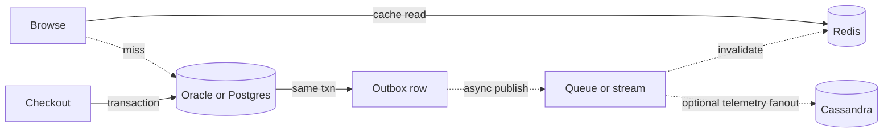

# Polyglot persistence for a POS-like estate

Device retail spans workloads that do not want the same database. Catalog reads dwarf writes. Checkout is rarer and must not double-charge or oversell. Sessions die in minutes. Telemetry arrives continuously and is read by key. A principal's job is to assign each workload an owner, a consistency bar, and an operational cost, then refuse a second store that does not change one of those three.

## How to choose

Start from the invariant, not from the product you know. If two facts must change together or not at all, they belong in one transactional database. If a fact can be rebuilt from a system of record, it may be cached. If the only queries are "this key, this order," a partition store can work. If analysts will filter by arbitrary columns next quarter, do not promise Cassandra.

Operational cost is part of the decision. Each engine adds backup, capacity, on-call, client libraries, and a failure mode the service must degrade through. Four engines for a team that can staff one primary on-call rotation is a reliability loss even when the diagram looks modern.

## Decision table

| Workload | Fit | Consistency | Transactions | Operational cost | Why |
| --- | --- | --- | --- | --- | --- |
| Order, payment state, reservation of record | Oracle if that estate already owns it; Postgres for a new service | Strong, read-your-writes | Multi-row ACID in one database | High if Oracle license and process limits; moderate on managed Postgres | Idempotency keys, foreign keys, unique constraints |
| New relational service, plan metadata, config | Postgres | Strong on the primary; replica lag if you read it | ACID | Moderate; watch connections and vacuum | JSONB for the long tail without leaving SQL |
| Device page, price display, session, rate limit | Redis | Stale up to TTL; failover can lose the last writes | Single-key atomic commands, Lua on one slot | Low if it is a cache; high if you treat it as a database | Absorbs browse QPS; not the ledger |
| Heartbeats, clickstream, audit by entity and time | Cassandra | Tunable; `LOCAL_QUORUM` is the usual bar | Single-partition only; LWT is narrow | High: repair, tombstones, compaction, data-model review | Only when volume and key shape justify a cluster |
| Search by free text or many optional facets | Search index, not these four | Near-real-time, not the order of record | None that you should use for money | Another cluster to run | Do not fake this with Cassandra secondary indexes |

Read the table as policy. Browse traffic uses Redis in front of the system of record. Checkout writes the system of record. Telemetry does not join to the order table at request time. Search is a derived index fed by events.

## Consistency you can explain

Oracle and Postgres on the primary give you committed reads of your own writes inside a session that uses that primary. A read replica, an Oracle Active Data Guard query, or a Postgres streaming replica can lag. Any screen that says "your order is placed" must read the primary or the same transaction. Redis adds a second lag: invalidation delay plus async replication. Cassandra at `ONE` can return a version a quorum write has already superseded. At `LOCAL_QUORUM` read and write, a single partition behaves coherently for practical purposes and still will not update inventory and order together.

Name the anomaly you accept. A device page that shows yesterday's marketing bullet for a minute is acceptable. A checkout that decrements stock in Redis and inserts the order in Oracle without a single owner is not. The customer-visible stock count on a browse page can be a hint. The reservation at checkout is a conditional update in the transactional database.

## Transactions and cross-store work

A transaction stops at one database. Outbox is the pattern that survives contact with this estate: in the same Oracle or Postgres transaction, write the order row and an outbox row. A publisher reads the outbox and emits to a queue or stream. Consumers update search, cache invalidation, and warehouse messages. The outbox row is the idempotency anchor. Dual-write (commit the order, then call Redis, then call Kafka) fails in the gaps and leaves no record of the intent.

Saga language is useful when several services each own a database: reserve inventory, authorize payment, confirm order, and compensate on failure. Compensation is a business action (release reservation, void authorization), not a technical rollback. It requires idempotent handlers and a timeout for every step. Do not implement a saga across Redis and Cassandra for an order that could have lived in one Postgres schema.

## Data ownership

Each fact has one writer. Suggested split for this domain:

- Catalog master data and price of record: the merchandising system and its relational database. Services cache projections.
- Cart: one service. Anonymous carts may live in Redis with TTL if loss on failure is acceptable before checkout; once the customer commits, the relational order is the owner. Do not let the web app and the store app both write the cart key.
- Inventory on-hand: one inventory service and one transactional store. Redis may hold a hint. Cassandra should not hold the allocatable quantity unless you have a proven single-partition design and a business sign-off on conflict behavior.
- Payment: the payment service stores attempts and provider references in its relational database. Card data stays at the provider. Logs and APM do not get the PAN.
- Telemetry: Cassandra or an object store plus a warehouse, keyed so a store device has a bounded partition. It is not joined synchronously to checkout.

## Operational cost in practice

Oracle cost shows up as license, specialized DBAs, and connection limits. Postgres cost shows up as vacuum, connection counts, and migration discipline; managed Aurora or RDS removes host work and leaves you the SQL and the pool. Redis cost is memory, hot keys, and the temptation to put durable state in it because the API is easy. Cassandra cost is the cluster itself: repair schedules, disk, the inability to add a query later, and people who can read a tracing session. A principal proposal includes who is on call and what the restore drill is. "We will cache it in Redis and also write Cassandra for scale" without a query and an RPO is not a proposal.

## Failure and degradation

When Redis is down, catalog falls back to the database if that database is sized for a fraction of browse traffic, or it fails closed on browse and keeps checkout up. Size the fallback or you turn a cache outage into a database outage. When a Cassandra telemetry cluster is down, checkout continues. If checkout cannot proceed without telemetry, the dependency is wrong. When the relational primary is down, you stop taking orders. Queueing orders in Redis to "replay later" creates a second ledger with no constraints. Multi-AZ failover of the primary is the mitigation, with a tested RTO, not a shadow write path.

## A small estate, not a museum

A coherent target for a new slice of omnichannel POS: Postgres or the existing Oracle for transactional state, Redis for cache and ephemeral session, a queue for integration, and object storage for documents and statements. Add Cassandra only with a written access path, a partition bound, and a consistency level. Add a search cluster only with a defined lag from the outbox. Revisit the split when a workload's shape changes, not when a new engine is fashionable.

Solid edges are synchronous and transactional. Dotted edges are cache-aside misses and asynchronous projections. Cassandra sits on the dotted path because telemetry must not be required to commit the sale. If a requirement forces it onto the solid path, the model is no longer optional and the consistency story has to be rewritten.
