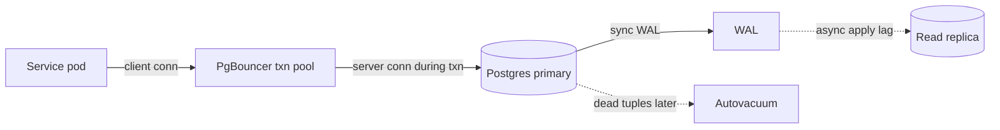

# PostgreSQL for a principal architect

PostgreSQL is the usual choice for a new POS-adjacent service when you do not already live inside an Oracle estate: orders sidecar, configuration, audit that is relational, plan metadata that is partly structured. This note assumes you can write SQL. It focuses on MVCC reality, indexes, plans, vacuum, pooling, and how you migrate without locking the store.

## MVCC in the heap

Every row version is a tuple in the table heap. `xmin` is the transaction id that created the version. `xmax` is the transaction id that deleted or superseded it, if any. A snapshot decides which tuples are visible. Updates do not overwrite the old tuple in place. They write a new tuple and mark the old one dead for future snapshots. Indexes point at tuple ids, so an update that touches an indexed column often updates the index too. The heap therefore accumulates dead tuples until vacuum reclaims them.

That is the operational difference from Oracle. Oracle's readers reconstruct history from undo. Postgres readers walk versions that still sit in the table, and something must clean them up. Long transactions pin snapshots. Autovacuum cannot freeze or remove tuples that an open transaction might still see. A forgotten admin session, a Flyway lock, or a reporting query on the primary is how a checkout table bloats during a promotion weekend.

Default isolation is `READ COMMITTED`: each statement takes a new snapshot. `REPEATABLE READ` holds one snapshot for the transaction and, in Postgres, also rejects anomalies that other products still call repeatable read. `SERIALIZABLE` uses serializable snapshot isolation and may abort a transaction with a serialization failure. The application must retry those aborts. They are not deadlocks, and they are not a reason to drop to "no transactions."

Writers still take row locks. `SELECT FOR UPDATE` and `UPDATE` block other writers on those rows. Readers using MVCC do not wait on those locks. Foreign keys take locks on the referenced row for the duration of the statement. An unindexed foreign key does not change locking the way a missing Oracle child index does in the classic parent-lock story, but it does make deletes of the parent expensive. Index the referencing column.

## Indexes

B-tree is the default and the right choice for equality, range, and sort on scalar columns: store id, SKU, order id, created time. Composite order matches leftmost predicates. A btree on `(store_id, sku)` does not serve `WHERE sku = ?` alone.

GIN (generalized inverted index) indexes elements inside a composite value. Use it for JSONB containment (`@>`, `?`), arrays, and full text. GIN is slower to update than a btree and can pending-list under bursty writes. A device document you filter by several attributes belongs in JSONB plus GIN only if the access path is real. If you always filter by SKU equality, store SKU in a btree column and keep JSONB as the payload.

GiST fits geometric types, range types, and exclusion constraints. A promotion that must not overlap another promotion for the same SKU and time range is an exclusion constraint on a range, backed by GiST. That pushes a business invariant into the database without a trigger.

Partial indexes encode a predicate: open orders, active reservations. They stay small and match the hot path. Expression indexes match a wrapped column or a JSONB field you promote to a scalar lookup. Build them when the plan shows a sequential scan you cannot accept, not one per column.

## Reading a plan

`EXPLAIN` is the estimate. `EXPLAIN (ANALYZE, BUFFERS)` executes the statement and adds actual time, row counts, and buffer hits versus reads. On a production primary, analyze has a cost; use a replica or a short statement, and never analyze a statement you are not willing to run.

Look for estimated rows far from actual rows. That is missing statistics, a correlated predicate, or a function the planner cannot see through. `work_mem` too low shows up as external sorts and hash batches. A nested loop that runs an index probe millions of times is often a missing index or a bad row estimate, not a reason to raise memory until the sort fits. `Index Only Scan` still checks the visibility map. If the heap is dirty, it falls back toward heap fetches and the index-only win disappears until vacuum sets the map.

## Vacuum, bloat, and wraparound

Autovacuum removes dead tuples, updates statistics, and freezes old transaction ids so the 32-bit xid space can wrap safely. Wraparound is not theoretical. If freezing falls behind, the cluster will stop accepting writes to protect itself. Monitor oldest `xmin`, dead tuple percentage, and autovacuum lag per hot table. A cart table with a high update rate needs a more aggressive per-table autovacuum scale factor than a static device-attribute table.

Vacuum reclaims space inside the file for reuse. It does not always shrink the file on disk. `VACUUM FULL` and `pg_repack` rewrite the table and take serious locks or disk. Prefer not to need them. Fillfactor below 100 on a heavily updated table leaves room for heap-only tuple updates when no indexed column changes, which reduces index churn.

## JSONB

JSONB is the right store for plan configuration, feature flags on a device offer, or a payload whose shape differs by product line, provided you do not query every key ad hoc. Constraints still belong on columns you join and unique-check. A common split: relational columns for identity, price, status, and foreign keys; JSONB for the long tail of merchandising attributes. Index the operators you use. A GIN index does not make `->>` filters with a cast automatically fast unless the expression matches an index.

JSONB is not a document database license to skip migrations. When a key becomes a predicate in every request, promote it to a column.

## Pooling

Postgres forks a backend per connection. A few hundred active backends is already a lot of memory and snapshot overhead. A Kubernetes deployment with many pods times a large Hikari pool will open thousands of idle connections and fall over before CPU does. PgBouncer in transaction pooling mode is the standard relief: the application holds a client connection, and a server connection is checked out only for a transaction.

Transaction pooling breaks session state: `SET` of session parameters, temporary tables, advisory locks held outside a transaction, and prepared statements that outlive the transaction unless you use a protocol PgBouncer is configured to support. Session pooling avoids those breaks and does not reduce server connections much. Statement pooling is rarely what you want. Set the application pool modest, set PgBouncer's pool to the real backend budget, and put timeouts on both. RDS Proxy is the managed cousin with the same session-versus-transaction tradeoff.

## Locking and migrations

Row locks, `NOWAIT`, and `SKIP LOCKED` matter for work queues. `SKIP LOCKED` is a clean way to let workers claim outbox rows without blocking each other. Advisory locks can serialize a singleton job; do not use them as a general inventory mutex if the critical section includes HTTP.

Schema change on a live catalog is expand then contract. Add a nullable column, deploy code that writes both, backfill in batches, enforce not-null, then drop the old shape in a later release. `CREATE INDEX CONCURRENTLY` and `DROP INDEX CONCURRENTLY` avoid a long write lock and cannot run inside a transaction block. A migration tool that wraps every script in one transaction will fail or, worse, take `ACCESS EXCLUSIVE` via a naive `ALTER`. Strong locks that rewrite a table (`ADD COLUMN ... DEFAULT` on old versions, type changes) need a maintenance window or a shadow-column plan. State the lock level in the change review.

## When Postgres beats Oracle for a new service

Choose Postgres when the service is new, the workload is relational OLTP plus a modest amount of JSON, and you want licensing and operations to look like every other cloud database. Extensions (range types, exclusion constraints, `pg_trgm`, logical replication) cover cases that would be extra options elsewhere. Logical replication and read replicas cover fan-out; they are not a multi-master write story. You still need a primary for strongly consistent checkout.

Stay on Oracle when the data, the packages, and the operational muscle already live there and the cost of a rewrite exceeds the license pain. Do not stand up Postgres as a second system of record for the same order. One owner of the write model, one transactional boundary.

The request path is solid: pool, primary, WAL flush on commit. The replica edge is dotted because apply lags; a read-your-writes cart must use the primary. Vacuum is dotted because it is asynchronous maintenance, not part of the user round trip, and it is still on the critical path of table health.
