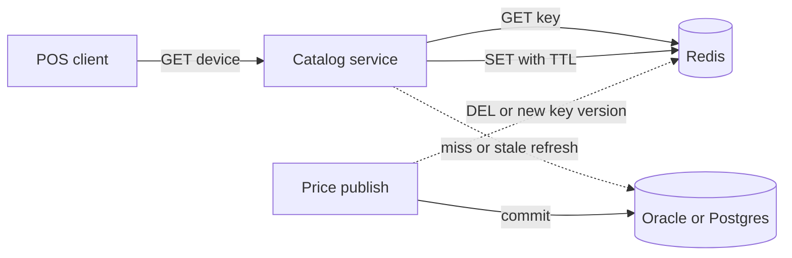

# Redis for POS catalog and session

Redis is the memory tier in front of catalog reads, session and cart state, rate limits, and short-lived locks. It is not the system of record for inventory you cannot afford to lose, and it is not a relational join engine. A principal uses it to absorb read fan-out and to keep hot keys explicit.

## Structures and when

Strings hold a serialized blob, a counter, or a session token. A device-detail cache entry is usually a string with a TTL. Hashes hold field-value maps when you update one field without rewriting the value, such as a cart's item count beside its currency. Lists are queues with `LPUSH` and `BRPOP`; they are fine for a simple work list and a poor fit once you need acknowledgements and replay. Streams add consumer groups, ids, and pending entries. Prefer a real log (Kafka, SQS) when the consumer must retain history for days. Sets answer membership: accessories compatible with a device, if the set stays bounded. Sorted sets rank by score: "popular devices in this store today" with a trim to the top window. Bitmaps and HyperLogLog are approximate or dense counters; use them for presence and unique counts, not for money.

Pick the structure for the command you will run. If you only `GET` and `SET` a JSON document, a string is enough. If you need `ZRANGE` by score, a sorted set is the point. Fetching a key and filtering in Java means the structure is wrong or the key is too big.

## Cache-aside and write-through

Cache-aside is the default for catalog. The service reads Redis. On a miss it reads Oracle or Postgres, then writes Redis with a TTL. The database remains the source of truth. Stale data lives until TTL or an explicit delete. That is acceptable for device marketing copy and list price display when checkout reprices from the system of record.

Write-through writes the cache and the database in the request path. It reduces staleness and couples latency to both. Write-behind writes the cache and flushes later. It is a data-loss design unless the flush is durable and ordered. Do not write-behind inventory.

Invalidate on write to the system of record: delete the key, do not update it with a value you hope is complete. A delete is idempotent. A rushed update races with another writer and can put the old blob back. Version the cache key (`device:v12:{sku}`) when a release changes the JSON shape, and let old keys expire.

## TTL, eviction, stampede

Every cache entry that can become wrong needs a TTL, including negative cache of "SKU not found." TTL bounds a missed invalidation. Eviction policy decides what happens when memory is full. `allkeys-lru` or `allkeys-lfu` will evict keys that have no TTL, including a lock or a feature flag if they share the instance. `volatile-lru` evicts only keys with a TTL. `noeviction` returns errors on writes once full, which is what you want for a lock or queue instance so the failure is visible.

Split workloads. Catalog cache can drop entries. A session store may use a different logical database or, better, a different cluster so a catalog flood cannot evict sessions. Redis logical databases are not isolation; they share one thread and one memory cap. Separate clusters when the failure domains differ.

A stampede happens when a hot key expires and every request misses together: a national device page at the top of the hour. Mitigations that work: a short lock so one request rebuilds and others wait or serve stale; probabilistic early refresh before TTL; stale-while-revalidate where you keep the last blob under a second key. A single-flight guard only inside one JVM does nothing across pods. The guard has to be shared or the database has to survive the miss storm. JMeter will show this if the test expires the key; a test that warms once and then reads will not.

## Locks

`SET key token NX PX ttl` is a lock with a lease. Release it with a compare-and-delete (a small Lua script) so you do not delete a lock another holder acquired after your TTL. Redlock, which tries to lock a majority of independent masters, has a public critique: process pauses, clock jumps, and failover can still produce two holders. Treat a Redis lock as a best-effort mutex for stampede and for "only one refresher," not as the correctness mechanism for inventory. Inventory decrement belongs in a conditional update in the database, or in a service whose log is the authority. If you do lock in Redis, carry a fencing token into the system of record so a late holder cannot commit.

Never hold a lock across a payment call. The TTL will expire, a second holder will enter, and the first call will still complete.

## Persistence, replication, cluster

RDB snapshots the dataset on an interval. You can lose the window since the last snapshot. AOF logs writes and can fsync every command, every second, or never. `appendfsync everysec` is the common compromise: at most about a second of loss, and less latency than always. AOF rewrite compacts the log in the background. Persistence protects against a process restart. It does not replace the database. A cache can run with persistence off if a cold start from the database is acceptable and sized for.

Replication is asynchronous. A replica can lag, and a promoted replica can lose the writes the old primary had not sent. That is another reason not to keep the only copy of a reservation in Redis. Redis Sentinel manages failover of a primary-replica set. Cluster shards the keyspace into 16384 hash slots. The key's hash, or the hash of the `{tag}` substring, picks the slot and thus the node. Multi-key commands and transactions must touch one slot. `{storeId}` forces keys for that store onto one slot. A hot store can still skew a node. Resharding moves slots; clients must follow `MOVED` and `ASK`. Spring's Redis client has to be cluster-aware or you will see cross-slot errors only in production.

## Spring

Spring Cache (`@Cacheable`, `@CacheEvict`) is cache-aside around a method. It is the right tool for "cache this lookup." Key design is the whole contract: include every argument that changes the result, and do not include a giant object whose `toString` is unstable. Null caching, exception caching, and sync versus unsync are configuration, not defaults you can ignore. `sync=true` collapses stampede inside one process only.

`RedisTemplate` or `StringRedisTemplate` is the right tool when the structure matters: sorted sets, streams, locks, multi-key with a hash tag. Do not hide a sorted set behind `@Cacheable`. Serialization must be explicit. Java serialization couples the cache to class versions and is a bad default. JSON or a compact string lets you read a key during an incident. Set connection timeouts and command timeouts. A Redis blip should fail the cache call and either hit the database or fail the request, not hang the Tomcat or Netty thread until the pool is dead.

## Invalidation in this domain

Catalog display: TTL plus delete-on-publish of that SKU. Plan compatibility: version the key when the matrix is republished, because the matrix is a graph and partial deletes miss edges. Cart: either the database is the owner and Redis is a view, or Redis is the owner for the anonymous session with a TTL and the database becomes the owner at login or checkout. Pick one owner. Session: short TTL, refresh on activity, store only an opaque server-side session id in the cookie. Do not put payment instruments in Redis.

Solid arrows are the happy read. Dotted arrows are the optional miss path and the asynchronous publish invalidation. Publish commits the database first, then deletes the key. A reader between those steps can repopulate the old value; a short TTL or a version suffix bounds that race. Do not pretend delete-after-commit is linearizable.
