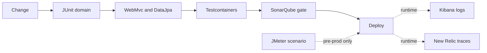

# Testing, observability, and DevSecOps

A principal does not claim "we have 80% coverage." They name which failure would reach a store, which test would catch it, and which signal would page a human.

## Test layers

Unit tests cover the domain without Spring: `Order.addLine` rejects a negative quantity, `Money.plus` rejects a currency mismatch, a conditional inventory update is expressed as a pure decision if you separate the SQL from the rule. JUnit 5 and Mockito live here. Mock the port (`PaymentGateway`), not the internal private method. `@InjectMocks` plus a pile of `@Mock` on a 400-line service is a signal the service does too much. Assert the state change and the interaction that matters (`verify(gateway).authorize(cmd)`), not every trivial getter.

```java
@Test
void declinesWhenGatewayDeclines() {
    when(gateway.authorize(cmd)).thenReturn(new Declined("51", "insufficient funds"));
    TenderResult result = service.authorize(cmd);
    assertThat(result).isInstanceOf(Declined.class);
    verify(orders, never()).markAuthorized(any());
}
```

Slice tests (`@WebMvcTest`) check validation, status codes, and the problem JSON without starting the database. `@DataJpaTest` checks the query and the conditional update against a real engine. Prefer Testcontainers (Postgres, or the Oracle image you are licensed to run) over H2 when the SQL uses `FOR UPDATE`, sequences, or JSON operators. H2 will pass a query that Oracle rejects.

A contract test on the Feign client or the OpenAPI spec catches a field rename between order and inventory. A full `@SpringBootTest` through Tomcat is few and slow: one checkout path, not one per branch. Test time is a design constraint. If the suite needs a shared mutable database, it will flake.

What you do not mock: the idempotency unique constraint. A unit test with a fake map does not prove two pods. One repository test that inserts the same key twice and expects a constraint violation does.

## Performance tests

JMeter (or an equivalent) belongs on a scenario you can describe: quote with 30 lines, authorize with a stubbed gateway, reserve under contention on one hot SKU. Assert error rate and latency against a threshold the business set, on hardware you document. A JMeter run from a laptop against a shared dev database is not evidence. Do not invent a throughput number in an interview; describe the scenario, the bottleneck you would look for (pool, lock, GC, downstream), and how you would read the result.

## Observability

Logs are structured (JSON), include correlation id, order id, store id, and the idempotency key. They do not include PAN, full track data, or a secret. Kibana is the search UI on top of the log store: you filter by correlation id when a store reports a failed tender. A log line that says "error occurred" without ids is useless at 2 a.m.

Metrics: request rate, latency histogram, error rate by route and by dependency, Hikari active and pending, circuit-breaker state, JVM heap and GC pauses. New Relic (or a similar APM) ties a slow transaction to the stack and the external call. Use it to see that p99 moved because inventory's query regressed, not because "Java is slow." Traces connect the hops. Logs, metrics, and traces are three views of one id, not three products to name-drop.

Alert on symptoms a customer feels (error budget, tender failures, pool exhaustion) and on a dependency that is about to cause that (disk, sessions). An alert on every exception class pages forever and gets muted.

## SonarQube and the pipeline

SonarQube is a quality gate, not a score to game. Rules that earn their keep: cognitive complexity on the checkout service, bug-level null risks, security hotspots (SQL injection via native query concatenation, hardcoded credentials), and coverage on new code rather than a legacy average. A gate that fails the build on new critical issues is useful. A gate that demands 90% on a generated class teaches people to exclude modules. Do not suppress a finding you cannot explain; do suppress a false positive with a reason.

The pipeline: compile, unit test, integration test with Testcontainers, SAST (SonarQube and a dependency check for known CVEs), image build, deploy. Secrets come from the CI vault, not from `application.yml` in git. A dependency with a critical CVE on a network-facing library blocks promotion. A CVE in a test-only jar does not need the same drama; say so, so you do not look like you treat the scanner as a god.

## Supply chain and runtime

Run the container as a non-root user. Read-only root filesystem where the app allows it. Limit the service account. Network policy so the order pod cannot talk to the whole data center, only inventory, pricing, payment, and the database. Apigee is not a substitute for authenticating internal calls.

Feature flags for a new tender type let you ship the code dark and enable one store. The flag is configuration, tested in both states. A flag that wraps an untested path is a production test you did not admit to.

## Principal versus mid-level

Mid-level: "I write JUnit and Mockito and we use Kibana and SonarQube." Principal: place each bug in a layer (domain unit test versus Testcontainers constraint test versus trace in New Relic), refuse to log payment data, and describe an alert that maps to a cashier-facing failure. Mention one flake you would not tolerate (shared DB row, `Thread.sleep` in a test).

## Failure modes

- Mockito `when` on a final method or a wrong matcher (`any()` mixed with raw values) that passes while the production call is different.
- Asserting `verifyNoMoreInteractions` on a service that logs through a mock, making the test brittle and still missing the money assertion.
- Coverage via tests that call getters.
- Dashboards that show average latency only. Averages hide the store on a bad link. Use a high percentile and a count of timeouts.
- SonarQube exclusions on the package that contains the payment adapter, which is the package you most want scanned.



Runtime edges are dotted because they are after release, not a substitute for the gate. JMeter is dotted because it is a targeted scenario, not a unit test, and it does not run on every commit unless you have the environment to support that.
