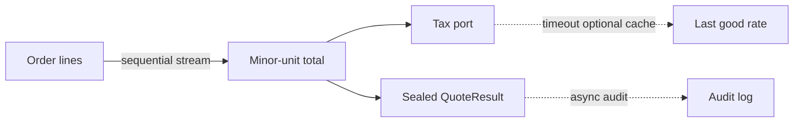

# Java 8 through 17, and what 21 changes

The working set is Java 8 and 17. A principal answer maps each language feature to a bug it prevents or a cost it hides, and treats Java 21 as a direction, not as the version on the resume.

## Lambdas and method references

A lambda is an object implementing a functional interface, unless it does not capture and the runtime can optimize it. Capturing a local variable requires that variable to be final or effectively final, because the lambda may run later on another thread. Capturing `this` (a reference to an instance field) pins the outer object. A lambda registered on a static bus can leak the whole service.

Prefer a method reference when the signature already matches (`lines::add`). Do not wrap it in a lambda that only forwards. `@FunctionalInterface` is documentation plus a compiler check; the language only needs a single abstract method.

## Streams

Streams express pipeline transformations. They do not run until a terminal operation. Intermediate operations are lazy and may be fused. That laziness is why an infinite `generate` is legal until `limit`, and why a side effect inside `map` is a bug: you cannot rely on it running, or running once, especially once someone adds `parallel()`.

```java
long total = lines.stream()
    .filter(line -> line.sku().startsWith(prefix))
    .mapToLong(OrderLine::extendedMinor)
    .sum();
```

`mapToLong` avoids boxing. `map(OrderLine::extendedMinor).reduce(0L, Long::sum)` boxes. For a cart of twenty lines it does not matter. For a pricing batch over a store's catalog it does.

`parallel()` uses the common `ForkJoinPool` unless you build the stream from your own spliterator and pool. CPU pricing of independent lines can benefit. A parallel stream that calls JPA or HTTP inside `map` will exhaust the pool and block the JVM's other parallel work. Streams are also a poor fit when you need an early imperative break with external state, or when the pipeline is one `map` that a `for` loop would show more clearly to the next reader. Exception handling inside a stream is awkward: checked exceptions do not pass through `Function`. Do not hide them in a runtime wrapper without a plan at the terminal operation.

`Collectors.groupingBy` for tender totals is the right use. `groupingByConcurrent` is for a parallel stream and a concurrent map. Do not use `peek` for business logic; it is a debug hook and is skipped by some optimizations in later JDKs when the element is unused.

## Optional

`Optional` is a return type for "maybe no price for this SKU," not a field type, not a method parameter, and not a substitute for every null. `get` without `isPresent` is the old NPE with extra steps. `orElse(expensive())` evaluates the fallback every time; `orElseGet` does not. `orElse(null)` means you gave up. For a missing price, `orElseThrow(() -> new SkuNotPriced(sku))` keeps the failure explicit at the edge of the domain.

## java.time

`Instant` is a timestamp. `LocalDate` is a store's business date without a zone. A POS "today" is the store zone, not UTC, or the overnight batch books sales on the wrong day. `DateTimeFormatter` is thread-safe. Do not store `java.util.Date` in new code. Conversions at the JDBC boundary should be explicit (`OffsetDateTime`, or `LocalDate` for a business date column).

## Java 9 through 17 language features you should write on a board

- `var` (10) for locals when the constructor name is already on the right. Do not use it when the type is a numeric primitive you need the reader to see, and never for fields.
- Switch expressions (14) return a value and must be exhaustive for the cases you list. They do not fall through.
- Text blocks (15) for SQL or JSON fixtures in tests. Not a templating language. Escape carefully.
- Pattern matching for `instanceof` (16) binds the cast: `if (result instanceof Authorized a) { use(a.authCode()); }`.
- Records (16) for DTOs and value carriers. A record can implement an interface. Compact constructors validate. They are shallowly immutable: a record holding a `List` still needs `List.copyOf` if you must freeze the contents.
- Sealed classes and interfaces (17) restrict implementations. Combine them with pattern switches as those switches become standard. On 17, a sealed hierarchy plus `instanceof` patterns is the portable style if preview switch patterns are off.
- Helpful `NullPointerException` messages (14, on by default later) name the null field. Turn them on (`-XX:+ShowCodeDetailsInExceptionMessages`) if the runtime is 17 and the flag is not default in your build.

Modules (JPMS, Java 9) matter when you must export a narrow API or deny deep reflection. Spring Boot services often run on the classpath. Know `opens` for reflection, and do not claim a module migration you have not done. Illegal reflective access that was warned on 11 is tighter on 17; libraries that poke at `java.base` need a current version.

## Concurrency APIs in this range

`CompletableFuture` is the async composition tool through 17 (see the concurrency notes). `Flow` (reactive streams interfaces) landed in 9. Do not adopt a reactive stack only because the interfaces exist; a blocking Spring MVC order API with a bounded pool is easier to debug unless the concurrency model truly demands event loops.

## Java 21 as a forward note

Virtual threads (`Executors.newVirtualThreadPerTaskExecutor`) make blocking I/O cheap in threads. They do not expand the database pool. Structured concurrency (preview around 21) treats a fan-out of price and tax as a unit that cancels siblings on failure. Sequenced collections give a defined encounter order API. Generational ZGC becomes the low-pause collector you would actually plan for. Pattern matching for switch and record patterns are the natural completion of sealed `TenderResult`. In an interview, say what you would re-evaluate on an upgrade (thread pool sizing, `synchronized` pinning on 21, test runs that assume platform-thread limits) and what you would not rewrite (JPA transaction boundaries, idempotency).

## Principal versus mid-level

Mid-level: "I use streams and Optionals to write cleaner code." Principal: show a primitive stream, explain why this pipeline must stay sequential, reject `Optional` fields on a JPA entity, and use a sealed result instead of a nullable auth code. Mention one 17 feature (records or sealed classes) as a way to make illegal tender states unrepresentable.

## Failure modes

- Stream pipeline with a lambda that calls a stateful setter. Order and duplication change under `parallel()`.
- `orElse(new Decline())` allocating a decline on the success path and, worse, logging inside the supplier that was not lazy.
- Record `equals` used as a JPA entity identity. Records are values. Entities have a lifecycle. Do not mix them.
- Catching `Exception` around a stream terminal and retrying the whole quote, including a non-idempotent reserve that already committed.



The cache edge is optional and stale by design; tax law may not allow it for the charged total. The audit edge is async and must not change the quote the customer saw. Call out which edge is allowed to be stale before you offer it.
