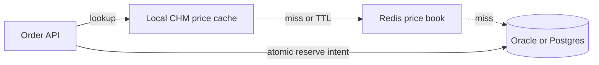

# Collections and generics at principal depth

POS services live and die by maps: SKU to on-hand, store to price book, idempotency key to payment attempt. Interviewers want the cost model and the contracts, not a list of class names.

## Lists

`ArrayList` is a growable array. `get` is O(1). `add` at the end is amortized O(1). Insert or remove at index i copies the tail, O(n). Default capacity is 10; growth is 1.5x (`old + (old >> 1)`), which copies. For a known cart size, pass the capacity. `LinkedList` is a doubly linked list: O(1) insert at an iterator position you already hold, O(n) to reach index i, and a heavy per-node object header plus two pointers. It is almost never the right `List` for a request-scoped order. It also implements `Deque`; use `ArrayDeque` for a stack or queue instead of `Stack` (synchronized legacy) or `LinkedList`.

`Arrays.asList` returns a fixed-size list backed by the array. `set` works; `add` throws. `List.of` is immutable and rejects nulls. Do not return a live `ArrayList` field from a domain object if callers can mutate the aggregate behind your back.

Fail-fast iterators on `ArrayList` and `HashMap` check `modCount`. Structural modification during for-each throws `ConcurrentModificationException`. The check is best-effort, not a concurrency control. A single-threaded iterator that calls `list.remove(i)` inside an index loop skips elements; use `Iterator.remove` or `removeIf`.

## Hash tables

`HashMap` (Java 8+) is an array of bins. A bin is a linked list, or a red-black tree when the bin length reaches 8 and the table length is at least 64. Below that length the map resizes instead of treeifying, because a short table means a bad spread, not a deep bin. Untreeify happens when a tree bin shrinks to 6. The default load factor is 0.75: resize when `size > capacity * loadFactor`. Capacity is always a power of two so the index is `hash & (n - 1)`, not modulo.

The supplemental hash mixes high bits (`h ^ (h >>> 16)`) so a hashCode that only varies in the high bits still spreads. A terrible `hashCode` (constant, or only the low bits of a sequential id) still degenerates a bin. `null` keys are allowed once in `HashMap` and not at all in `ConcurrentHashMap` or `Hashtable`.

```text
table (power of two)
  [0] -> null
  [1] -> Node -> Node -> TreeNode...
  [2] -> Node
index = (h ^ (h >>> 16)) & (table.length - 1)
resize: transfer nodes to a table twice as large
```

`LinkedHashMap` keeps insertion or access order. Access-order plus `removeEldestEntry` is a simple bounded LRU for an in-process price cache. It is not concurrent and it is not a substitute for Redis when many POS instances must see the same on-hand snapshot.

`TreeMap` is a red-black tree ordered by `compareTo` or a `Comparator`. Operations are O(log n). Use it for range queries (price bands, time windows), not for equality lookup. The comparator must be consistent with `equals` or `get` will surprise you.

`EnumMap` is a specialized array indexed by ordinal. For a closed set of tender types it is dense, fast, and iteration-order stable. `EnumSet` is a bit vector. Prefer them over `HashMap<TenderType, ...>` when the key is an enum.

## ConcurrentHashMap versus a synchronized map

`Collections.synchronizedMap` locks the entire map on every call. Compound actions (`containsKey` then `put`) are still races unless the caller holds the same mutex. Iterators must be manually locked or they race.

`ConcurrentHashMap` does not lock the whole table. Empty-bin inserts use CAS. Updates to an existing bin synchronize on the head node of that bin. Reads are volatile reads of the table and nodes and do not block writers. Iterators are weakly consistent: they reflect some state at or after the iterator was created, never throw `ConcurrentModificationException`, and may not show a concurrent insert. `size` is an estimate-style sum of counter cells, not a lock-the-world count. There is no `null` key or value. `compute`, `merge`, and `putIfAbsent` are the atomic compound operations you actually want for an in-memory reservation counter. The mapping function must be short and must not update other keys of the same map (deadlock risk during a resize/bin lock).

Do not use `ConcurrentHashMap` as a clustered inventory store. It is one JVM. Redis or the database is the source of truth across POS instances. A local CHM is a stampede shield or a request-scoped dedupe table.

## Generics, erasure, and PECS

Generics are erased to their bound (usually `Object`) at compile time. There is one `List` class at runtime. You cannot write `new T()` or `instanceof List<String>`. Reifiable types (arrays, primitives) keep their component type; that is why `new List<String>[10]` is illegal and why `ArrayList<String>[]` is a compiler error waiting to become heap pollution.

```java
public interface PriceBook<P extends Price> {
    P quote(String sku);
}

public static void applyDiscounts(List<? extends LinePriced> lines) {
    for (LinePriced line : lines) {
        line.discountedMinor(); // producer: read only
    }
}

public static void collect(List<? super OrderLine> sink, OrderLine line) {
    sink.add(line); // consumer: write only
}
```

PECS: producer extends, consumer super. `List<? extends LinePriced>` produces values and does not accept `add` of an unknown subtype. `List<? super OrderLine>` accepts an `OrderLine` and the get-type is effectively `Object`. Wildcards are for API inputs. Do not put wildcards on return types unless the caller truly should not know the exact type; they stick to the caller.

Heap pollution comes from raw types and unchecked casts. A raw `List` assigned a `List<Sku>` and then a `String` is a runtime `ClassCastException` at the point of use, not at the point of insertion. Treat raw-type warnings as defects in a SonarQube quality gate, not as noise.

Bounds matter for POS money: ` <T extends Comparable<? super T>>` is the `Collections.sort` pattern so a comparator on a supertype still works. Unbounded `<?>` means "unknown"; you can pass it around and clear it, not insert a useful value.

## Arrays versus lists

Arrays are covariant (`String[]` is an `Object[]`) and fail at runtime on a bad store (`ArrayStoreException`). Generics are invariant: `List<String>` is not a `List<Object>`. That invariance is why the collections API is safe and array APIs are not. Do not expose `E[]` from a generic class unless you take a `Class<E>` or an `IntFunction<E[]>` to allocate.

## Principal versus mid-level

Mid-level: "`HashMap` is amortized O(1), use `ConcurrentHashMap` for threads." Principal: explain tree bins, why capacity is a power of two, why `synchronizedMap` does not make check-then-act safe, weakly consistent iteration, and why a local map cannot be the inventory authority. State the allocation cost of boxing `Long` keys on a hot SKU cache and when you would use a primitive map library versus staying on the JDK.

## Failure modes

- Unbounded `HashMap` cache with no eviction: Metaspace is fine, the heap is not. The process OOMs on a long-lived POS price book.
- Using `parallelStream` on a shared non-concurrent list.
- `Objects.hash` on a large immutable key in a tight loop allocating a varargs array. A hand-written `hashCode` is appropriate on a hot key.
- Relying on `HashMap` iteration order. It is unspecified (not insertion order).



The dotted edges are cache misses, not the write path. Inventory decrement does not "fall through" a cache. Say that distinction before you draw the next box.
