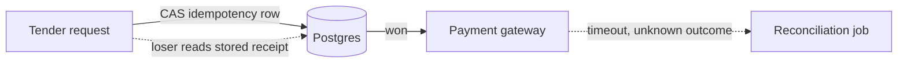

# Java concurrency and the memory model

A principal candidate treats concurrency as a correctness problem first and a throughput problem second. On a POS tender path, a double charge or a lost decrement is worse than a slower lock.

## Happens-before

The Java Memory Model does not promise that a write on thread A is visible to thread B unless a happens-before edge exists. Without that edge the compiler and CPU may keep the write in a register, reorder it, or leave it in a store buffer. The edges you use in application code:

- Program order in a single thread.
- A monitor unlock happens-before a later lock of the same monitor.
- A volatile write happens-before a later volatile read of that field.
- `Thread.start` happens-before the started thread's actions. A thread's actions happen-before `join` returns.
- A concurrent collection's atomic update happens-before a read that observes that update (the collection's specification).
- Transitivity: if A happens-before B and B happens-before C, A happens-before C.

`volatile` gives visibility and a limited ordering constraint. It does not make `count++` atomic: that is read, add, write. Two threads can lose updates. Use `AtomicInteger`, `LongAdder` (high contention, approximate structure of striped cells), or a lock around the compound action.

Safe publication: a non-volatile object is safely published if you publish it via a volatile or final field, a lock, a concurrent collection, or `static` initializer. `final` fields are safe after the constructor finishes, which is why immutable `Money` needs no lock to be shared. Publishing `this` before the constructor finishes (starting a thread, registering a listener) leaks a partially built object.

## Locks

`synchronized` is reentrant and ties the lock to the monitor of an object. Prefer a private final lock object over locking `this`, so callers cannot accidentally synchronize on your instance and deadlock. `ReentrantLock` adds `tryLock`, interruptible lock, and fairness (fairness costs throughput; use it only when starvation is a real bug). `ReadWriteLock` helps when reads dominate and the critical section is long enough to justify the extra atomics. A read-write lock around a nanosecond map get is slower than a `ConcurrentHashMap`.

```java
private final Object tenderLock = new Object();

public Receipt authorize(TenderCommand cmd) {
    synchronized (tenderLock) {
        if (attempts.containsKey(cmd.idempotencyKey())) {
            return attempts.get(cmd.idempotencyKey());
        }
        Receipt receipt = gateway.authorize(cmd);
        attempts.put(cmd.idempotencyKey(), receipt);
        return receipt;
    }
}
```

That snippet is correct and still the wrong production design if `gateway.authorize` is a remote call inside the lock. You hold the monitor across network I/O and stall every other tender on the JVM. Lock the check-and-mark of the idempotency key, do the I/O outside, and be ready for two calls to pass the check if you only used a plain map without an atomic `putIfAbsent`. The better local form is `ConcurrentHashMap.compute` or, across instances, a unique constraint plus an idempotency row in Oracle or Postgres.

Deadlock needs two locks and a cycle. Fix the order (always store lock then SKU lock), or use a single lock, or `tryLock` with a timeout and a defined abort. Lock ordering bugs do not show up in unit tests that take one lock.

## ConcurrentHashMap bin locking

Java 8+ `ConcurrentHashMap` synchronizes on the bin head for updates, and CAS-es a null bin to a new node. It is not a single global lock and it is not `Collections.synchronizedMap`. `synchronizedMap` serializes every method on one mutex and still leaves compound actions to the caller. CHM's `compute` / `merge` hold the bin lock for the duration of your function: keep that function in memory and free of blocking I/O. Size is maintained with `LongAdder`-style cells so writers do not bounce one cache line. Iterators are weakly consistent.

`Hashtable` and `Vector` are legacy synchronized collections. Do not bring them up except to say you would replace them.

## Executors and futures

Do not create a `new Thread` per POS request. Use an `ExecutorService` whose bound you can explain. A fixed pool caps concurrency. An unbounded `Executors.newCachedThreadPool` or an unbounded queue in front of a small pool will either explode thread count or pile memory in the queue during a price-check storm. For a mixed workload, separate pools: one for CPU pricing, one for blocking gateway calls, so a slow authorizer cannot occupy every carrier.

`CompletableFuture` chains are the Java 8/17 tool for fan-out (price, tax, loyalty) with an explicit executor. `thenApply` runs in the completing thread if the future is already done, which can be the gateway callback thread; do not block there. `thenApplyAsync` takes an executor. Always handle `exceptionally` or `handle`. A forgotten exceptional future is a swallowed tender failure. Timeouts: `orTimeout` (Java 9+) or a scheduled cancel. On Java 17, name the threads (`ThreadFactory`) so a Kibana or New Relic thread dump shows `tender-io-3` and not `pool-4-thread-9`.

```java
CompletableFuture<Price> price = CompletableFuture.supplyAsync(() -> prices.quote(sku), io);
CompletableFuture<Tax> tax = price.thenApplyAsync(p -> taxes.calculate(p), cpu);
return tax.orTimeout(200, TimeUnit.MILLISECONDS);
```

Cancellation does not stop a running JDBC call. It completes the future; the thread keeps going unless the task checks `Thread.interrupted` or the driver supports abort. Say that when asked "how do you time out a slow Oracle query."

## Atomics and stale reads

`AtomicReference.compareAndSet` is the building block for a lock-free state machine (tender: NEW -> AUTHORIZING -> AUTHORIZED). CAS fails when another thread won; retry or reload. ABA is rare in GC languages if the reference changes identity, and real if you reuse objects. `volatile` flag for "shutdown" is correct for a one-way publish. A volatile `Map` reference publish (copy-on-write replace) is a valid read-heavy price snapshot: writers build a new immutable map and swing the reference. Readers never lock. Writers must not mutate the published map.

## Virtual threads, as a Java 21 note

The resume target is Java 17. Virtual threads arrived as preview in 19/20 and as a platform feature in 21. They are cheap to block: the JVM mounts them on a small set of carrier threads. They do not make CPU-bound work faster, and they do not remove the need for pooling JDBC connections. Pinning (a virtual thread stuck on a carrier) happens inside `synchronized` and native calls on 21; later JDKs relaxed the `synchronized` case. For an interview: if the service moved to 21, blocking Feign or JDBC on virtual threads can replace a large platform thread pool, but HikariCP `maximumPoolSize` is still the real concurrency limit. Do not pool virtual threads.

## Principal versus mid-level

Mid-level: "`volatile` is for visibility, `synchronized` is for mutual exclusion." Principal: point at the happens-before edge, show a compound action that is still racy, refuse to hold a lock over the payment gateway, and separate in-JVM CHM from cross-instance idempotency. Mention thread-dump evidence (blocked on one monitor, or a pool exhausted by a downstream) as how you would confirm it in production.

## Failure modes

- Double-checked locking without `volatile` on the field (broken before a correct JMM publication).
- `synchronized` on a String literal or an autoboxed Integer (shared monitors, mysterious contention).
- `parallelStream` using the common `ForkJoinPool`, stalling unrelated parallel streams in the same JVM.
- Swallowing `InterruptedException` without restoring the interrupt flag, so a shutdown never lands.
- Assuming `ConcurrentHashMap.get` and a later `put` are one atomic reservation. They are not.



The reconciliation edge is async and mandatory whenever the gateway timeout leaves an unknown outcome. Retrying a capture blindly is how a POS double-charges. The loser path is a read of the stored receipt, not a second authorization.
