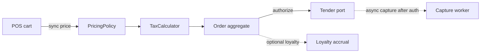

# Java language and OOP at principal depth

A principal interview does not ask you to recite the four pillars. It asks whether a domain model for a point-of-sale (POS) order stays correct when pricing, tax, tenders, and inventory reservations change independently, and whether `equals` / `hashCode` will corrupt a `HashMap` six months after the class is extended.

## Identity, state, and behavior

Every object has identity (reference), state (fields), and behavior (methods). `==` compares identity for reference types. `equals` compares value, but only if you define it. `String`, `Integer`, and the wrappers intern or cache some values; do not rely on `==` for boxed numbers outside the cached range (`Integer` caches -128 through 127 by default).

Fields are not polymorphic. If a superclass and subclass both declare `status`, the field that is read depends on the compile-time type of the reference. Methods are dispatched on the runtime type (invokevirtual / invokeinterface). Overload selection is compile-time. A classic bug is an overloaded `apply(Payment)` and `apply(CardPayment)` where the caller holds a `Payment` reference: the `Payment` overload runs even when the object is a `CardPayment`.

```java
public final class Money {
    private final long minorUnits;
    private final String currency; // ISO-4217, not a display symbol

    public Money(long minorUnits, String currency) {
        if (currency == null || currency.length() != 3) {
            throw new IllegalArgumentException("currency");
        }
        this.minorUnits = minorUnits;
        this.currency = currency;
    }

    public Money plus(Money other) {
        requireSameCurrency(other);
        return new Money(Math.addExact(minorUnits, other.minorUnits), currency);
    }

    public long minorUnits() { return minorUnits; }
    public String currency() { return currency; }
}
```

`Math.addExact` fails closed on overflow. Money in a POS cart is a value, so the type is `final`, fields are `final`, and arithmetic returns a new instance. Mutable `Money` with setters is how rounding bugs leak across threads and across the cart.

## Encapsulation that a team can keep

Encapsulation is not "make fields private and generate getters." It is keeping invariants in one place. A `OrderLine` that lets callers set `quantity` and `extendedPrice` independently will drift. Prefer methods that move the aggregate from one valid state to another: `changeQuantity(int qty)` recomputes the extension inside the object.

Package-private is a real access level. Domain types that must not be constructed by other modules can live in the same package as a factory, with a package-private constructor. On Java 17, a module boundary (`exports`) is stronger than package-private, but most Spring Boot services are still a single unnamed or lightly modular application. Do not pretend JPMS is your design unless you actually ship modules.

## Inheritance, composition, and LSP

Inheritance couples subclasses to the superclass's protected state and call sequence. The fragile-base-class problem shows up when someone adds a call to an overridable method inside a constructor or inside `setQuantity`. Constructors must not call overridable methods: the subclass fields are still at default values.

Liskov substitution is a behavioral contract, not a keyword. If `RefundTender.capture()` throws `UnsupportedOperationException`, callers written against `Tender` are wrong. Model the difference in the type system.

```java
public sealed interface TenderResult permits Authorized, Declined, RetryableFailure {
    String code();
}

public record Authorized(String authCode, String code) implements TenderResult {}
public record Declined(String code, String reason) implements TenderResult {}
public record RetryableFailure(String code, boolean safeToRetry) implements TenderResult {}
```

Records (standard since 16, normal in a Java 17 codebase) give you constructor, accessors, `equals`, `hashCode`, and `toString` for transparent carriers. Sealed types were finalized in Java 17: the compiler checks that a `switch` over `TenderResult` is exhaustive. That is the right tool for a closed payment outcome, not a boolean `success` plus a nullable reason string.

Prefer composition when behavior varies independently. Tax, discount, and loyalty accrual are strategies injected into pricing, not subclasses of `Order`.

```text
Order (aggregate)
  |-- lines: List<OrderLine>
  |-- pricing: PricingPolicy      (strategy)
  |-- tax: TaxCalculator          (strategy)
  '-- tenders: List<Tender>

Do not: class TaxFreeOrder extends Order extends AbstractOrder
```

## equals, hashCode, and collections

The contract: if `a.equals(b)` then `a.hashCode() == b.hashCode()`. The reverse is not required. `equals` must be reflexive, symmetric, transitive, and consistent, and must return false for null. Violating symmetry (`Order.equals(String)`) breaks `HashSet` and any library that assumes the contract.

Mutable keys are a failure mode. If you insert an entity into a `HashSet` and then change a field used by `hashCode`, the bucket is stale and `contains` returns false. Value objects used as map keys must be immutable. For JPA entities, do not implement `equals` on a generated id that is null before `persist`, and do not include lazy associations (they trigger loads and can stack-overflow through bidirectional cycles). A stable business key (`storeId` + `orderNumber`) is the usual choice once it is assigned.

`compareTo` must agree with `equals` if the objects go into a `TreeSet` or `TreeMap`. If two money amounts compare as 0 but `equals` is false, the set silently drops one.

## Interfaces, abstract classes, default methods

Use an interface for a role the caller depends on (`InventoryReservation`). Use an abstract class only when you share protected state and a template of calls. Default methods let you evolve an interface, but conflicts are real: if two interfaces provide the same default and a class implements both, the class must override. A class method beats a default method. Do not put mutable state in interfaces.

Checked exceptions are part of the signature. A principal candidate can defend a narrow checked exception at a port boundary (`ReservationRejected`) and unchecked exceptions for programmer errors. Blanket `throws Exception` erases that signal. Spring's transaction proxy rolls back on runtime exceptions by default and commits on checked exceptions unless `rollbackFor` says otherwise; that interaction belongs in the design of domain exceptions, not as an afterthought.

## What you say at principal level versus mid-level

Mid-level: "I use interfaces for loose coupling and override `equals` and `hashCode`." Principal: name the invariant, where it is enforced, what happens when a subclass or a new tender type appears, and which bugs you have seen (overload dispatch, broken equality in a set, constructor calling an override). Tie it to a POS line: quantity, unit price, and tax must change together, and a declined tender must not look like an authorized one to the order aggregate.

## Failure modes

- Anemic domain model: a `OrderService` of 2,000 lines mutates public setters. Rules duplicate in the API layer and a batch job.
- God aggregate: `Order` loads payments, shipments, and audit history. Keep the consistency boundary to what must commit together.
- `instanceof` ladders that a sealed type would close. Adding `WalletTender` should fail compilation in the switch, not fail in production as a missed branch.
- Leaking `java.util.Date` or a mutable array from an accessor. Return a defensive copy or an immutable list (`List.copyOf`).



The dotted capture path is eventual: authorization and basket persistence succeed before capture. The loyalty edge is optional and must not roll the tender back if the loyalty call fails. Say that out loud in an interview; it shows you separate the consistency boundary from side effects.
