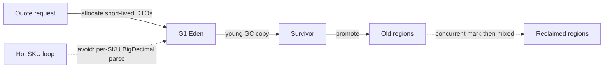

# JVM, GC, and performance for a POS service

Principal interviews move past "the heap is young and old." They ask which pause goal you have, what you would measure, and which allocation you would remove before you touch collector flags.

## What the JVM is doing

Bytecode is interpreted, then hot methods are compiled by C1 (client) and C2 (server). Tiered compilation is the default. Warm-up is real: the first minutes after a deploy on a fresh JVM are not your steady-state latency. Escape analysis can scalar-replace a short-lived object that does not escape a method, so a theoretical allocation may not show up. Do not count on it for a `Money` that you store on an `Order`.

Compressed ordinary object pointers (`UseCompressedOops`, default under about 32 GB heap) keep references at 4 bytes. Crossing the threshold widens references and can increase heap use and cache misses. Object header is mark word plus class pointer (compressed). An `ArrayList` of boxed `Integer` for quantities is header plus `Integer` object per value. Primitive collections or a plain `int[]` matter on a hot pricing loop; they do not matter on a once-per-request DTO.

```text
Java heap
  G1 regions (Eden, Survivor, Old, Humongous)
    [EE][EE][S][OO][H........][OO][EE]
Metaspace (class metadata, native)   Code cache (JIT)
Thread stacks (platform threads)     Direct buffers (Netty, JDBC)
```

Metaspace exhaustion is a classloader leak (redeploying in an app server, generating proxies without bound), not a heap leak. Direct `ByteBuffer` exhaustion shows up as native memory, outside `-Xmx`. A service that sets a 2 GB heap and ignores direct buffers plus thread stacks will be OOM-killed by the cgroup while the JVM still thinks it has heap.

## G1, practically

G1 is the default collector from Java 9 onward, including 17. The heap is divided into regions. Most allocations land in Eden. A young collection copies live objects to survivor (or promotes them). Concurrent marking finds live data in old regions. Mixed collections then reclaim old regions that are mostly garbage, alongside a young collection. You set a pause goal with `-XX:MaxGCPauseMillis` (default 200). G1 treats it as a goal, not a deadline. Humongous objects, larger than half a region, go to humongous regions and are collected differently; a large `byte[]` of a receipt image allocated on the request path creates humongous waste. Region size is ergonomic from heap size; forcing `-XX:G1HeapRegionSize` is a last resort.

G1 is the right default for an order API that can tolerate pauses of tens of milliseconds and wants throughput. It is the wrong place to start if you have not removed a per-request allocation storm.

## ZGC, practically

ZGC (production from 15, available on Java 17) targets very low pause times using colored pointers and load barriers. Most of the work is concurrent. Java 17 ZGC is single-generation: it works, but allocation rate hurts more than in generational ZGC, which arrived as a later JDK feature (generational mode became the default in the Java 21 line). ZGC wants headroom; if the heap is packed, you pay in allocation stalls instead of long pauses. Use it when the SLO is tail latency on a large heap (multi-gigabyte order history, in-memory price book) and you have CPU to spare for barriers. Do not enable it because a blog said "no pauses."

Shenandoah is the other low-pause concurrent collector. Know the name; do not pretend you tuned both in production if you have not.

## Reading a problem

Symptoms and the usual cause:

| Symptom | Look at |
| --- | --- |
| Pauses in GC logs, latency spikes | Pause time, heap occupancy at start of GC |
| CPU high, allocation rate high, pauses short | Too much garbage; fix code, not MaxGCPauseMillis |
| Full GC or to-space exhausted | Heap too small, leak, or humongous churn |
| RSS grows, heap stable | Direct buffers, threads, native JDBC, metaspace |
| Latency only after deploy | JIT warmup, cold caches |

Flags you should be able to justify on Java 17: `-Xms` equal to `-Xmx` for a service container so the heap does not resize, GC logging (`-Xlog:gc*`), and a heap dump on OOM. Avoid a suitcase of experimental flags you cannot explain. Container support is on by default in modern JDKs: the JVM sizes itself from cgroup limits. A mismatch between the Kubernetes limit and an old JDK that ignored cgroups is a classic "it OOMs at 25% of the node."

## Allocation and the POS path

The expensive pattern is allocating inside a loop that runs per SKU per quote: new `BigDecimal` with a string, new `SimpleDateFormat` (also not thread-safe), new `String` from concatenation in a log line that is disabled. `BigDecimal` is correct for money math when you already have a decimal quantity; `long` minor units are cheaper and exact for currency. `DateTimeFormatter` is immutable and shareable; `SimpleDateFormat` is not.

Logging at INFO with string concatenation on the tender path allocates even when you later filter in Kibana. Parameterized logging (`log.info("order {} store {}", id, store)`) skips the build when the level is off. JSON serialization of a fat entity graph (Hibernate proxies, lazy collections) allocates and can trigger N+1 queries during rendering. Map to a DTO before the serializer.

JDBC and HTTP clients allocate buffers. A blocked virtual or platform thread does not allocate much; a retry storm does. Connection pool exhaustion (HikariCP waiting on `connectionTimeout`) looks like a latency spike and is not a GC problem. Check pool metrics before you blame G1.

## Principal versus mid-level

Mid-level: "I would increase the heap and switch to G1." G1 is already the default. Principal: state the pause SLO, separate allocation rate from leak from native memory, name one object you would stop allocating, and say how you would prove it (GC log, a profiler allocation sample, New Relic transaction breakdown, heap dump dominator tree). Refuse to tune ZGC on a service whose p99 is a slow Oracle query.

## Failure modes

- Caching the world in a static `HashMap` "for performance" and calling the resulting full GCs a GC bug.
- `ParallelGC` threads on a small container stealing CPU from the single application core.
- Taking a heap dump on a large production pod during an incident without a plan for disk and pause. Prefer a histogram or a dump on one canary.
- Confusing safepoint time with GC time. A long safepoint can be a biased-lock revocation or a thread dump storm; on modern JDKs biased locking is off (removed after Java 15).



The dotted edge from the hot loop is the allocation you refuse to add. The dotted edge from old regions is concurrent and mixed collection, not a stop-the-world full compact on every request.
