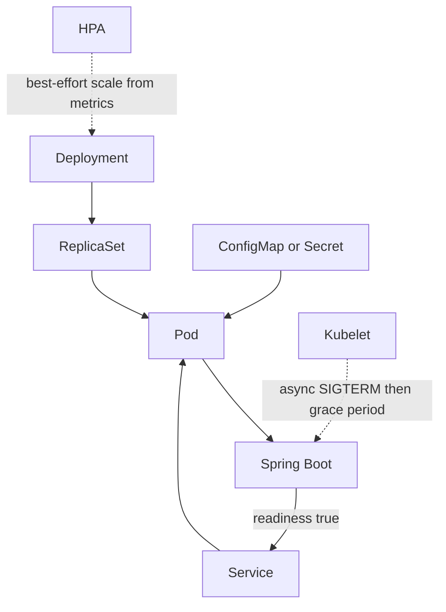

# Kubernetes core for a Java principal

Kubernetes is a control loop that tries to make the cluster match a declared desired state. You do not SSH in and start a JVM. You declare Pods, and controllers create, heal, and roll them. The interview is about those objects, the failure modes, and how a Spring Boot process should behave inside them.

## Pods, Deployments, and namespaces

A Pod is the smallest deployable unit: one or more containers that share a network namespace, localhost, and volumes. They are scheduled together and die together. Most services are one container per Pod. A second container is a sidecar (log shipper, proxy), not a hidden second product.

You rarely create Pods by hand. A Deployment owns a ReplicaSet, which owns Pods. You set a replica count and a Pod template. The Deployment controller replaces Pods when the template changes and can roll back to a previous revision. `RollingUpdate` uses `maxUnavailable` and `maxSurge` so capacity stays within bounds. `Recreate` tears the old Pods down first; avoid it for anything that must stay up.

A namespace is a naming and policy boundary: RBAC, resource quotas, network policy, and limit ranges apply per namespace. It is not a hard security boundary against a cluster-admin, and it is not a performance isolation domain by itself. Name namespaces after environments or platforms (`payments-prod`), and do not colocate unrelated tenants without policy.

Labels select. The Service, the Deployment, and network policy must agree on the same label selectors. A typo in a label is a production outage that looks like "the app is healthy but nobody can call it."

## Service, configuration, and probes

A Service gives a stable DNS name and a virtual IP in front of Pods that match its selector. Inside the cluster, callers use `http://orders.payments.svc.cluster.local`. Endpoints update as Pods pass readiness. kube-proxy or the dataplane implementation (iptables or IPVS on classic clusters, eBPF on some CNIs) programs that path. You do not hardcode Pod IPs.

ConfigMaps hold non-secret configuration. Secrets hold credentials. A Secret is not encryption by itself; values are base64-encoded in the API. Turn on encryption at rest for etcd, restrict RBAC, and prefer an external secret store with a short sync if the organization already has one. Mount config as files or environment variables. Twelve-factor apps read configuration from the environment. On Spring Boot, environment variables and `SPRING_APPLICATION_JSON` override `application.yml` packaged in the image. Do not bake environment-specific URLs into the image.

Probes tell the kubelet what "healthy" means:

- **Startup probe:** the process is still booting. While it fails, liveness is not evaluated. Use this for a JVM that spends time on classpath and connection pools, so a slow start is not killed.
- **Liveness:** the process is wedged and should be killed. Point it at a cheap actuator endpoint that does not call the database. A liveness check that depends on a downstream will restart every Pod when that downstream blips, and you will cause an outage loop.
- **Readiness:** the Pod should receive traffic. It may fail when the app is up but cannot serve yet (migrations still running, mandatory dependency down). Failing readiness removes the Pod from the Service. It does not restart it.

Spring Boot exposes `/actuator/health/liveness` and `/actuator/health/readiness` when probes are enabled. Wire kube probes to those paths, not to a full health group that fans out to every integration.

## Requests, limits, and the HPA

`requests` are what the scheduler uses to place the Pod and, for CPU, the share it is entitled to when the node is busy. `limits` are the ceiling. CPU limit enforces throttling: the container is paused until the next CFS period, latency spikes, and the process is otherwise "fine." Memory limit is different. Exceed it and the kubelet OOMKills the container. There is no throttle.

Size the JVM inside the limit, not equal to it. The container must fit heap, metaspace, thread stacks, code cache, direct byte buffers, and native memory from the client libraries. Setting `-Xmx` to the memory limit is a classic OOMKilled. Prefer a measured heap and a container limit with headroom, or a recent JVM that respects the cgroup limit via `MaxRAMPercentage` with that percentage left below 100 so non-heap has room. Watch container memory working set, not only heap from the actuator.

A HorizontalPodAutoscaler changes the Deployment replica count from a metric, often CPU utilization relative to request, or a custom metric such as consumer lag or HTTP in-flight. HPA cannot help a Pod that is memory-leaking; that needs a fix or a restart policy you understand. Set requests honestly. If requests are far below real usage, the scheduler overpacks the node and the HPA scales on a lie.

## Rollouts and graceful shutdown

A rollout creates new Pods, waits until they are Ready, then terminates old ones, within surge and unavailable limits. `kubectl rollout status` and `kubectl rollout undo` are the operational pair. If readiness never flips true, the rollout sticks. That is safer than shifting traffic to a broken version.

Termination: the Pod is removed from endpoints, the kubelet sends SIGTERM, waits `terminationGracePeriodSeconds`, then SIGKILL. Spring Boot should set `server.shutdown=graceful` so it stops accepting and drains in-flight requests, with `spring.lifecycle.timeout-per-shutdown-phase` comfortably under the grace period. A `preStop` hook that sleeps briefly covers the race where endpoints are not yet updated when SIGTERM arrives. Close Kafka consumers and RabbitMQ channels on the context shutdown hook so you leave the group or ack cleanly instead of waiting for session timeout.

The Deployment path is the desired state. Dotted edges are asynchronous or best-effort: shutdown is a signal the process must honor in time, and the autoscaler reacts to lagged metrics rather than to the request that is happening right now.

## What to say in an architecture review

State the replica count and why it survives a single node loss (pod anti-affinity or topology spread). State requests and limits and the heap math. State which probe hits which actuator group. State how config enters the process. State the drain behavior on deploy. Those five answers separate someone who has run Java on Kubernetes from someone who has only drawn a Pod.
