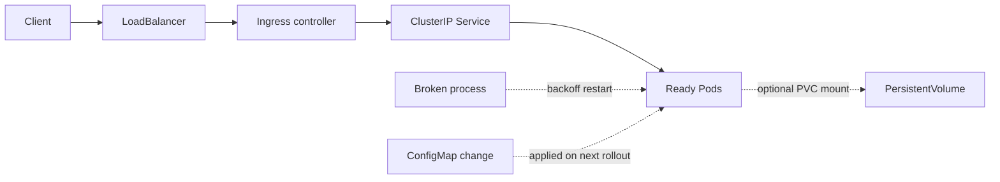

# Kubernetes networking and operations

Once Pods run, the questions that page people are traffic, storage, and crash loops. This note is the operational half: how a request reaches a Spring Boot process, where bytes live, and how you debug the Pod that will not stay up.

## ClusterIP, NodePort, and LoadBalancer

Every Service you create for east-west traffic should start as **ClusterIP**. It is reachable only from inside the cluster, on a virtual IP and a DNS name. That is the right exposure for orders calling inventory.

**NodePort** opens a high port on every node and forwards it to the Service. It is useful for a lab or a peculiar network where a cloud load balancer is unavailable. It is a weak production edge: you depend on node IPs, you punch a port range, and you bypass a cleaner ingress path.

**LoadBalancer** asks the platform to provision an external load balancer and to send it to NodePorts or directly to Pods, depending on the cloud controller. Use it for a few stable entry points, typically the ingress controller or a TCP service that is not HTTP. One LoadBalancer per microservice becomes expensive and spreads firewall rules.

An **Ingress** (or the newer Gateway API, if the platform has adopted it) is an HTTP and TLS routing table. Host and path rules choose a Service. An ingress controller (a real Deployment: NGINX, Envoy, a cloud controller) implements those rules. The Ingress object does nothing by itself. Terminate TLS at the ingress unless you have a measured reason to re-encrypt. Keep timeouts at the ingress aligned with the application's deadlines. A 60-second proxy idle timeout in front of a 10-second server timeout produces confusing client errors.

NetworkPolicy is the allow-list between namespaces. Default-deny, then permit the gateway to the BFF and the BFF to its upstreams. Labels do the selection. Without a policy, cluster networking is flat and any compromised Pod can open a TCP connection to any Service.

## Storage: PV and PVC

A container filesystem is ephemeral. `emptyDir` disappears with the Pod. That is correct for a scratch space and wrong for anything you must keep.

A PersistentVolume is a piece of storage the cluster knows about. A PersistentVolumeClaim is a request: size, access mode, and StorageClass. Dynamic provisioning creates the volume when the claim is bound. Access modes matter. `ReadWriteOnce` means one node mounts the volume read-write, which fits a single database Pod and does not fit a Deployment with two replicas writing the same disk. `ReadWriteMany` requires a storage system that actually supports it.

Do not put a primary database on a random claim without backup, snapshot class, and a restore drill. For most Spring services the disk you need is none: state lives in a database or a broker outside the replica set. Claims show up for caches that can be rebuilt and for legacy apps that write local files. `StatefulSet` gives stable identity and a claim template per ordinal. A Deployment with a single shared claim is the wrong tool when each replica must own its own volume.

## Requests, limits, and throttling in production

CPU request selects the node and sets the relative weight. CPU limit turns into CFS quota. A Java service under limit will show rising p99 while CPU metrics look "capped," and thread dumps look idle because threads are throttled, not blocked on locks. If the node has headroom and latency tracks the quota, raise or remove the CPU limit and keep the request so scheduling stays honest. Many production Java platforms run CPU requests without a tight CPU limit for this reason, and still set a memory limit so a leak cannot take the node.

Memory has no throttle. The OOM killer fires at the limit, often before the JVM heap is "full," because native memory counts. Read the previous container's termination reason: `OOMKilled` with exit 137. Fix the budget; do not only raise the limit forever.

A limit range and a resource quota on the namespace stop a team from scheduling unbounded Pods. Without requests, a Pod is BestEffort and is the first evicted when the node is under memory pressure.

## CrashLoopBackOff

`CrashLoopBackOff` means the container process exits, and the kubelet is waiting longer between restarts (backoff capped around five minutes). The Pod is not "stuck starting." It is crash, pause, crash.

Debug in this order. `kubectl describe pod` and read the Events: probe failures, image pull, failed mount. `kubectl logs pod --previous` shows the last crash, which is the one you need; the current logs may be empty if it dies during startup. Check the exit code. 137 often means OOM. A Spring process that prints `Application run failed` usually has a bad configuration key, an unreadable secret mount, or a flyway migration that throws. A process that never listens will fail readiness and, if liveness is pointed at the same port with no startup probe, get killed and then crash-loop.

Distinguish ImagePullBackOff (the image or the pull secret) from CrashLoop (the process ran and died). Distinguish a failing liveness probe on a live process from a process that exits. Restarting harder does not fix a missing environment variable.

## Twelve-factor config on a cluster

Build one image, promote it. Environment-specific data comes from ConfigMaps, Secrets, and the platform, not from a rebuild. Spring profiles may select a file inside the image for non-secret defaults, but URLs, pool sizes, and feature toggles that change per environment should be external. After you change a ConfigMap, a running process does not see environment variables refresh. Either mount the map as a file and reload, or roll the Deployment. Rolling is the predictable option for JVM flags and env vars.

Log to stdout. Let the node agent ship logs. Do not write a log file inside the container and forget to rotate it. Health, metrics, and traces leave through the actuator and the OpenTelemetry agent. Probes stay cheap.

Traffic to Ready Pods is the solid path. The volume is optional because most stateless Java services do not need one. Restart backoff and config pickup are dotted because they are asynchronous: a crashed process is not serving, and a ConfigMap edit does not change the JVM until something reloads or the Pod is replaced.
