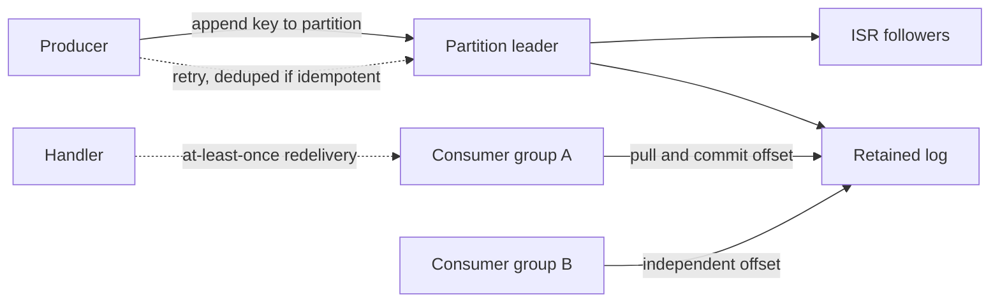

# Kafka for a principal architect

Kafka is a distributed commit log. Producers append records. Consumers read at their own pace. The broker retains the log whether or not anyone has read it. That single fact separates Kafka from a traditional message queue and drives ordering, replay, and failure design. Speak in those terms. Do not recite client method names you would have to look up.

## Topic, partition, offset, key

A topic is a named stream. It is split into partitions. Each partition is an ordered, append-only log. A record's offset is its position in that partition. Offsets increase. They are not reused. Order is guaranteed inside one partition, not across a topic. If you need global order, you have one partition, and you have given up throughput.

The record key decides the partition, typically by hash, so all records with the same key land on the same partition and stay ordered relative to each other. Keys are how you keep one account's debits ordered. A null key spreads records round-robin and gives you no per-entity order. Include a key on purpose. Do not use a key with so few distinct values that one partition becomes hot while others sit idle.

## Consumer groups

Consumers in one group split the partitions of the subscribed topics. One partition is assigned to at most one consumer in the group. Ten consumers and three partitions means seven consumers sit idle. A second consumer group reads the same log independently, with its own offsets. That is how analytics and the transactional path share a topic without competing.

The group commits offsets it has finished. Lag is the difference between the log end and the committed position. Lag is the metric you alert on, together with time lag, because a consumer stuck on a poison record shows lag even when CPU is idle. Rebalance runs when members join or leave, when partitions change, or when a member misses its heartbeat or poll interval. During a classic eager rebalance, members drop assignments and stop, then receive a new assignment. Cooperative incremental rebalance moves only the partitions that must move, which shortens the pause. A slow handler that does not poll in time looks like a dead member and triggers a rebalance storm. Bound the work between polls, or offload it with a queue you can still shut down cleanly.

## Replication, ISR, and acks

Each partition has a leader and followers. The replication factor is how many copies exist. Producers and consumers talk to the leader. Followers replicate. The in-sync replica set (ISR) is the leader plus followers that have caught up within the cluster's lag threshold. If the leader dies, a replica from the ISR is elected. `acks=0` does not wait. `acks=1` waits for the leader's local log. `acks=all` (or `-1`) waits for the full ISR. Pair `acks=all` with a minimum ISR of at least two if you want to survive a single broker loss without accepting a write that only one broker saw. A write can still fail, and the producer must retry. Those retries are why idempotence matters.

## Idempotent producers, transactions, and delivery

An idempotent producer attaches a producer id and a sequence number so the broker can drop duplicates caused by retries of the same producer session on a partition. It does not make a whole business action exactly-once. It stops double-appends when the producer times out after the broker already wrote the record.

Transactions let a producer commit or abort a batch of writes across partitions, and they can include the consumer-offset commit so a read-process-write between Kafka topics is atomic from the point of view of a consumer that uses read-committed isolation. That is the Kafka-to-Kafka case. A transaction does not enlist your Oracle database. Across Kafka and a database, use the outbox pattern: write the business row and the outbox row in one database transaction, and publish from the outbox. On the consumer side, at-least-once is the default you should design for. The handler will see duplicates and, if you commit before you finish, it can also lose work. Commit after a successful side effect, and make the side effect idempotent.

Effectively-once handling means the consumer stores the event id, or the business natural key, in the same database transaction as the mutation, with a unique constraint. A redelivery hits the constraint and does nothing. That is your tool for "exactly once" that finance will actually accept. Say effectively-once, and say which key makes the handler safe to retry.

## Retention, compaction, lag operations

Retention by time or size deletes old segments. The log is not a queue that empties when consumed. Compaction keeps the latest record per key and drops older ones, which fits a changelog of account state. Compaction does not preserve every event, and it does not promise a strict time bound the way a delete policy does. Use delete retention for an event stream and compaction for a snapshot-by-key.

Schema evolution belongs in a registry (Avro, Protobuf, or JSON Schema). Prefer backward-compatible changes: add optional fields, do not reuse field numbers, do not change a field's type. Consumers keep working on the new schema. Producers that must move first need forward compatibility. Agree the compatibility mode in the architecture review, not after the first broken consumer.

The append and the two independent groups are the core model. Dotted edges are the failure paths you still design for: a producer retry that may duplicate unless the producer is idempotent, and a consumer redelivery that is at-least-once until the handler itself rejects duplicates.
