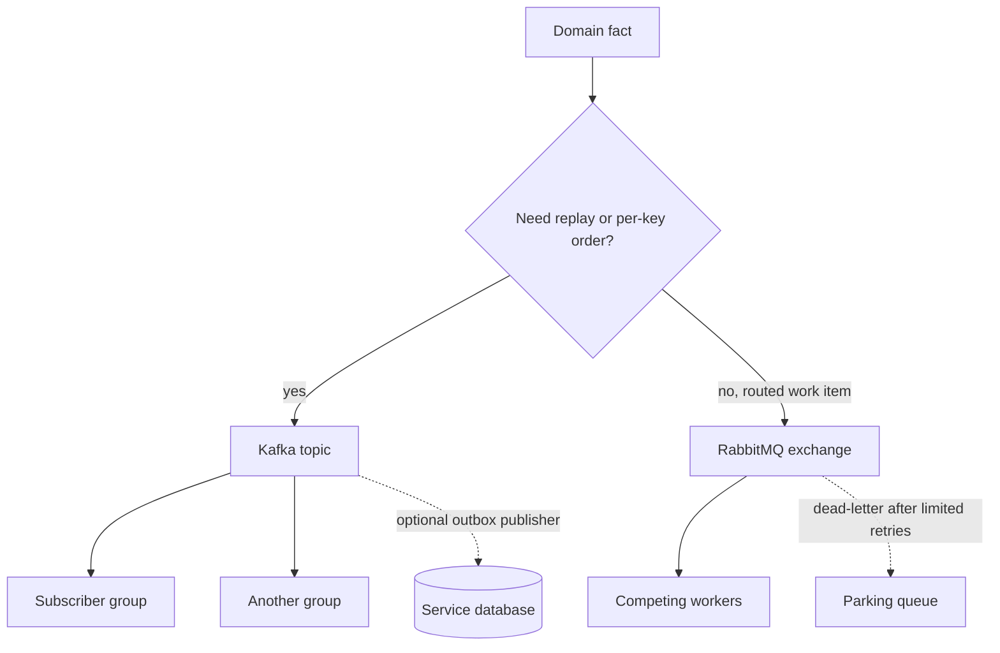

# Kafka and RabbitMQ: choosing and combining them

Teams get into trouble when they pick a broker by fashion. Kafka and RabbitMQ solve different problems well, and a platform often runs both. The architect's job is to name the job-to-be-done, the delivery guarantee you can actually keep, and the operational burden you accept.

## Two models

Kafka stores an ordered log per partition. Producers append. Consumers pull and remember an offset. Messages stay until retention or compaction removes them. Many independent consumer groups can read the same history. Replay is a first-class recovery tool.

RabbitMQ routes a message through an exchange into one or more queues and pushes it to a consumer. Acknowledgement deletes it from the queue. Competing consumers share work. Exchanges express routing. Replay is not a feature; if you need it, you archived the payload somewhere else.

Neither product gives you end-to-end exactly-once across a database by itself. Both can lose a message if you ack or commit too early, and both can deliver twice if you ack or commit after a crash window. Idempotent handlers are mandatory either way.

## Comparison that holds up in a design review

| Concern | Kafka | RabbitMQ |
| --- | --- | --- |
| Primary shape | Retained log | Routed queue |
| Who tracks progress | Consumer offset | Broker removes on ack |
| Ordering | Per partition, hence per key | Per queue only while a single consumer works it; prefetch and competing consumers break it |
| Routing | Topic name; consumers filter | Direct, topic, fanout, headers |
| Replay | Yes, within retention | No, unless you stored a copy |
| Scale-out of workers | Add consumers up to partition count | Add competing consumers on the queue |
| Backpressure | Consumers slow down; log grows; lag is visible | Prefetch bounds unacked work; queues grow; memory needs a policy |
| Poison message | Lag stalls a partition; skip or park with care | Nack to a dead-letter queue |
| Best fit | Event streams, changelog, many independent subscribers | Tasks, RPC-style work, selective routing, short-lived commands |

Throughput bragging is a weak argument. A well-run RabbitMQ cluster moves serious volume. Kafka's advantage is the log: sequential disk, batching, and many readers that do not multiply writes. RabbitMQ's advantage is the routing table and the ability to address one worker pool without standing up a new retained stream.

## Delivery, in one sentence each

Design Kafka consumers as at-least-once. Turn on an idempotent producer so retries do not append duplicates inside a producer session. Use transactions when the pipeline is Kafka-to-Kafka and consumers read committed. When the side effect is a database, use an outbox and a unique key on the consumer. Design RabbitMQ the same way on the handler: manual ack after commit, publisher confirms before you forget the message, prefetch set, dead-letter after limited retries.

"We set acks=all so it is exactly-once" is incorrect. `acks=all` raises the chance the log has the record on multiple brokers. It says nothing about the consumer applying the record once.

## Operational load

Kafka operations center on partition count (you cannot process one partition on two members of the same group), replication, ISR health, disk retention, and rebalance behavior. A hot key is an operational incident. Schema compatibility is part of the platform, not an application nicety.

RabbitMQ operations center on queue depth, unacked count, consumer utilization, disk or memory alarms, and whether queues are durable and replicated (quorum). A missing binding drops traffic even when publishers see a socket success, unless confirms and mandatory returns are on. A retry loop without TTL can melt a CPU.

Run both only with a clear rule. For example: domain events that more than one context stores go to Kafka; user-driven jobs with a callback and a dead-letter desk go to RabbitMQ. Do not publish the same business fact to both "to be safe" without an owner for each path. Dual writes without an outbox will diverge.

## A decision you can defend

Ask four questions.

1. Do subscribers need to join later and read history? If yes, Kafka.
2. Do you need pattern routing or a true work queue that drains? If yes, and you do not need replay, RabbitMQ.
3. Is order required per business key at high parallelism? Kafka partitioning fits. RabbitMQ needs a careful single-active consumer story you should not invent casually.
4. What is the poison-message path? Parking lot and lag alert, named in the design, with an idempotency key in the payload.

If the answer is "we might need both later," start with the one that matches today's failure story. Migrating a retained log into a queue later throws away the property you paid for. Wrapping RabbitMQ to pretend it is Kafka, or putting a queue semantic on a compacted topic, produces a system nobody can reason about on call.

The choice is explicit. Dotted edges are the paths that are easy to forget and optional only in the sense that a happy diagram omits them: the transactional outbox that avoids a dual write, and the parking queue that takes poison messages off the hot path.
