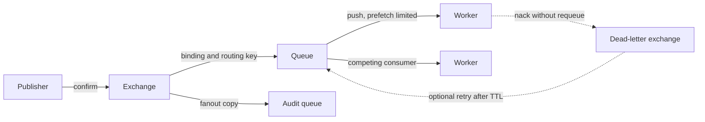

# RabbitMQ for a principal architect

RabbitMQ is a broker that accepts a message, routes it through an exchange, stores it in a queue, and pushes it to a consumer. Once the consumer acknowledges, the broker deletes it. There is no retained log to rewind. Routing is the feature. Your job is to pick an exchange type, make failure visible, and keep consumers from being buried under unacked work.

## Exchanges, queues, bindings, routing keys

The producer publishes to an **exchange**, not directly to a queue (the default exchange is a convenience that uses the queue name as the routing key). A **binding** ties an exchange to a queue, optionally with a routing key or header match. The queue is the buffer consumers read from.

- **Direct:** the routing key equals the binding key. Use it for targeted work: `payments.capture` lands in the capture queue.
- **Topic:** the routing key is a dot-separated name. `*` matches one word, `#` matches zero or more. `order.*` matches `order.created` and not `order.created.eu`. Use topic when subscribers own a pattern and you do not want a new queue binding style for every event name.
- **Fanout:** every bound queue gets a copy. Use it for true broadcast. Routing keys are ignored.
- **Headers:** match on header values instead of a routing key. `x-match` = `all` or `any`. It is flexible and harder to operate, because the routing table is invisible unless you inspect bindings. Prefer topic unless the selector really is a set of attributes.

Competing consumers are multiple consumers on one queue. The broker delivers each message to one of them. That is how you scale workers. Order is not preserved once two consumers run, and even one consumer with a prefetch above one can complete work out of order. If you need per-entity order, you need a design that pins that entity to one active worker, which RabbitMQ does not give you as cleanly as a Kafka partition key. Say so, and do not promise global order.

## Ack, nack, prefetch

Auto-ack removes the message when it is sent to the client. If the worker dies mid-handler, the message is gone. Use manual acknowledgement. Ack after the side effect commits. `basic.nack` or `basic.reject` with `requeue=true` puts the message back; with `requeue=false` it is dropped or dead-lettered. Requeue-on-failure without a delay spins a poison message at full speed. Cap retries, then dead-letter.

Prefetch (QoS) is the maximum number of unacked messages a consumer may hold. Prefetch of unlimited (or a huge number) lets a fast broker dump the queue onto one consumer, which then looks busy while others idle, and a crash redelivers a huge set. Set prefetch to what one instance can process before it acks. This is the main fairness and overload control on a work queue.

## Publisher confirms, mandatory, and durability

A publisher confirm is the broker's promise that it took responsibility for the message (it was routed to a queue, and if the queue is durable and the message persistent, that it was handled under the broker's durability rules). Wait for the confirm before you consider the send done. Publishing into the void and hoping is how you lose payments at the edge.

A mandatory message that matches no queue is returned to the publisher. Treat that return as a defect in bindings, not as a retry. Durability has three layers: durable exchange, durable queue, and persistent messages. Restart survival needs all three. Mirrored or quorum queues are how the message survives a node loss; a durable queue on one node does not. For new work, prefer quorum queues when the platform's RabbitMQ version supports them, and understand they trade some latency for a Raft majority. If you are unsure of the cluster's version, describe the requirement (survive one node, no silent loss) rather than inventing a flag.

## TTL and dead letters

Message TTL and queue TTL expire messages. Expiry, rejection without requeue, and queue length limits can dead-letter. A dead-letter exchange receives those messages with headers that explain why. Bind a retry queue or a parking-lot queue there. A practical pattern: main queue, on failure nack without requeue, dead-letter to a retry exchange that waits (TTL) and routes back, with a death count header. After N deaths, route to a parking queue that alerts a human. Do not retry forever.

## Honest contrast with Kafka

RabbitMQ is the better fit for task distribution with rich routing, per-message ack, and a queue that drains. Kafka is the better fit for a retained, replayable log, high fan-in throughput, and ordered processing per key. RabbitMQ consumers do not rewind to yesterday; you would have had to archive elsewhere. Kafka does not natively route one event to a pattern of queues with topic exchanges; consumers filter or you use separate topics. Using RabbitMQ as an event log, or Kafka as a tiny RPC work queue, fights the tool. Latency-sensitive command handoff between a handful of workers is a RabbitMQ conversation. A stream of order facts that billing, fraud, and warehouse all store at their own speed is a Kafka conversation.

Confirms and bindings are the reliable path. The dotted edges are the failure path: a nack is a deliberate drop from the main queue, and the retry hop is optional and delayed, not a second copy of the happy path.
