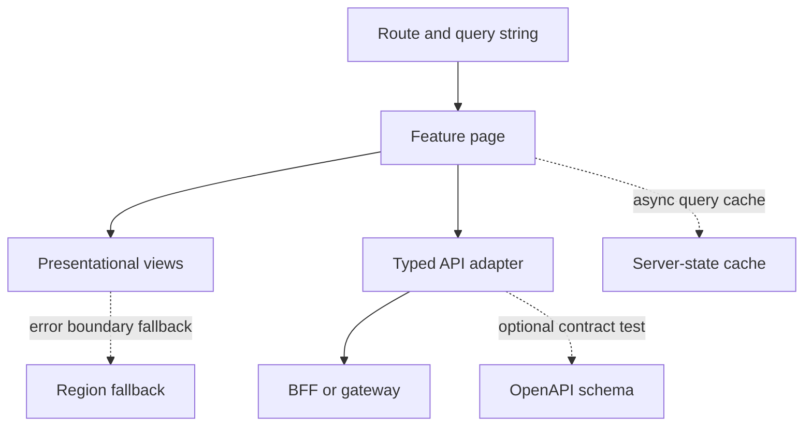

# React architecture for a tech lead

A principal does not win a React interview by reciting hook names. You win it by showing how the UI module fits the system: boundaries, ownership, failure, and how a team changes the screen without breaking the contract. This note is the operating model, assuming you can already read a component.

## Module boundaries

Slice the frontend by business capability, aligned with the backend bounded context, not by technical type. `orders/`, `billing/`, and `identity/` each own their pages, feature components, and API adapter. A shared `design-system/` holds buttons, focus traps, and tokens. A shared `http/` holds the client, correlation-id header, and error mapping. Feature folders do not import each other's internals. They talk through a small public index or through the URL. That rule is the frontend version of not reaching into another service's database.

The route map is the public API of the SPA. Deep links must open the same screen a refresh would open. If a filter exists only in memory, a pasted link lies. Put shareable state in the query string. Put secrets nowhere in the URL.

## Container, view, and adapter

Keep a thin adapter that speaks HTTP and returns typed domain objects. The page component decides which queries to run and which commands to send. Presentational components receive data and callbacks and contain no fetch calls. This split is composition, not a mandate to wrap every button in three files. It exists so you can test the view with plain props and test the adapter against a recorded OpenAPI example.

Map backend errors at the adapter. A 409 with a problem+json body becomes a typed `ConflictError` the form can attach to a field. Do not let raw Axios-shaped objects leak into JSX. Your Spring services already use a consistent error model; the client should switch on that model once.

## Composition over inheritance

Older Angular and desktop UI habits reach for a base page class: shared init, shared auth check, shared spinner. In React, a base class fights hooks and hides data flow. Share behavior with hooks (`usePagedQuery`, `useConfirmDialog`) and share structure by passing children. A layout route renders the shell and an `<Outlet />` for the child route. A table component accepts a row renderer. Special cases stay at the edge as wrappers, not as overrides of protected methods.

When a hook's dependency list becomes a grab bag of unrelated concerns, the component is doing two jobs. Split it. The senior signal is a smaller component with a name that matches a use case, not a 800-line screen with twenty effects.

## Cross-cutting concerns you own

**Authentication gate.** A route guard checks a session endpoint or an in-memory user query. It does not decode a JWT in the browser and trust the roles. The API enforces authorization again.

**Correlation.** Generate or forward a request id on every call so a user screenshot lines up with gateway logs. Surface a short reference in the error fallback.

**Release.** The SPA is a static asset with cache headers. `index.html` must not be cached for long, or clients will keep a shell that points at deleted hashed chunks. Hashed JS and CSS can be immutable. Coordinate that with the ingress or CDN. A feature flag evaluated at the BFF lets you ship a dark route without a flag service embedded in the bundle.

**Testing.** Test behavior: the user filters, the right request leaves, the empty state shows, the error alert is focusable. A snapshot of a 400-line tree catches nothing you care about. Contract-test the adapter against the OpenAPI schema in CI. End-to-end tests cover one happy path and one auth failure per critical journey, not every checkbox.

## Failure and degradation

Design each region to fail independently. An error boundary around the orders table should not take down the shell navigation. If recommendations time out, the order still submits. Timeouts on the BFF should be shorter than the user's patience and shorter than the downstream deadline budget you already use between Java services.

Idempotency keys on payments and other commands belong in the client as a key created when the user starts the action, then reused on retry. A new key per HTTP retry creates double charges. Disable the button while the mutation is in flight, and still make the server idempotent. The UI is not the consistency boundary.

## Review standard for your team

Reject a pull request that fetches inside render, uses index keys on a reorderable list, stores a refresh token in `localStorage`, or duplicates a DTO by hand next to a generated client. Require an empty state, an error state, and a label on every new control. Require the OpenAPI change in the same pull request as the screen, or a linked contract PR that merges first. Ask who owns the feature folder in six months. Architecture is that answer, kept boring on purpose.

The page depends on the route and the adapter on purpose. The cache, the schema check, and the region fallback are dotted because they are best-effort or optional relative to the command path: the cache may be cold, the contract test runs in CI rather than in the browser, and the fallback renders only when the child tree throws.
