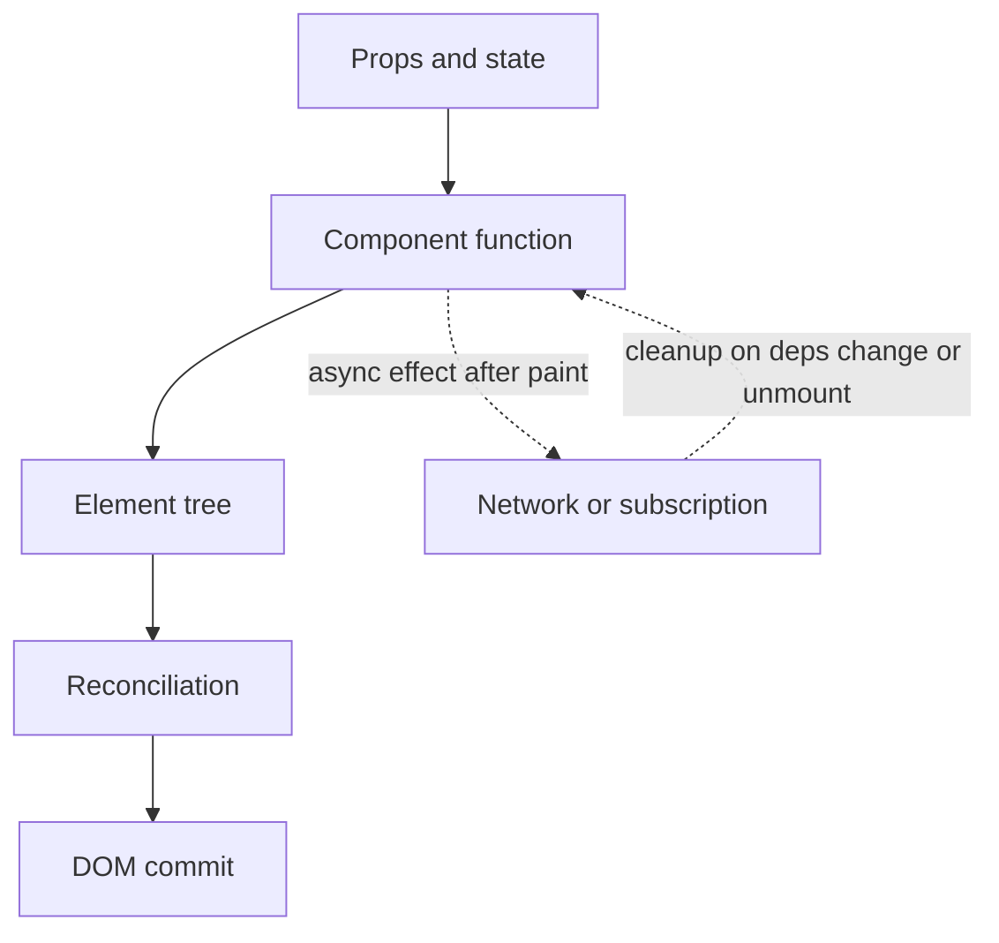

# React fundamentals for a backend lead

You already know how to structure a service, a contract, and a failure mode. React is the UI runtime that turns those contracts into a screen. Treat a React tree as a function of inputs: given props and state, a component returns a description of the UI. React calls that function, diffs the result against the last description, and updates the DOM. Application code does not reach into the DOM to change text on every click.

## Components, JSX, props, and state

A component is a function (or, rarely in modern code, a class) that returns React elements. JSX is syntax that compiles to `createElement` calls. It is not HTML. `class` becomes `className`, comments are JavaScript comments, and event names are camelCase (`onClick`). A component name must start with a capital letter so React treats it as a component rather than an intrinsic DOM tag such as `div`.

Props are the inputs a parent passes. They are read-only for the child. State is data the component owns that can change over time. Calling a state setter schedules a new render. It does not mutate the variables from the render that is already on screen. When the next value depends on the previous one, use the functional updater so a burst of clicks does not close over a stale snapshot.

```tsx
type OrderBadgeProps = { status: "OPEN" | "PAID"; count: number };

export function OrderBadge({ status, count }: OrderBadgeProps) {
  return (
    <span className={`badge badge-${status.toLowerCase()}`}>
      {status} ({count})
    </span>
  );
}
```

Lift state when two siblings must stay in sync, the same way you would not hide a shared fact inside one microservice and hope the other guesses it. Keep state local when only one subtree reads it. Derive values during render when they are a pure function of props or state. Copying a prop into state with an effect is a common source of bugs, because the copy goes stale.

## Rendering and reconciliation

Each render produces an element tree: plain objects describing type, props, and children. Reconciliation walks the new tree against the previous one. If a node keeps the same type at the same position, React updates the existing DOM node. If the type changes, React unmounts the old subtree and mounts a new one, which resets state inside it. That is why swapping a component type, or changing a `key` on a parent, is a deliberate reset.

Lists need a stable `key` so React can match identity across renders. A persistent id from the API is the right key. The array index is a poor key when rows are inserted, removed, or reordered, because component state (including an input's value) stays attached to the position, not the business entity.

```tsx
{orders.map((order) => (
  <OrderRow key={order.id} order={order} />
))}
```

Keys only need to be unique among siblings. They are not global ids, and they are not passed as a prop unless you also declare `key` as your own prop, which you should not.

## Hooks you will see in every review

`useState` stores a value and a setter. `useEffect` runs after the browser paints. Use it to synchronize React with something outside React: a network request, a subscription, a timer, or a non-React widget. Return a cleanup function. Declare every reactive value the effect reads as a dependency. An empty dependency array means "subscribe on mount, clean up on unmount." The linter rule for dependencies is there because a missing dependency is a stale-closure bug, the frontend cousin of reading a shared field without a memory barrier.

`useRef` holds a mutable box. Writing `ref.current` does not schedule a render. Use it for a DOM node, a timer id, an `AbortController`, or the previous props when you truly need them. Do not read a ref during render to derive UI that should be state.

`useMemo` caches a calculated value between renders. `useCallback` caches a function identity. Both exist so an expensive calculation can be skipped, or so a child that is wrapped in `memo` can bail out when its props are unchanged. They are not a house style. A memoized callback whose dependencies change every render buys nothing and hides the real data flow.

```tsx
function SearchBox() {
  const [q, setQ] = useState("");

  useEffect(() => {
    const ctrl = new AbortController();
    const timer = setTimeout(() => {
      fetch(`/api/orders?q=${encodeURIComponent(q)}`, { signal: ctrl.signal })
        .catch((err: unknown) => {
          if (err instanceof DOMException && err.name === "AbortError") return;
        });
    }, 300);
    return () => {
      clearTimeout(timer);
      ctrl.abort();
    };
  }, [q]);

  return (
    <input
      value={q}
      onChange={(e) => setQ(e.target.value)}
      aria-label="Search orders"
    />
  );
}
```

The input is controlled: React state is the source of truth, and the DOM value follows it. An uncontrolled input keeps the value in the DOM and is read through a ref on submit. Prefer controlled inputs when you validate as the user types, disable a submit button, or mirror the value into the URL. Give every input a label.

## Context, data fetching, and errors

Context sends a value through a subtree without threading props at every level. It fits theme, locale, and the signed-in principal. It is a poor cache for server data, because a new context value rerenders every consumer. Split a frequently changing value from a stable one. If you pass an object as the provider value, memoize that object or you will rerender consumers on every parent render.

Model four outcomes for any remote read: loading, empty, success, and error. A slow response for query A must not overwrite the screen for a newer query B. `AbortController`, or a monotonically increasing request id, closes that race. Show the empty state as a real state, not as a blank table. Your backend already distinguishes 204, an empty page, and 500; the UI should too.

An error boundary is a class component with `static getDerivedStateFromError` and, if you need logging, `componentDidCatch`. It catches render and lifecycle failures in its children and renders a fallback. It does not catch errors in event handlers, timers, or async work, and it does not catch errors thrown in the boundary itself. Handle those at the call site, and attach the same correlation id you already send on API calls so a UI failure joins the backend trace.

```tsx
class OrdersErrorBoundary extends React.Component<
  { children: React.ReactNode },
  { failed: boolean }
> {
  state = { failed: false };
  static getDerivedStateFromError() {
    return { failed: true };
  }
  render() {
    if (this.state.failed) return <p role="alert">Orders failed to render.</p>;
    return this.props.children;
  }
}
```

## Accessibility is part of the contract

Use a `button` for actions and an `a` for navigation. Associate each control with a `<label htmlFor=...>` or an `aria-label`. Do not communicate status by color alone. When a dialog opens, move focus into it and return focus to the trigger on close. A `div` with `onClick` is skipped by keyboard users unless you add a role, a tab stop, and key handling. The native element is shorter and correct. Headings should follow the page outline, and images that carry meaning need alternative text.

## How a backend lead reviews a React pull request

Read the diff the way you read a controller. Does the client call the endpoint you published, with the same field names, enums, and error body? Are row keys stable ids? Do effects return a cleanup? Is there a loading and an error path, or only the happy render? Can a double-click submit the form twice? Would the component still be honest if the API returned an empty list or a 409? Are tokens or environment-specific secrets present in source that ships to the browser?



The solid path is synchronous and must stay pure. The dotted edges are the async boundary: effects run after paint, and cleanup is best-effort cancellation when the user has already moved on. Side effects belong in effects, event handlers, or a data library, not in the render body.
