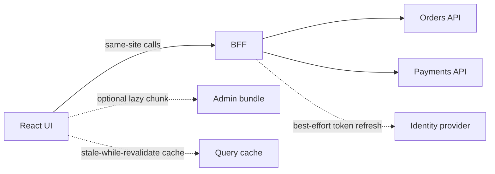

# React state, performance, and the boundary with the backend

A slow React screen is usually a data-flow problem, not a missing `useMemo`. As a principal, you are accountable for where state lives, which contract the UI is allowed to assume, and which secrets never enter the browser bundle. Performance work starts by naming the kind of state, then measuring, then changing the structure.

## What actually causes a rerender

A function component runs again when its own state updates, when its parent renders it and it is not skipping that render, or when a context it consumes changes. A parent render does not mean the DOM writes every child from scratch. React still reconciles. It does mean the child function executes, and any work inside it runs again.

Three patterns cause wasted work. First, state is stored too high, so a keystroke in a search box rerenders a large page. Second, a context value is a new object every render, so every consumer rerenders even when the meaningful fields did not change. Third, an effect writes state on every pass and retriggers itself. Colocate state with the components that need it. Split contexts. Keep render pure.

`React.memo` skips a rerender when props are shallowly equal. It helps a heavy child whose parent renders often for unrelated reasons. It does nothing if the parent passes a fresh object, array, or inline function each time. `useCallback` and `useMemo` exist to keep those identities stable when a memoized child or a dependency list needs it. Wrapping every callback by default adds noise and can retain stale closures if dependencies are wrong. Measure with the React profiler before you sprinkle memo. Premature memo is the same mistake as caching a repository call that was never on the flame graph.

## Server state and client state

Client state is the UI's own facts: which panel is open, the draft text that has not been submitted, the selected tab. Server state is a cache of someone else's facts: orders, prices, entitlements. Mixing them in one `useState` plus `useEffect` tends to omit caching, retries, deduplication, and invalidation.

A server-state library such as TanStack Query (often called React Query) treats a query key as the cache address. Components subscribe to that key. The library dedupes in-flight requests, keeps previous data while a refetch runs, and exposes `isPending`, `isError`, and `data`. After a mutation, you invalidate the keys the command affected, the same way you would evict a cache entry after a write. The server remains the source of truth. The cache is allowed to be stale for a defined time.

Keep the mutation's optimistic update narrow and reversible. If the POST fails, roll the cache back. Do not invent a second source of truth in context "so the header updates." Put the header on the same query key.

```tsx
const orders = useQuery({
  queryKey: ["orders", statusFilter],
  queryFn: () => api.listOrders(statusFilter),
});
```

Lifting state is still correct for shared client state, such as a wizard step that two panels edit. Do not lift server payloads to a top-level context just to avoid prop passing. Prop drilling of a stable id through two layers is cheaper and clearer than a global store. Composition (children, slots, and small components) replaces the inheritance hierarchies you may remember from older UI frameworks. React has no component base class you are meant to extend. A specialized screen composes a table, a filter, and a dialog.

## Code splitting and long lists

Route-level `React.lazy` and `Suspense` keep the admin bundle out of the customer shell. Split on routes and on heavy, rarely opened panels. Splitting every component creates a waterfall of tiny requests. Name the fallback so the user sees a stable loading region, not a blank page.

Virtualize a list when you actually render hundreds or thousands of rows at once. Libraries such as `react-window` or `react-virtual` mount only the visible window plus a small overscan. Virtualization is unnecessary for a page of twenty orders, and it complicates accessibility and variable row heights. Paginate or cursor-fetch from the API first. A principal should push back on a UI that downloads an entire ledger to filter it in the browser.

## BFF, OpenAPI, and tokens

The browser should speak to a backend-for-frontend or a gateway shaped for the screen, not fan out to every internal microservice. The BFF aggregates, applies the user's authorization, and returns a DTO the page can render without joining five payloads. That also gives you one place for timeouts, circuit breaking, and audit.

Publish the contract as OpenAPI. Generate the TypeScript client from that spec in CI so the UI build fails when a field is renamed. Hand-written interfaces drift, and the drift shows up as `undefined` in production. Treat the spec as you treat an Avro or Protobuf schema: additive changes, explicit deprecation, no silent type changes.

Authentication for a browser app should assume the bundle is public. Do not embed client secrets, signing keys, or long-lived tokens in source, `.env` files that Vite or webpack inline, or `localStorage`. A solid shape is an authorization-code flow with PKCE, where the BFF holds the refresh token in an `HttpOnly`, `Secure`, `SameSite` cookie and the browser calls the BFF on the same site. The access token then stays on the server side of the BFF, or lives only in memory for a short public-client case. XSS must not be able to read a refresh token. CSRF still matters for cookie sessions; use SameSite and an anti-CSRF control on state-changing routes. Authorization decisions remain on the server. Hiding a button is not access control.



Solid edges are the request path the screen needs. Dotted edges are optional or best-effort: a lazy chunk that may never load, a client cache that can be discarded, and a token refresh that must fail closed if the identity provider is unreachable.

## What you ask for in a design review

Ask which state is server-owned and which is draft UI. Ask what the query keys are and which mutation invalidates them. Ask for the OpenAPI diff, not a screenshot. Ask where the refresh token lives. Ask what happens on 401, 409, and a slow 200. Ask whether the list is paginated at the source. Memo and virtualization come after those answers, and only when a profile or a real row count says they pay for themselves.
