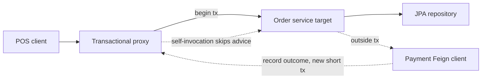

# Spring Boot core: container, proxies, transactions

Spring Boot is a composition of a bean container, an AOP proxy mechanism, and auto-configuration. Principal interviews probe whether you know which object is actually called at runtime.

## Container and bean lifecycle

The `ApplicationContext` loads definitions, instantiates beans, injects dependencies, and calls lifecycle callbacks. Constructor injection makes the dependency required and the field final. Field injection hides the dependency from unit tests and allows circular construction to limp along. A cycle is a design smell: `OrderService` and `InventoryService` calling each other means the boundary is wrong. Break it with an event or a third orchestrator.

Singleton scope is one instance per context, not one instance per JVM if tests load two contexts. The singleton is stateless or holds thread-safe state. A request-scoped cart bean exists, but putting domain state in a `Request` scope and also in the database will drift. Prototype scope gives a new instance per lookup, not per injection into a singleton: the singleton has already been injected once. Use `ObjectProvider<T>` when a singleton must ask for a new prototype.

Lifecycle: constructor, `@PostConstruct` or `InitializingBean`, ready, then `@PreDestroy` on shutdown. Do not call a remote system in a constructor. A `@PostConstruct` that fails stops startup; that is what you want for a missing required key, and not what you want for an optional loyalty endpoint. Configuration belongs in `@ConfigurationProperties` with validation (`@Validated` plus `@NotBlank`), not scattered `@Value` strings that fail on first request.

```java
@ConfigurationProperties(prefix = "pos.pricing")
public class PricingProperties {
    private Duration quoteTimeout = Duration.ofMillis(200);
    private int maxLines = 200;
    // getters and setters, or a Java 16+ record bound via a constructor
}
```

Boot auto-configuration is conditional (`@ConditionalOnClass`, `@ConditionalOnProperty`). You exclude what you do not run (`@SpringBootApplication(exclude = ...)`) rather than fighting a bean that started because a jar was on the classpath. Profiles (`application-local.yml`) select beans. A profile that changes transaction semantics between local and production is a defect.

## Proxies and self-invocation

`@Transactional`, `@Cacheable`, and `@Async` are implemented with proxies (JDK dynamic proxy if the bean is injected as an interface, CGLIB subclass if it is a class). The proxy is the object in the container. The target is the object inside. Container callers hit the proxy, so the advice runs. The target calling its own method uses `this.method()`, which does not pass the proxy, so the advice does not run.

```java
public void checkout(CheckoutCommand cmd) {
    // self-invocation: reserve's @Transactional is ignored
    reserve(cmd);
}

@Transactional
public void reserve(CheckoutCommand cmd) {
    repository.save(cmd.toReservation());
}
```

Fixes: move `reserve` to another bean (the clean design), inject a self reference through the container (works, easy to misuse), or `AopContext.currentProxy()` with `exposeProxy` (framework plumbing leaking into the domain). AspectJ compile-time or load-time weaving would advise `this`, at a build-tool cost most Boot services do not pay. In an interview, draw the proxy and say you would split the bean.

The same trap hits `@Cacheable` on a private method (the proxy cannot override it) and on a `final` method (CGLIB cannot override it). JDK proxies only advise interface methods. If you inject the concrete class, you may get CGLIB. If you inject the interface, you get a JDK proxy. Behavior of self-invocation is the same: internal calls skip advice.

## Transactions and rollback rules

`@Transactional` starts a transaction at the proxy boundary, binds it to the thread (`TransactionSynchronizationManager`), and commits or rolls back when the method returns. Default rollback is for `RuntimeException` and `Error` only. A checked exception commits unless you set `rollbackFor = Exception.class` or a specific type. That default surprises people who throw `InsufficientStockException extends Exception` and watch the reservation row commit.

```java
@Transactional(rollbackFor = ReservationException.class)
public Reservation reserve(String sku, int qty) throws ReservationException {
    if (onHand.get(sku) < qty) {
        throw new ReservationException(sku); // checked; rollback only because of rollbackFor
    }
    return repository.save(new Reservation(sku, qty));
}
```

Catching the exception inside the transactional method and not rethrowing means the proxy sees a normal return and commits. Marking the transaction rollback-only (`setRollbackOnly`) is the explicit form when you must catch and still roll back.

Propagation: `REQUIRED` (default) joins the caller's transaction or creates one. `REQUIRES_NEW` suspends the outer transaction and commits the inner one independently. That is how you persist an audit or a payment attempt even if the order rolls back, and it needs a second connection from HikariCP. `NESTED` uses a savepoint on some databases and is not a new transaction. `SUPPORTS` joins if present. Self-invocation skips all of these.

Read-only transactions (`readOnly = true`) hint Hibernate to skip dirty checking and some JDBC drivers to use a read connection. They are not a security boundary. Isolation: the database default is often Read Committed (Postgres, Oracle). `REPEATABLE_READ` or a version column is an application choice for a lost update, not something you set globally on every repository method.

Transaction boundary equals consistency boundary. Do not hold a transaction open across a Feign call to the payment gateway or Apigee. You pin a Hikari connection and a database session for the whole network timeout. Load, decide, call the gateway outside, then open a short transaction to record the outcome. If the process dies after the gateway succeeds and before the record, reconciliation owns that gap. Pretending one `@Transactional` method makes that atomic is the mid-level mistake.

## HikariCP

Boot uses HikariCP. `maximumPoolSize` is per instance. Ten pods times a pool of 20 is 200 sessions against Oracle or Postgres, plus admin and batch. Size the pool from the database's session limit and the query latency, not from a desire for more threads. `connectionTimeout` is how long a request waits for a connection before an exception (this is a latency SLO). `maxLifetime` should be shorter than the database or firewall idle cut so the pool retires sockets first. `leakDetectionThreshold` logs a stack when a connection is held too long; that is how you catch a transaction wrapped around a remote call. `minimumIdle` equal to max avoids connection creation spikes and is reasonable for a steady POS API.

## Auto-config you should be able to trace

A failing `DataSource` health check, a second `DataSource` for reporting, and `@Transactional` on the wrong transaction manager are routine production bugs. If two data sources exist, name the transaction manager and point `@Transactional(transactionManager = "orderTx")` at it. Otherwise Spring may put the order write on the reporting pool or refuse to start.

## Principal versus mid-level

Mid-level: "Spring manages beans and `@Transactional` makes the method transactional." Principal: explain proxy versus target, checked versus unchecked rollback, why the Feign call sits outside the transaction, and how HikariCP multiplies by replica count. Mention one startup failure mode (circular bean, missing property, conditional auto-config you did not expect).

## Failure modes

- Class-level `@Transactional(readOnly = true)` inherited by a write method that was added later.
- `REQUIRES_NEW` inside a loop, exhausting the pool.
- Lazy initialization exception because the session closed at the service boundary and the controller touched a lazy collection. Fix the fetch plan, do not re-open the session in the controller.
- Singleton bean holding a mutable `HashMap` of carts.



The self-invocation edge is the bug. The Feign edge is deliberate and outside the first transaction. The path back is a second short transaction, not an extension of the first.
