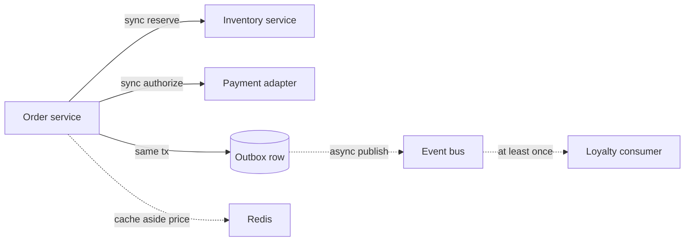

# Spring Cloud and microservice design for POS

The point of the split is independent failure and independent release, not a diagram with more boxes. A principal describes consistency, timeout, and what the cashier sees when a dependency is down.

## Boundaries

A workable cut for omnichannel POS: order (basket and tender state), inventory (on-hand and reservations), pricing (price book, promotions), and payment gateway integration. Each owns its data. The order service does not update the inventory table because it has a JDBC URL. It calls a port or consumes an event.

Synchronous calls (Spring MVC plus OpenFeign or a plain `RestClient` / `WebClient`) fit a cashier who needs an answer now: quote tax, authorize tender, reserve the last unit. Asynchronous events fit what can trail: analytics, loyalty accrual, search indexing, notifying a warehouse.

```java
@FeignClient(name = "inventory", url = "${pos.inventory.base-url}")
public interface InventoryClient {
    @PostMapping("/reservations")
    ReservationResponse reserve(@RequestHeader("Idempotency-Key") String key,
                                @RequestBody ReserveRequest body);
}
```

Feign is a declarative client. Timeouts are not optional: connect timeout short, read timeout bounded by the cashier SLO, and a clock on the caller shorter than the caller's own deadline so the failure is yours to map to a `503` or a declined tender. Default Feign or Ribbon timeouts that sit at several seconds will pile up threads and Hikari connections. Propagate a correlation id header. Do not propagate a database transaction.

## Failure and Resilience4j

Circuit breaker, bulkhead, and retry are different tools. Retry only idempotent calls: `GET` availability, or `POST` reserve that honors an idempotency key. Retrying a capture that is not idempotent double-charges. A circuit breaker opens when the payment gateway is failing so you fail fast instead of occupying the pool. A bulkhead limits concurrent calls to inventory so a slow database there cannot consume every Tomcat thread in the order service.

Fallbacks must be honest. A fallback price of zero is a production incident. A fallback that returns the last cached price is acceptable only if the business accepts a stale price and you label it. For on-hand, "unknown" should stop the sale or move to a degraded offline queue, not pretend the SKU exists.

Timeouts, retries, and breaker thresholds interact. Three retries inside a call that already has a one-second budget is a design error. The budget belongs to the user gesture.

## Data consistency

You cannot have a single ACID transaction across order and inventory databases. Options:

- Synchronous reserve, then local order commit, with a compensating cancel if the order commit fails. The reserve has an expiry so a crashed caller does not hold stock forever.
- Outbox: write the order and an `outbox` row in the same local transaction. A publisher reads the outbox and sends `OrderPlaced`. Consumers are idempotent. This avoids dual-write (commit the database, crash before publish).
- Saga: a coordinator (or choreography) runs reserve, pay, confirm, with compensations. Choreography is harder to see in one place. Orchestration is a workflow you can draw. Either way, every step has a compensation and a timeout.

```text
Orchestrated checkout
  order tx: insert order PENDING + outbox
  inventory: reserve (idempotent)
  payment: authorize (idempotent)
  order tx: mark AUTHORIZED
  on payment decline: cancel reservation (compensation)
```

At-least-once delivery means consumers see duplicates. The inventory consumer keys off the reservation id. The inbox table (processed message ids) makes that durable.

## Redis

Redis is the shared cache and sometimes a lock or a rate limiter. Price book: cache aside, TTL, invalidate on a pricing event if you must be tighter than the TTL. Do not use Redis as the only copy of a reservation unless you have designed persistence, failover, and the same conditional-update semantics you trust in Postgres. A distributed lock in Redis (SET NX with expiry) can dedupe a scheduler; the lock expiry must exceed the critical section or two holders run. A lock is not a transaction.

Cache stampede: many pods miss the same hot SKU key and all hit Oracle. A short lock or a single-flight around the load, plus a stale-while-revalidate value, is the usual mitigation. Set a timeout on the Redis command. A hung Redis must not hang checkout longer than the cashier can wait; the call needs a deadline and a defined miss path.

## Config, discovery, and the gateway

Spring Cloud Config (or an equivalent externalized config store) keeps feature flags and endpoints out of the image. Secrets are not in git. Discovery (Eureka or Kubernetes DNS) is how Feign finds inventory. In Kubernetes, a service DNS name is enough and a second registry is often extra moving parts. Apigee (or Spring Cloud Gateway) is the external edge: auth, quota, and routing. Internal service-to-service calls still authenticate. Do not assume the mesh or the gateway did it if you have not deployed one.

`@RefreshScope` beans pick up new config. A refresh that changes a Feign URL does not drain in-flight tenders. Roll config the way you roll code: deliberately.

## Observability across services

One trace id from the device through Apigee, order, inventory, and the gateway. Logs include that id (Kibana). New Relic or the trace backend shows which hop consumed the budget. Without this, "inventory is slow" is a guess.

## Principal versus mid-level

Mid-level: "We use microservices and Feign, and a circuit breaker for resilience." Principal: name the consistency boundary, the idempotency key on the reserve, the compensation, the timeout budget, and why Redis is allowed to cache price and not on-hand. Say what the cashier sees in degraded mode.

## Failure modes

- Dual-write: save order, publish event, crash between them, inventory never reserves or reserves twice on a naive retry.
- Shared database "just for this join" that couples release cycles.
- Retry plus a non-idempotent Feign POST.
- Circuit breaker fallback that returns success.
- Chatty calls: the order service fetches SKU master data one GET per line inside the tender transaction.



Dotted edges are the ones that may arrive late or twice. The synchronous reserve and authorize are on the cashier path and must be idempotent because the client will retry.
