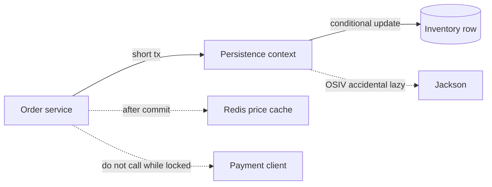

# Spring Data JPA and Hibernate

JPA's persistence context is a unit of work, not a cache you sprinkle on a repository. Principal interviews ask where SQL runs, how many queries run, and what is locked.

## Persistence context

An `EntityManager` tracks loaded entities. Within a transaction, reading the same id twice returns the same instance (first-level cache). Dirty checking compares current state to the snapshot taken at load and writes an `UPDATE` at flush if they differ. You do not need an explicit `save` on a managed entity; `save` matters for new entities and for Spring Data's merge behavior on detached ones. Flush happens before commit, before a query that might depend on pending writes (FlushMode.AUTO), and when you call `flush`.

```java
@Transactional
public Order addLine(String orderId, AddLine cmd) {
    Order order = orders.findById(orderId).orElseThrow();
    order.addLine(cmd.sku(), cmd.qty(), cmd.unitMinor());
    return order; // dirty checking writes the line at commit
}
```

Outside the transaction the entity is detached. Changing it does nothing to the database unless you merge it. Merging a graph the client built is how over-posting attacks write columns you did not mean to expose. Map a command DTO onto the aggregate inside the service.

OSIV (`spring.jpa.open-in-view`, default true in Boot) keeps the session open for the whole web request. Lazy loads succeed in the controller or Jackson and the connection stays checked out. Turn it off for a service you care about and make the fetch plan explicit. The failure mode you then see, `LazyInitializationException`, is the design telling you the session boundary was crossed.

## Fetching and N+1

`@OneToMany` defaults to lazy. A loop that touches `order.getLines()` for each order is one query plus one per order. Fixes: `join fetch` in JPQL, an `@EntityGraph`, or a DTO projection that selects the columns you need. `join fetch` with a collection and a pageable limit is the Hibernate warning you should know (HHH000104): the limit is applied in memory, or the join multiplies rows. Page the parent ids first, then fetch lines with `where orderId in :ids`.

EAGER on an association "to avoid lazy problems" loads the graph on every query, including ones that needed a status flag. Entity graphs per use case beat a single eager mapping.

Projections (`interface` or record DTO) skip the persistence context for read models. They do not dirty-check. Use them for order search screens. Use entities when you will mutate.

## Locking and inventory

Two associates selling the last unit is a lost update under Read Committed if both read `qty = 1` and both write `qty = 0`.

Optimistic locking: `@Version` on the row. The update is `set qty = ?, version = version + 1 where id = ? and version = ?`. Zero rows updated means someone else won; you reload or return `409`. It fits order header edits. It is a poor fit for a hot SKU where conflicts are constant, because every loser retries.

Pessimistic locking: `SELECT ... FOR UPDATE` on the inventory row inside a short transaction. The second seller blocks, then sees the new quantity. Keep the transaction tiny. Do not call Feign while holding the row lock. A `SKIP LOCKED` pattern fits a worker claiming outbox rows; it is the wrong semantics for a customer waiting on a specific SKU.

A reservation row (sku, qty, status, expires_at) plus a conditional update (`update inventory set on_hand = on_hand - :qty where sku = :sku and on_hand >= :qty`) is one statement and does not require reading first. Check the update count. That pattern is the one to write on a whiteboard for POS on-hand.

Oracle and Postgres both support this. Isolation defaults differ in details (Postgres MVCC, Oracle multi-version reads). Do not set `SERIALIZABLE` globally to avoid writing a conditional update. Know that a unique constraint is your idempotency lock, and that a deferred constraint changes when the failure appears (statement versus commit).

## Schema and mappings

Map money as `long` minor units or a precise decimal column. Do not use `double`. `@Enumerated(EnumType.STRING)` so reordering the enum does not corrupt the column. Bidirectional `@OneToMany` needs a owning side; helper methods on the aggregate maintain both sides. `equals` / `hashCode` on entities: business key or a carefully documented id strategy, never a lazy collection.

N+1 is not the only query bug. A missing index on `(store_id, created_at)` makes the "today's orders" screen a sequential scan. JPA will not add it for you. Shipping `ddl-auto=update` in production is how a rename drops data. Use a migration tool (Flyway or Liquibase) and `ddl-auto=validate`.

## Second-level cache versus Redis

Hibernate's second-level cache stores entity state across sessions in one JVM, with a cluster invalidation story if you add a provider. It couples caching to mappings and is easy to get wrong with collections. A Redis cache of a read-mostly price book, with an explicit TTL and a known stale window, is usually the POS design you can explain. Inventory counts that must not be stale do not belong in a 30-second cache in front of the decrement. Cache the price; lock the on-hand in the database.

## Spring Data repositories

Derived query names are fine for `findByStoreIdAndStatus`. A 12-clause name is unreadable; use `@Query` or the criteria API. `saveAll` batches only if you enable JDBC batching and the ids are generated in a way the driver can batch (sequence with allocation, not IDENTITY on every insert in some setups). Know `hibernate.jdbc.batch_size` and `order_inserts`.

`@Transactional` on the repository interface method is a short transaction per call. If the service is also transactional, REQUIRED joins it. If the service is not, each repository call commits alone and you lose the aggregate invariant. Put the transaction on the application service, not on every finder.

## Principal versus mid-level

Mid-level: "Lazy loading causes N+1, I use join fetch." Principal: disable OSIV, page parents then fetch children, choose optimistic versus conditional update for the hot SKU, and keep the row lock off the network. Mention batching and `ddl-auto=validate`.

## Failure modes

- `Optional.get` on `findById` in a stream, turning a missing order into a 500.
- Cascade `REMOVE` from order to a shared SKU reference.
- A read-only transaction that still dirty-checks a huge graph because the flag was not applied to the right manager.
- Lazy load of lines during JSON serialization, after the pool is already waiting.



Dotted edges are the paths that must not sit inside the inventory lock: cache refresh, payment, and serializer-driven lazy loads.
