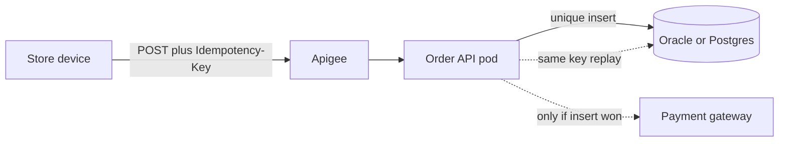

# REST and OpenAPI for an order API

A principal designs the HTTP contract so a retry from a flaky store network cannot double-charge, and so the OpenAPI document matches the runtime.

## Resources and methods

Model nouns: `/orders`, `/orders/{orderId}/tenders`, `/skus/{sku}/availability`. Verbs live in methods. `POST /orders` creates and is not idempotent unless you add an idempotency key. `PUT /orders/{id}` replaces and is idempotent. `PATCH` is a partial update and needs a defined merge (JSON Patch or a documented field set). `GET` is safe and idempotent. `DELETE` is idempotent: deleting a missing order is still success if the client wanted it gone (`204`), or `404` if you must distinguish "never existed" for audit. Pick one and write it down.

Status codes are part of the contract. `201` with `Location` on create. `202` when acceptance is queued (capture submitted, not settled). `400` for a malformed body. `422` is widely used for a syntactically valid body that fails domain rules (quantity zero); some teams stay with `400` and a problem code. Be consistent. `409` for a version conflict or a duplicate idempotency key with a different body. `412` if you use preconditions. `429` when the store client must back off. `503` when a dependency is down and retry may help. Do not return `200` with `{ "success": false }`.

```java
@PostMapping("/orders/{orderId}/tenders")
public ResponseEntity<TenderReceipt> authorize(
        @PathVariable String orderId,
        @RequestHeader("Idempotency-Key") String key,
        @Valid @RequestBody TenderRequest body) {
    TenderReceipt receipt = tenders.authorize(orderId, key, body);
    return ResponseEntity.status(HttpStatus.CREATED).body(receipt);
}
```

## Idempotency

Store networks retry. The client sends `Idempotency-Key` (a UUID it generated) on `POST` authorization. The server stores the key, the request hash, and the response. A retry with the same key and same body returns the stored response and does not call the gateway again. A retry with the same key and a different body returns `409`. The unique constraint is in Oracle or Postgres, not only in a `ConcurrentHashMap`, because more than one instance serves the store.

Expiry of the key is a product decision (often on the order of a day for a payment attempt). After expiry, a retry is a new attempt; the client must not reuse keys blindly. `GET` does not need an idempotency key. Natural idempotency of `PUT` still needs a version (`ETag` / `@Version`) so two managers do not overwrite each other's order note.

## Errors

RFC 7807 `application/problem+json` gives `type`, `title`, `status`, and `detail`, plus an extension for `code` (`SKU_NOT_ON_HAND`). A `@ControllerAdvice` maps domain exceptions. Do not leak SQL or a stack trace in `detail`. Log the correlation id; return the correlation id to the client so a Kibana search finds the line.

Validation: `@Valid` on the body, Bean Validation on the DTO (`@NotNull`, `@Positive`, `@Size`). Method validation needs `@Validated` on the controller class. A failed constraint is a `400` with field errors, not a 500. Distinguish validation from business rules. "Quantity must be positive" is validation. "Only two of this SKU remain" is a domain result with `409` or `422`.

## Pagination, filtering, and time

Offset pagination (`page`, `size`) is simple and lies when new orders insert at the top of the list: clients skip or duplicate rows. Keyset pagination (`createdAt`, `id`) is stable. Cap `size`. Never return an unbounded order history. Filter store id from the authenticated token, not only from a query parameter the client can change. Timestamps in the API are ISO-8601 with offset. Business date is a separate field in the store zone.

## OpenAPI

springdoc-openapi (Boot 2/3) publishes `/v3/api-docs` and a Swagger UI from annotations, or you generate the API from a spec. Code-first is faster for an internal order service and drifts when someone changes a DTO and forgets the semantics. Contract-first (the YAML is the source, generated interfaces) fits when Apigee or several clients share the contract. A principal states which one the team uses and what breaks if they diverge: the gateway policy, the generated client, and the mock server in CI.

Document the idempotency header, error schema, and required auth scope as spec content, not as a wiki paragraph. Use one `Error` schema. Enumerations in the spec are a compatibility promise: adding an enum value is a compatible change for a tolerant reader and a breaking change for a generated client that switches exhaustively. Removing a field is breaking. Additive optional fields are compatible if clients ignore unknowns (`additionalProperties` policy must be explicit).

Versioning: a new major path (`/v2`) when you break. Do not version every release. Keep `/v1` until store clients have moved. Apigee can route and quota in front; the service still enforces authz and idempotency, because not every caller comes through the gateway (batch, other microservices).

## Security on the edge

Authenticate at the gateway or with resource server JWT validation, then authorize in the service (this associate can sell at this store). Do not trust `X-Store-Id` from the device without binding it to the token. TLS ends at Apigee only if the hop inside is also trusted; say which hop is encrypted. Idempotency keys are not credentials.

## Principal versus mid-level

Mid-level: "I use the right status codes and `@Valid`." Principal: walk a retried tender from the store device through Apigee to two pods, show the unique key, the conflict on a mismatched body, and the problem document. Explain keyset pagination and one compatibility rule for the OpenAPI enum of tender types.

## Failure modes

- Idempotency stored only in Redis with eviction under memory pressure, then a retry charges again.
- `POST` create returning `200` and a body without an id when the insert actually failed and was swallowed.
- Binding a Hibernate entity as the request body, so the client sets `version`, `status`, or a price.
- CORS configuration as a substitute for authentication.



The replay edge is a read of the stored receipt. The gateway edge happens only for the request that won the insert. Both dotted edges are the retry story; draw them before you talk about HTTP status codes.
