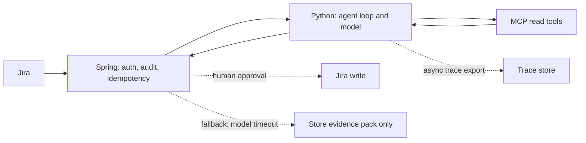

# Production LLM systems — study notes

Audience: Gowrishankar Sekar, a Java and Spring engineer who also builds agent workflows. The design below keeps the system of record in the JVM and the model loop in a separate service. Numbers you have not measured stay as budgets you would set, not as results you achieved.

## A latency budget

Interactive calls die by a pile of reasonable steps. Write the budget before you write the prompt. Example for an internal triage draft, not a consumer chat widget:

- Webhook and queue overhead: a small slice.
- Auth, idempotency, load ticket: a small slice.
- Three read tools in parallel, each with its own timeout: the largest slice.
- One model call to classify and draft, streamed if a human is watching: the second largest slice.
- Schema check and persistence: a small slice.

If the user is an on-call engineer waiting on a draft, a few seconds of tools plus a few seconds of model is a different product from a chat reply that must start streaming inside a second. The executive dashboard is closer to interactive: one metric tool, a short generation or no generation at all if the tool returns a table. Do not put an agent loop in front of a number you could render directly.

Parallelize independent reads. Logs, commits, and the deployment record do not depend on each other once you know the service and the time window. Sequential ReAct is for when the next query depends on the last hit. Start with a planned parallel fetch, then one model call. Add a second loop only if the first pack is insufficient.

## Streaming

Stream tokens when a person is reading the draft as it forms. Do not stream half a JSON object into a downstream system. For machine consumers, buffer, validate the schema, then commit. If you stream to the UI, stream a preview channel and still persist only the validated object. Cancel the upstream model call when the client disconnects so you do not pay for tokens nobody reads.

## Timeouts, retries, and fallbacks

Every outbound call has a timeout shorter than the caller’s timeout. Tools timeout independently. A hung OpenSearch query must not hold the worker until the platform kills it.

Retry only idempotent reads, and only on transport failures or 429/503, with a small attempt count and jitter. Do not retry a validation error or a 4xx from a bad query. Do not retry a non-idempotent Jira write unless you have an idempotency key and you know the server honors it.

Fallbacks you can defend:

- Model timeout or 5xx: serve a structured “evidence pack ready, draft unavailable” and let a person write the RCA. Do not fall through to an older model that lacks the tool schema unless you have tested that path.
- One tool down: draft with the tools that returned, and set `missing_sources` so the text cannot claim those sources were checked.
- Low confidence or schema failure: escalate. That path is drawn as a dotted edge because it is not the happy path.

Circuit-break a tool that is timing out often so one bad dependency does not consume the whole worker pool.

## Cost

Cost is tokens in, tokens out, tool CPU, and engineer time when the draft is wrong. Levers that do not require a made-up bill:

- Smaller model for routing, larger model only for the draft, if you have measured quality.
- Cap tool payload bytes before they enter the prompt. A 2 MB log dump does not make a better RCA.
- Cache embeddings and cache retrieval for identical documents. Do not cache a classification on ticket text alone if logs can change.
- Batch evaluation offline. Do not run three judge models on every production ticket.
- Log token counts per template version so a prompt edit that triples input size is visible the same day.

Agentic Universe templates should carry a budget: max tool calls, max model turns, max input characters. A template without a budget will be copied into a worse workflow.

## Caching

Cache **safe** things: prompt templates by version, tool schemas, embedding vectors for unchanged chunks, OpenSearch query results only when the time window is closed and the underlying index is immutable for that window. Do not cache “the answer for this customer” across sessions if the bill can change. Include the template version and the model id in the cache key. A cache hit on the previous prompt is a subtle incident.

## Guardrails

Separate input, tool, and output checks.

- Input: drop or redact secrets in the ticket before the model sees them. Reject prompt sizes over the cap.
- Tools: allow list, argument schema, tenant scope, read versus write.
- Output: JSON schema, citation ids must be from the tool results, no write unless the gate passed. A classifier that only checks “is this toxic” does not catch a wrong RCA.

Guardrails are code around the model. A sentence in the system prompt is not a guardrail.

## Observability

A trace for one ticket should show: template version, model id, each tool name, sanitized arguments, latency, status, byte size, token usage, the validation result, and whether a human approved a write. You should be able to replay the tool results into a new prompt without calling production again. This is the same discipline as tracing a Spring request across services, with the model as one span and each MCP call as a child span.

Alert on loop rate (duplicate tool calls), tool error rate, schema-failure rate, and timeout rate. A drop in “tickets drafted” can be a model outage or a silent schema change. Keep both on one dashboard.

## PII

Tickets, logs, and order metrics can carry phone numbers, account ids, and free-text complaints. Minimize before the model call: pass correlation ids and redacted lines when the raw line is not required. Know where the provider retains prompts. For a sovereign or enterprise deployment, “we send everything to a third-party API” may be unacceptable even when the model is better. That constraint belongs in the design, not in a footnote after you built the call.

Do not put raw PII in traces, prompt-cache keys, or evaluation spreadsheets. Sample golden sets by hand and strip them.

## Prompt and model versioning

Treat prompts as code. A template has an id, a version, the tool allow list, and the model id it was tested with. The production trace stores that tuple. Roll forward by shipping a new version. Keep the previous version runnable so you can route a percentage of tickets back when the new draft quality drops. Do not edit a prompt in place on a server you cannot rebuild.

Schema changes are breaking changes. If you add a required field to the RCA object, old evaluators and old UI clients must tolerate it or you migrate them in the same release.

## A clean Java and Python boundary

Spring is the system of record. Python is the model runtime. The boundary is a small HTTP (or messaging) contract, not a shared database full of prompts.

**Spring Boot owns:** Jira webhook verification, authentication, idempotency keys, the audit log, PII policy, authorization, calling MCP servers that sit next to internal systems if those servers need corporate network credentials, human-approval state, and the write to Jira. It is where transactions and retries already live.

**Python owns:** tokenization-sensitive preprocessing if you truly need it, embedding calls, the agent loop, model SDKs, and schema-shaped generation. It receives a minimized ticket and the ids of evidence it is allowed to read. It returns a validated draft or a typed error. It does not hold the Jira write credential.

Contract rules: version the payload (`triage.v1`), set deadlines in the request, return structured errors (`tool_timeout`, `schema_invalid`, `model_unavailable`), and make the call idempotent on the ticket id plus template version. Spring times out the Python service and falls back to “evidence stored, draft missing.” Python times out each tool and the model inside a shorter budget. Neither side parses the other’s logs as an API.

This split matches a lead who can review a Spring service and also talk about the model loop. You do not have to pretend the LLM lives inside the JVM. You also do not have to throw away operational discipline because the new component is Python.

