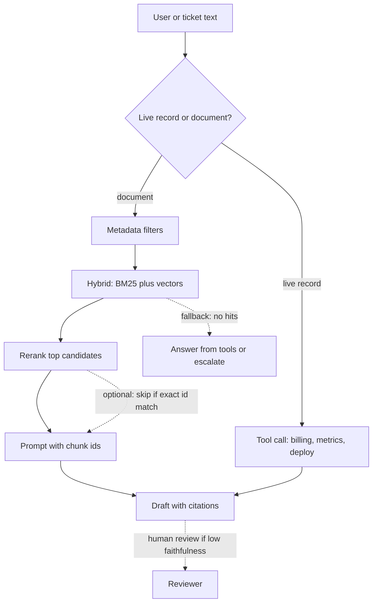

# RAG and retrieval — study notes

Audience: Gowrishankar Sekar. You have used OpenSearch as a log store behind an agent. These notes connect that experience to retrieval-augmented generation for applied interviews. Do not claim a RAG evaluation score you did not measure.

## Where RAG fits

RAG retrieves passages at request time and asks the model to answer from those passages. Use it when the knowledge changes, is too large to put in the prompt or in weights, and must be cited. Policy documents, runbooks, and resolved-ticket history are RAG problems. The current order status, the current bill, and today’s error count are not. Those are tool calls, because the source of truth is a transactional system, not a chunk index.

Your triage agent already makes this split. OpenSearch holds logs: high volume, time-bounded, exact strings matter. That is retrieval, but it is **filtered search**, not “embed the ticket and hope.” A runbook that explains a business rule is the RAG half. The deployment package version is a tool or a resource read. Say all three so you do not describe every lookup as RAG.

## Chunking

Chunks are the unit you retrieve and cite. Too large and the model gets noise plus a blown context window. Too small and you split the sentence that contains the exception from the sentence that contains the cause.

Practical defaults you can defend:

- Split on structure first: markdown headings, ticket fields, log records, code functions. Then apply a size cap.
- For prose runbooks, chunks roughly a few hundred tokens with overlap only where a rule crosses a heading. Overlap hides bad splits; it does not fix them.
- For logs, do not embed raw lines as unrelated chunks. Store an event with timestamp, service, severity, and message. Retrieve with filters. Embedding is optional for similar-incident search, not for “what happened at 10:41.”
- Keep the title or section path in the chunk body so a paragraph that says “set it to true” still says which feature.
- One index record should carry the metadata you will filter on: `service`, `language`, `environment`, `updated_at`, `doc_type`.

Re-chunk when you change the embedding model or the document template. Old vectors and new vectors in one index silently hurt recall.

## Embeddings and hybrid search

An embedding maps text to a vector so “payment failed” can sit near “checkout exception.” Bi-encoders are fast enough to run over the corpus ahead of time. They miss exact tokens: error codes, SKUs, config keys, commit SHAs, and rare Indic words. **Hybrid search** runs a lexical query (BM25 in OpenSearch) and a vector query, then fuses the ranks or scores.

OpenSearch is a credible retriever for this. You already operate it for logs. For documents you would use a keyword query plus a k-NN query, with a filter clause so the vector search does not wander outside the tenant or service. Fusion can be a weighted sum after score normalization, or reciprocal-rank fusion. You do not need the formula memorized. You need the reason: lexical search saves identifiers; vectors save paraphrases. Code-mixed user text (“recharge nahi ho raha”) will not share tokens with an English runbook titled “prepaid recharge failure.” Vectors can help only if the embedding model actually saw that mix. Otherwise translate or index a parallel field. Do not assume a general English embedding covers Indic support text.

## Metadata filters

Filters are not a reranker. They drop documents that must not be in the candidate set: wrong tenant, expired policy, draft runbook, another product line. Apply them in the query so you never retrieve the forbidden chunk and then hope the prompt ignores it. For triage logs, the filter is the product: service, environment, time window, trace id. Semantic similarity across last month’s logs is how you attach the wrong incident.

Put fields you filter on in a keyword mapping, not only inside the text. Update `updated_at` and drop or decay stale chunks. A telecom plan that changed yesterday must outrank the plan PDF from last year even if the old PDF is longer and embeds “better.”

## Reranking

First-stage retrieval optimizes recall over a few dozen candidates. A **reranker** (usually a cross-encoder that scores query plus passage together) reorders those candidates for precision. It is slower, so it sees dozens of hits, not the whole index. Use it when the top BM25 hit is a keyword collision and the right paragraph is third. Skip it when the query is an error code and lexical rank is already exact. Rerankers need to understand the query language. An English-only cross-encoder can push the right Hindi paragraph down. If you cannot verify the reranker’s language coverage, say you would test it on code-mixed queries before turning it on.

## Citations

A citation is a chunk id the user can open, not a footnote the model invents. Return the passage id, title, and offset from the retriever, then instruct the model to refer only to those ids. After generation, check that every cited id was in the prompt. Drop or regenerate sentences that cite an id you did not retrieve. For logs, the citation is the query plus the hit ids, so an on-call engineer can rerun it. “According to the logs” with no link is not a citation.

## When RAG loses

**Prefer a tool call** when the fact is live and structured: balance, order count, deployment version, ticket status. RAG will serve a stale copy with confident prose. The dashboard demo should call a metrics tool. Embedding yesterday’s screenshot of the dashboard is the failure mode.

**Prefer finetuning or a carefully maintained prompt** when you need behavior rather than facts: tone, output JSON, a classification habit, a domain vocabulary that appears in every request. Finetuning does not stay current. A rule that changes monthly belongs in retrieval or a tool. Finetuning also asks for data rights and a training pipeline you must govern. For a small stable schema (“always emit these keys”), a constrained decoder or a schema validator beats a fine-tune.

**Prefer the base model with no retrieval** when the question is general reasoning and extra passages would distract it. Empty retrieval should be allowed. Forcing the model to quote irrelevant chunks produces faithful nonsense: faithful to the wrong context.

## Evaluation

Two numbers carry most design reviews:

- **Context recall.** Among the passages a person marked as necessary, how many landed in the set you actually put in the prompt? This judges chunking, filters, and hybrid search. It ignores how well the model writes.
- **Faithfulness.** Do the claims in the answer follow from the retrieved context, with no added facts? A fluent answer can fail this. Judge it with a person on a sample, or with a second model that checks claims against passages, and spot-check that judge. A judge model is not ground truth.

Add **answer relevance** (does it address the question) and **citation precision** (are the cited ids real and supportive). Slice every metric by language and by code-mix. An average that hides a weak language is how Indic support looks fine in a demo and fails in a region.

For the log tool, the analogue of context recall is: given a ticket with a known trace id, did the query return that trace, and did the draft mention it. You can build that set without calling it RAG.

## Failure modes worth naming

Stale index. Chunk boundary cuts the condition from the action. Duplicate documents with conflicting versions. Embedding model mismatch after a silent upgrade. Tenant filter missing. Retrieved context so large the model attends to the middle and skips the exception. Prompt injection inside a retrieved page. Treating OpenSearch log search as if it were a chatbot memory.

