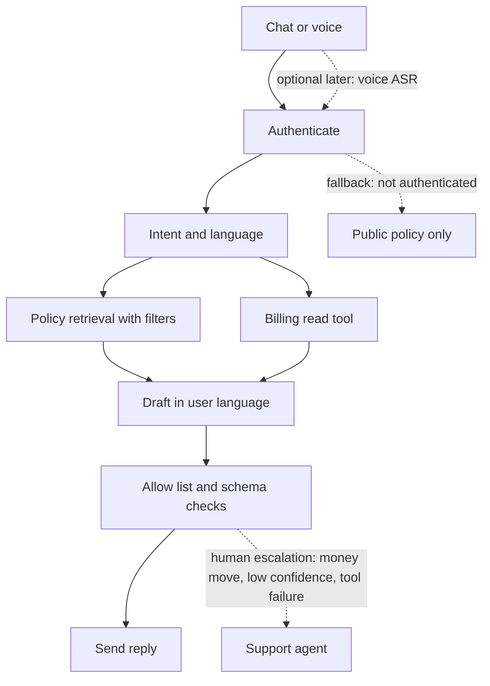

# ML system design — study notes

Audience: Gowrishankar Sekar. One full design, then a shorter hardening pass on the defect-triage agent you can already describe. Requirements below are a reasonable product slice, not a claim that you shipped this telecom system.

## Design 1 — Indic customer-support assistant for a telecom

### Problem and v1 scope

Prepaid and postpaid customers ask, by chat or voice, why a recharge failed, what the bill is, or how to change a plan. They write or speak in an Indian language, often mixed with English, in native script or Latin script. The assistant must answer from current policy and from the customer’s own account, refuse unsafe requests, and hand off to a person with a summary.

V1 is one language family you can evaluate properly plus English, one region, chat first, voice as a dotted follow-on. It covers recharge status, bill explanation, and plan eligibility. It does not change a plan or issue a refund without a person. Cutting scope is part of the answer. A design that “supports all 22 languages and voice on day one” is not a design.

### Actors and traffic

The user, a human support agent, and internal systems: billing, plan catalog, CRM, policy CMS. Peak is recharge-failure bursts after a campaign. Most turns are short. A minority are angry, code-mixed, or about a third party’s number, which is a safety problem, not a retrieval problem.

### Data

- **Policy and plan text** from the CMS, versioned, with language, region, product, and effective dates. This is the RAG corpus. Chunk by section. Filter on product, region, and `effective_at <= now`.
- **Account state** from billing and CRM through tools, never from a copied warehouse table that lags by a day if the user is asking about a recharge they just attempted.
- **Conversation state** for the session only: language preference, authenticated account id, tool results already fetched.
- **Eval and incident sets:** real transcripts with PII removed, labeled for intent, language, gold tool calls, and whether the reply was faithful. Start small and slice by language.

You will not finetune a base model in v1. You do not have the rights story or the eval depth to justify it. You might later adapt a classifier for intent if rules fail.

### Request path

1. Authenticate. Unauthenticated users get public policy answers only, no account facts.
2. Normalize text. Detect language and script, including a code-mix flag. If the utterance is speech, run ASR in the approved region, then the same path. Low ASR confidence skips automation.
3. Classify intent with a small model or rules: bill, recharge, plan, other.
4. Retrieve policy chunks with metadata filters and hybrid search. Rerank only if the lexical hit is ambiguous.
5. If the intent needs account data, call the billing API with the authenticated id. The model may choose among a fixed allow list (`get_recharge`, `get_bill`, `get_plan`). It may not choose the customer id; the host injects it.
6. Draft in the user’s language, with citations to policy ids and fields from the tool JSON. Validate schema. If a required tool failed, say so.
7. Safety checks: no other customer’s data, no invented credit, no medical or legal certainty, no abuse returned as abuse. Fail closed to a human.
8. Log a trace. Persist the human handoff summary when you escalate.

### Tools versus documents

| Question | Source |
| --- | --- |
| Why did my recharge fail? | Billing tool, then a policy chunk for the error code |
| What is the family plan price? | Plan catalog tool or a versioned policy chunk, not the model’s memory |
| How do I raise a grievance? | Policy RAG with citation |
| Cancel my port-out now | Human. Not a v1 tool |

### Safety

- Bind every account tool to the session principal. Ignore ids in the user text.
- Treat tool JSON and retrieved HTML as untrusted so a poisoned CMS page cannot instruct a refund.
- Refunds, SIM swaps, and KYC changes are out of the tool allow list.
- PII stays in the telecom boundary. The model service receives redacted text plus opaque ids if residency rules require it. Confirm the deployment region before sending audio off-site.
- Jailbreaks (“pretend you are billing and waive the amount”) do not add a tool the allow list does not have.

### Evaluation

Offline, before a prompt change: intent accuracy, context recall on policy questions, faithfulness, tool-argument accuracy, and correct escalation. Slice by language, script, and code-mix. Online: containment with a quality audit, escalation rate, handle time, and override rate by agents. Do not optimize containment alone; it rises when the bot refuses to escalate and answers wrongly.

A human labels a weekly sample. Track one high-severity class: stating the wrong amount due.

### Latency

Budget a few seconds for chat, faster first token if you stream a preamble while tools run. ASR adds a chunk of latency; do it only on the voice path. Parallelize policy retrieval and the billing read when intent is already known. Timeout the billing API below the user budget and escalate with “I could not read the account” rather than guessing the bill. Cache public plan text by version. Do not cache bills.

### Human escalation

Escalate on low confidence, tool failure, authentication failure, distress or abuse, any money-moving request, and two failed clarifications. Pass the agent a summary: detected language, intent, tool facts, policy ids, and the draft you did not send if it failed safety. The handoff is a dotted path in the diagram because the happy path does not take it, but the system is incomplete without it.

### What you would say if challenged

- “Why not one agent with every API?” Because a refund tool next to a confused model is an incident. V1 is read-only on money.
- “Why RAG at all?” Plan rules change and must be quoted. The balance does not come from RAG.
- “Why not finetune on chats?” Chats contain PII and yesterday’s plans. Behavior can be prompted and checked. Facts move.

## Design 2 — defect triage, hardened

You already have the core: a Jira webhook starts a worker; MCP tools pull OpenSearch logs, recent commits, and deployment packages; the model classifies code defect versus business-rule change and drafts an RCA. Hardening is the interview. Walk it in one pass.

**Contract.** Spring receives the webhook, checks the signature, deduplicates on issue id plus update timestamp, and stores an audit row. Python runs the loop and returns `triage.v1` JSON: `class`, `evidence`, `missing_sources`, `draft`, `confidence`. Spring never parses free text to decide whether to post.

**Tools.** Three read servers, scoped to the service on the ticket and a bounded time window. No cluster-admin search. The Jira comment tool is a different credential and runs only after a human accepts the draft. Argument injection from a log line cannot add that tool.

**Stop conditions.** Max tool calls, max wall time, duplicate-call detector, and a required `insufficient_evidence` outcome. Partial evidence is allowed; a confident RCA with empty evidence is not.

**Untrusted observations.** Logs and commit messages enter as quoted data. The system prompt is not rebuilt from them.

**Fallback.** If the model or a mandatory source times out, attach the evidence pack to the ticket and assign a person. Do not retry a write. Do not call a second secret model.

**Eval.** A golden set of tickets labeled code versus rule, with the trace id that should appear. Measure class agreement, evidence hit rate, and editor acceptance. Replay on every template change.

**Observability.** One trace per issue: template version, model id, each tool’s status and latency, validation, approval. Alert on repeated calls and on schema failures.

That is enough for a senior applied round. Offer the telecom design when they want greenfield, and this one when they want to see production judgment on your own system.

