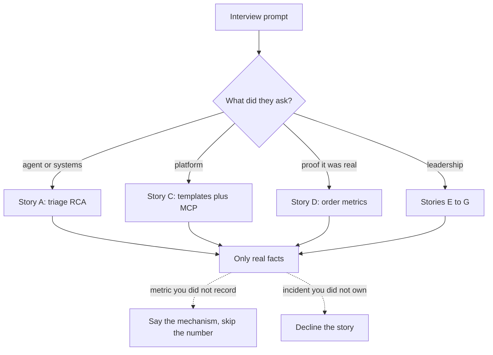

# Project story bank — study notes

Audience: Gowrishankar Sekar. Stories you may tell are only (1) the automated defect-triage and RCA agent, (2) the Agentic Universe platform and its executive order-metrics demo, and (3) generic lead themes: mentoring, incident response, and code quality. Where a metric would be a lie if invented, the text says **[add your number]**. Delete a story you cannot ground in something you did. Do not borrow a teammate’s incident and narrate it as yours.

Spoken samples are drafts in your voice. Fill brackets before the interview. If you lack the number, describe the mechanism and say you did not track it.

## Story A — Defect triage and RCA agent

**Situation.** Engineers were losing time on defects that arrived as Jira tickets. Some were code defects. Some were business-rule changes the code was enforcing correctly. The ticket text alone did not settle that.

**Task.** You owned an automated path: when Jira fires a webhook, an agent should gather evidence and draft an RCA, including a classification of code defect versus business-rule change.

**Action.** The webhook enters a worker you control. The model does not freely browse production. Through MCP it can pull OpenSearch logs, recent commits, and deployment packages. You bound the look-up to the service and the time window, treated tool output as data, and kept the posted RCA behind a draft so a person could check the class and the evidence before it became the record. The agent stops when evidence is enough or when a budget is hit, and it can return “not enough evidence” instead of a fluent guess.

**Result.** Say what you saw: reviewers got a draft, the class split matched how the team already talked about tickets, people used it or they did not. Volume, time saved, and acceptance are **[add your number]** only if you measured them. If you did not: “I can describe the path and the controls. I did not run a before-and-after study.”

**Sample.** “A Jira webhook started the run. The agent pulled OpenSearch logs, recent commits, and the deployment package over MCP, then classified code defect versus business-rule change and drafted the RCA. Writes stayed gated. Acceptance rate is **[add your number]** only if I look it up. Otherwise I describe the gate and stop.”

## Story B — A design tradeoff inside triage

**Situation.** The same ticket can be solved by a fixed pipeline or by a free agent loop.

**Task.** Pick a shape that on-call engineers can trust.

**Action.** Keep the trigger, the schema, and the write gate fixed. Let the model choose among a small allow list of read tools, because the next query sometimes depends on the last log line. Cap steps. If the evidence sources are known up front, fetch them in parallel and call the model once; spend a loop only when the pack is thin. That is the tradeoff: freedom inside a box, not a boxless agent.

**Result.** The shape is defensible without a metric. Loop-versus-one-shot deltas are **[add your number]** only if you ran that comparison.

**Sample.** “Webhook and final JSON are a chain. Evidence is a small agent: parallel reads when the window is known, a loop only if the pack is thin. The failure I designed against is a confident RCA with no sources.”

## Story C — Agentic Universe platform

**Situation.** Each new assistant risked becoming one-off glue of prompts and private function schemas.

**Task.** Make a template-driven way to plug multiple MCP tools into an LLM and build a workflow.

**Action.** A template names the prompt, the servers, the allow list, and budgets. The host discovers MCP capabilities and hides anything the template did not allow. Workflows share servers instead of copying clients. Describe tool registration only if you did it.

**Result.** The claim is reuse, not a user count. Workflows or tools that went live: **[add your number]**, or say the honest scope was the platform plus a demo.

**Sample.** “Agentic Universe was a host plus templates. The template, not the model, decided which MCP tools existed for that workflow. That kept a second use case from inheriting the first use case’s credentials.”

## Story D — Executive dashboard demo

**Situation.** You needed a proof that templates could serve a non-ticket workflow.

**Task.** An executive view of on-demand order metrics.

**Action.** Metric tools only, definitions in the template, a short prompt or a direct render of the tool table. No Jira write and no research loop. Show “as of” time. Latency or adoption is **[add your number]** or omitted.

**Sample.** “The demo was on-demand order metrics. The template exposed metric tools only, not the triage credentials. I would show the tool’s number, not a paragraph that remembers yesterday.”

## Story E — Mentoring

Use this only for people you actually mentored. Do not invent a protégé, a promotion, or a course rating.

**Situation.** A teammate needed to land a change that touched production path X (name a real area: webhook handling, a review bar, an on-call shadow).

**Task.** You were the lead responsible for their growth and for the quality of that area.

**Action.** Checkable help only: paired on a design, set a review standard, gave them the ticket, reviewed tests, let them present.

**Result.** Their outcome in words you can defend. Scores and time-to-productivity are **[add your number]** or omitted.

**Sample.** “I was the tech lead, so mentoring was part of the job, not a side talk. The example I would walk through is **[name the real piece of work]**. I had them drive the design, I reviewed for failure handling, and they shipped it. I will not put a number on team velocity.”

## Story F — Incident response

Do not invent an outage, a customer impact, or a postmortem date. If you have not owned an incident, say so and use the triage agent’s failure design as what you would do on call. If you have owned one, fill only real facts.

**Situation.** **[What broke, in one sentence you could defend]**. User impact: **[add your number]** or “I will not guess the count.”

**Task.** Your role: incident lead, service owner, or supporter. Say which.

**Action.** How you found it, mitigated, what you refused to do, how you communicated, and the durable fix.

**Result.** Time to mitigate **[add your number]** if you have it. The durable fix in one sentence.

**Sample if this happened.** “A draft looked sure and the evidence was thin. We stopped the write, kept the traces, and made missing sources a real output. I will not invent a customer-impact count for an internal draft path.”

## Story G — Code quality

**Situation.** Agent and webhook code rot the same way other services do: hidden prompts, untested tool parsers, reviews that only check the happy path.

**Task.** As lead, set a bar the team can apply without you in the room.

**Action.** Claim only what you enforced. Candidates: schema tests, a fixture with a poisoned log line, template version on the trace, timeout and idempotency on the review list, prompts changed only by pull request. Pick two.

**Result.** Defects caught in review or escaped bugs are **[add your number]** unless you counted them. The qualitative result is a repeatable bar.

**Sample.** “I care that a prompt change is a pull request with a fixture. One fixture I want on an agent is a tool result that tries to override the instruction. The test is that the allow list still holds and the write does not fire. That is a code-quality bar, not a model trick.”

## How to choose in the room

- System design or agent round: Story A, then B, then the hardening points (timeouts, untrusted tool output, human gate).
- Platform or “tell me about architecture”: Story C, with D as the concrete instance.
- Leadership round: E, F, and G. If F is empty, do not decorate it. Talk about the standard you set and the incident you would page yourself for.
- “Why this team?” Tie A and C to applied Indic or enterprise agents: you have built tool-using workflows with an audit boundary, and you want that craft on multilingual products. Do not claim you joined a Sarvam project you did not join.

Keep each answer under two minutes. Stop after the result.

