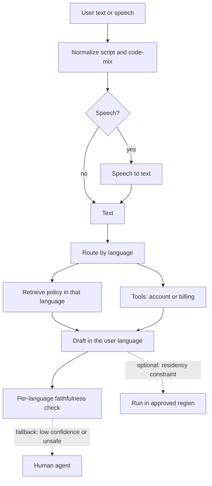

# Sarvam AI and Indic LLMs — study notes

Audience: Gowrishankar Sekar, Senior Tech Lead and M.Tech AIML student (BITS Pilani WILP, expected 2027), preparing for Sarvam AI and other applied AIML or agentic roles. These notes use public positioning only. They are not insider knowledge. Recheck the company site before the interview. The checklist at the end is part of the prep, not optional reading.

## How to describe the company without over-claiming

Sarvam AI is an Indian company building sovereign, Indic-language generative AI. Public material describes work across text, speech, and translation, aimed at Indian languages and at enterprise or population-scale use. Founders associated with the company in public pages are Vivek Raghavan and Pratyush Kumar. A commonly discussed adjacency is AI4Bharat: public bios have linked Pratyush Kumar with that open Indian-language research effort. Phrase it as public positioning. Do not say Sarvam “is” AI4Bharat, and do not imply you know internal ownership, roadmaps, or unreleased models.

A known public model theme is **Sarvam-1**, a small multilingual model for Indian languages, described in the company’s own write-up as an open model for Indic languages alongside English. Later generations aimed at Indian languages and enterprise use are part of the public story. With the model card closed, do not quote parameter counts, language lists, or benchmarks. Product names on the marketing site change. Describe categories you just reread.

Do not quote funding, valuation, or logos from memory.

## Why Indian-language AI is hard

**Script diversity.** Indian languages are written in several scripts (Devanagari, Tamil, Telugu, Kannada, Malayalam, Bengali, Gurmukhi, Odia, and others). Unicode encodes them as characters plus combining marks. A pipeline that assumes one letter is one byte, or that strips “non-ASCII,” destroys the text before the model sees it. Rendering, collation, and input methods differ. Normalization choices change token identity.

**Code-mixing.** Real users mix English and an Indian language in one sentence, often in Latin script: “data nahi chal raha since morning.” Support chats, social text, and voice transcripts look like this more often than clean monolingual prose. Models trained on formal news text under-serve the channel you would actually deploy.

**Morphology.** Dravidian languages are agglutinative: many suffixes stack on a stem, so a “word” is a small phrase. Indo-Aryan languages inflect heavily. A whitespace tokenizer and an English-centric vocabulary split or duplicate these forms badly, which hurts both quality and context length.

**Data scarcity.** The public web is skewed to English and to a few high-resource Indian languages. Hindi is not “all Indian languages.” Low-resource languages have thin clean text, even thinner parallel text, and speech data that is expensive to label. Scraped data is noisy, duplicated, and sometimes the wrong dialect or the wrong script.

**Dialects and register.** “Hindi” in a textbook, in a government form, and in a Mumbai chat are different. The same is true for Tamil, Bengali, and others. An average score can hide a dialect you dropped.

**Speech.** Many users will speak before they type. Code-mixed speech, accent, background noise, and telephony channels make ASR harder than a studio benchmark. Errors in speech-to-text become errors in the downstream assistant. A text-only demo hides the product.

## Tokenization

Subword tokenizers (BPE and similar) trained on English assign long, fragile token sequences to Indic text. Consequences you can explain without a paper quote:

- **High fertility.** The same meaning takes more tokens than English, so you buy less context, higher latency, and higher cost for the user who is not speaking English.
- **Broken units.** A tokenizer may split inside an akshara or separate a vowel sign from its consonant. The model can still learn, but it spends capacity on spelling instead of meaning.
- **Code-mix and romanization.** Latin-script Hindi and native-script Hindi are different surfaces for one utterance. If only one form is in training, the other looks like noise.
- **Numbers, dates, and product codes** in mixed text still need exact copy. Tokenization that is good for fluency can be bad for account ids. For those, prefer tools over generation.

Sarvam’s public Sarvam-1 write-up discusses a tokenizer built for Indic text and low fertility as a design goal. Treat the exact vocabulary size and the fertility table as something you reread, not something you recite. The interview point is that you understand why a custom tokenizer exists.

## Evaluation beyond English benchmarks

MMLU-style English tests do not tell you if a recharge complaint in Tamil was understood. Build evals that match the product:

- Per-language and per-script quality, not one average.
- Code-mixed and romanized sets collected from the channel you will serve.
- Translation: adequacy and faithfulness in both directions, including English to a low-resource language, which is often weaker.
- Speech: word error rate by language, and a task metric after ASR (did the assistant take the right action), because WER alone misses named entities.
- Agent tasks: tool-argument accuracy in the user’s language, escalation rate, and faithfulness to retrieved policy.
- Safety: abuse, medical or financial over-claim, and cross-language leakage (answering in a language the user did not want, or mixing policies).

Keep a human spot-check. A judge model that is weak in that language will rubber-stamp errors. Slice dashboards by language so a regression in one script is visible.

## Sovereign AI and data residency as requirements

“Sovereign” on a public homepage is a product constraint, not a slogan you should embellish. In practice it means some buyers will require data to stay in a chosen region, training and inference on infrastructure they can account for, limited retention of prompts, and a story for government or enterprise workloads that cannot send citizen or customer text to an arbitrary foreign API. You do not need their internal architecture. You need to show you design for it: minimize data sent to the model, separate PII, record where each call ran, and do not assume a default public API is acceptable.

Tie this to your production habits. A Spring service that redacts, audits, and times out, plus a model service with a versioned contract, is how a backend lead contributes to that requirement. Willingness to work on multilingual data — cleaning, tagging code-mix, building eval sets, error analysis — matters as much as willingness to call an API.

## How you present yourself

You are not applying as a pretraining researcher unless the job says so. The credible story:

- You ship systems. Jira-triggered triage with MCP tools (OpenSearch logs, commits, deployment packages) and a classification plus RCA draft is production-shaped work: triggers, tools, untrusted output, human approval.
- You think in platforms. Agentic Universe templates attach MCP tools to workflows. The executive order-metrics dashboard shows you can keep a workflow narrow.
- You are deepening AIML formally through the BITS Pilani WILP M.Tech, expected 2027, while leading as a senior tech lead. Say what you study. Do not claim a finished research portfolio you do not have.
- You will work on language data and evaluation, not only on English prompts. Mention code-mix, tokenization, and per-language metrics in your own words.
- You can sit on the boundary: Java/Spring for webhook, auth, audit, and writes; Python for the model loop.

Own the gap if you have not trained a foundation model or published Indic benchmarks. Say what you want to learn on the job: data mixtures, speech evaluation, localization. Do not borrow a project.

## Verify before the interview

Reread these on Sarvam’s own site the day before. If a bullet disagrees with the page, the page wins.

- Homepage and product pages: current categories (text, speech, translation, voice, documents, APIs). Note names you can see. Ignore anything you only half remember.
- About page: founder names, how they describe sovereign AI, and the exact public wording on AI4Bharat. Do not add a relationship the bio does not state.
- Models and blogs: Sarvam-1’s current description (size, languages, open weights or not). Any later model generation they want candidates to know. Skip benchmark numbers you cannot point to.
- Docs or API overview: which capabilities are generally available. Do not describe a model id you did not see.
- Careers page: the role’s team, whether they want application engineering, speech, or research, and the verbs in the posting. Match your story to that posting.
- Any “do not say” list you write after reading: funding figures, unreleased models, customer metrics, and internal tool names.

