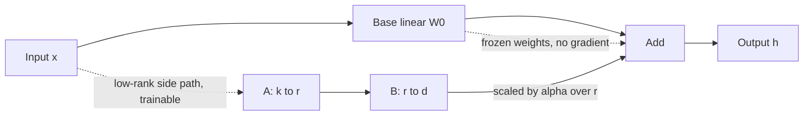

# LoRA

LoRA (Low-Rank Adaptation), introduced by Hu, Shen, Wallis, Allen-Zhu, Li, Wang, Wang, and Chen, is a way to finetune a large network by training a small update instead of all the weights. The base model stays frozen. The update is forced to be low rank.

## The idea

A pretrained weight matrix \(W_0\) maps activations with shape \(k\) to shape \(d\): \(W_0 \in \mathbb{R}^{d \times k}\). Full finetuning replaces it with \(W_0 + \Delta W\), where \(\Delta W\) has the same \(d \times k\) free parameters. LoRA constrains the update:

\[
\Delta W = BA, \quad B \in \mathbb{R}^{d \times r}, \quad A \in \mathbb{R}^{r \times k}, \quad r \ll \min(d, k).
\]

The forward pass is

\[
h = W_0 x + \frac{\alpha}{r} B A x.
\]

\(W_0\) does not receive gradient. \(A\) and \(B\) do. \(A\) is typically initialized from a random Gaussian and \(B\) from zeros, so \(\Delta W = 0\) at step 0 and training starts from the pretrained behavior. The diagram is a frozen main path plus a thin side path.

## Why a low-rank update can be enough

The motivating hypothesis is that task adaptation changes the weights in a low-dimensional way: the useful \(\Delta W\) has **intrinsic rank** much smaller than \(d\). You do not need a new full matrix to steer a model that already contains broad features. A thin update can reweight how those features combine. This is a hypothesis that works well in practice, not a proof that every task has a tiny rank. If the task is far from pretraining, or you need many independent behaviors, a too-small \(r\) underfits.

## Rank, alpha, and parameter count

Trainable parameter count for one matrix is

\[
r \cdot d + r \cdot k = r(d + k),
\]

versus \(d \cdot k\) for full finetuning. Example: \(d = k = 4096\) and \(r = 8\). Full update: \(4096^2 = 16{,}777{,}216\) parameters. LoRA: \(8 \times (4096 + 4096) = 65{,}536\) parameters, about \(0.4\%\) of that matrix. Add this up only over the matrices you adapt, not over the whole model if embeddings and layer norms stay frozen.

**Alpha** \(\alpha\) is a fixed scale, not a learned parameter in the original method. The effective step size of the update is \((\alpha / r)\) times \(BA\). If you increase \(r\) and keep \(\alpha\) fixed, the factor \(\alpha/r\) shrinks, which roughly stabilizes the magnitude of \(\Delta W\) as rank grows. A common default is \(\alpha = r\) or \(\alpha = 2r\), so the factor is 1 or 2. Treat that as a starting point you sweep, not a law. Some codebases absorb \(\alpha/r\) differently; read the implementation before you compare two runs.

**Which matrices.** The original work adapted attention projections and found that query and value (\(W_q\), \(W_v\)) were a strong efficiency point, with key and output optional. In practice people also adapt \(W_k\), \(W_o\), and sometimes the MLP projections (`gate`, `up`, `down`). More matrices means more capacity and more memory. Adapting every linear layer is still far smaller than full finetuning. Embeddings are often left frozen so the tokenizer interface stays put.

**Dropout** on the LoRA branch and a small **weight decay** are optional regularizers. **Bias** terms are often left frozen.

## What is frozen, and what "merge" means

Frozen: \(W_0\), and usually the embedding, the output head if you did not target it, and layer norms unless you chose otherwise. Optimizer states exist only for \(A\) and \(B\). That is the memory win. You store the base model once, plus a small file of adapter weights per task.

**Merging** for serving computes

\[
W' = W_0 + \frac{\alpha}{r} BA
\]

and drops \(A\) and \(B\). The merged layer is an ordinary dense linear. Latency matches the base model. There is no adapter hop at inference. You can keep the adapter unmerged if you need to swap tasks on one loaded base: one set of frozen weights, several side paths. Unmerged inference costs an extra small matmul per adapted layer.

Do not merge two adapters by naively adding them unless you have checked that they were trained against the same base and that their tasks do not interfere. Addition is a convenience, not a guarantee.

## Failure modes

- **Rank too small.** The side path cannot represent the update. Training loss plateaus above a higher-rank run. Raise \(r\), or adapt more matrices, before you blame the data.
- **Rank large and data small.** You approach full-finetune capacity and can overfit or **catastrophically forget** pretraining skills. The frozen base limits damage relative to updating every weight, but the model can still shift its style and lose tasks that the finetune never shows. Check the old task, not only the new loss.
- **Bad data.** LoRA faithfully fits whatever you put in the pairs: label noise, leaked answers, a single template, or a system prompt that will not be present at inference. Low rank does not filter errors. It only limits how those errors are stored.
- **Learning rate and scale mismatch.** LoRA often tolerates a higher learning rate than full finetuning because few parameters move, but \(\alpha/r\) and the learning rate multiply. Changing rank without touching \(\alpha\) or the learning rate changes the effective step.
- **Target modules wrong for the architecture.** A name list copied from another model (`q_proj`, `v_proj`) may match nothing, so you silently train zero tensors. Log the number of trainable parameters and confirm it is non-zero and in the expected range.
- **Serving the unmerged adapter with the wrong base.** The adapter is a delta on a specific \(W_0\). A different checkpoint, a different quantization, or a reordered vocabulary makes the sum meaningless.

## How to talk about it

State the shapes, the freeze, the scale \(\alpha/r\), and the parameter formula. Say that you merge when you want base-model latency and you keep the adapter when you want multi-task switching. Say what you would measure if rank were too low (train loss stuck, val not improving while a higher rank improves) versus if the data were wrong (train loss falls, held-out behavior is confidently bad).
