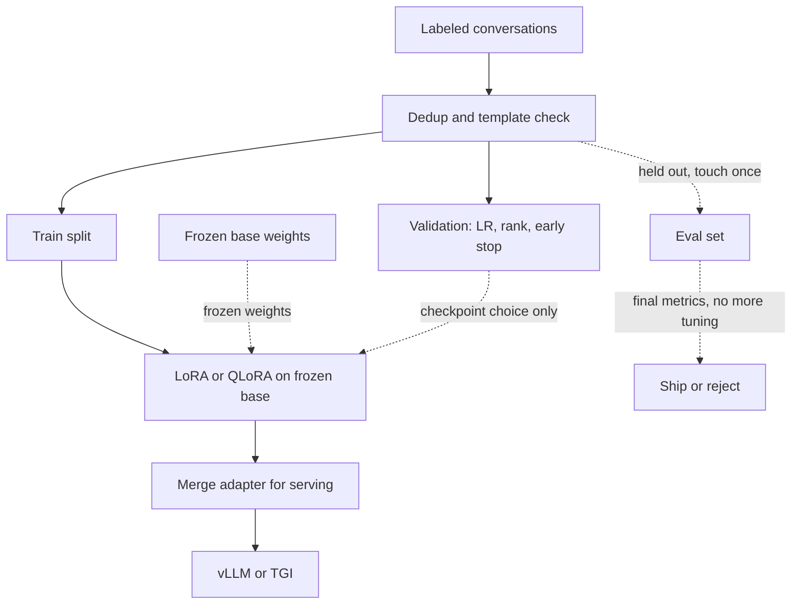

# PEFT and training practice

Parameter-efficient finetuning succeeds or fails in the dataset and the evaluation, not in a magic learning rate. LoRA and QLoRA are the update rule. This note is the surrounding practice: what you train on, what you refuse to tune on, and what you log so a run can be repeated.

## What you are optimizing

You still minimize next-token cross-entropy. On instruction data, mask the prompt tokens so the loss is on the assistant response only, unless you have a reason to learn the prompt text. If the loss includes the prompt, the model spends capacity copying your template. Keep the tokenizer identical to the base model. Do not add special tokens unless you resize the embedding and accept that those rows are new parameters.

A practical instruction record has a system or task prefix, a user input, and a target completion, stored as text plus the chat template the base model expects. Train and serve with the **same** template. A mismatch is a silent distribution shift: the model learned `<|assistant|>` and you serve `### Response:`.

## Dataset construction

Start from the decisions the model must make in production, not from a generic instruction dump.

- Write the input the way production will. Include the retrieved fields, the tool schema, and the language mix you will actually see.
- Write targets that a grader can check: exact JSON, a short answer plus a citation span, a refusal, or a fixed label set.
- Include negative and edge cases: missing fields, ambiguous questions, unsupported asks, and the previous skill you must not lose.
- Deduplicate. Near-copies inflate accuracy and slow learning of the rare case.
- Split by the unit that generalizes: document, customer, or time. A random split of overlapping tickets leaks the answer.
- Hold out an **evaluation set** that never drives early stopping, checkpoint selection, or prompt edits. Use a separate validation slice for those choices. If the dataset is small, say so and prefer a fixed validation set over cross-validation theater you will not finish.

Data quality dominates rank. A few hundred clean, representative pairs often beat tens of thousands of scraped, off-template pairs. If you cannot explain a label, do not train on it.

## A recipe checklist

These are starting points to sweep, not a universal hyperparameter set.

1. Confirm the base checkpoint, tokenizer, chat template, and dtype.
2. Choose target modules (`q_proj` and `v_proj`, or all attention projections, or attention plus MLP). Print trainable parameter count and the percentage of total parameters.
3. Pick rank \(r\) and alpha. Start near \(r \in \{8, 16, 32\}\) with \(\alpha = r\) or \(\alpha = 2r\). Raise rank if training loss floors and a higher rank still improves validation.
4. Learning rate: LoRA often starts around \(1 \times 10^{-4}\) for the adapter, sometimes lower (\(2 \times 10^{-5}\)) when the data is small or the rank is high. Full finetunes of the same model use smaller rates. Sweep on validation loss, not on the test set.
5. Epochs: small instruction sets overfit in a handful of passes. Watch validation loss every epoch. Stop when it rises while training loss falls.
6. Batch size and sequence length: fit memory first. Gradient accumulation increases the effective batch without extra activation memory. It does not fix a bad learning rate by itself.
7. **Packing** concatenates short examples into one sequence up to the max length, separated so one example's tokens are not trained as the continuation of another. Packing raises utilization. It is wrong if the boundary masking is buggy, because the model then learns to answer from a neighbor's prompt. If you are unsure, pad instead of pack until the mask is tested.
8. Gradient checkpointing if activations do not fit. It trades compute for memory.
9. Seed, full config, and data hash logged before the first step.

## Catastrophic forgetting

The new loss does not mention the old skills, so they can decay: format drift, worse general answers, a refusal policy that disappears, or a language the finetune never shows. The frozen base makes this less violent than updating every weight, but it still happens inside the adapter.

Checks that belong in the run, not in a postmortem:

- A slice of the previous task, scored the same way as before.
- A handful of pretraining-style or general prompts if you still need open chat.
- The new task's validation loss, so you see the tradeoff rather than only the win.

If the old task drops below the bar, reduce epochs, lower rank, mix in rehearsal data from the old task, or lower the learning rate. Rehearsal is data, not a slogan: real examples of the skill you need to keep.

## Merging and serving

After selection on validation, merge \(W' = W_0 + (\alpha/r) BA\) for single-model serving. For QLoRA, dequantize then add, as described in the QLoRA note. Keep the unmerged adapter if several tasks must share one loaded base.

**vLLM** and **Hugging Face Text Generation Inference (TGI)** serve decoder-only models with continuous batching, a paged KV cache, and tensor parallelism. Conceptually you give them a merged checkpoint (or a base plus an adapter, if that server version supports loading one). You set the chat template, max context, and dtype. Quantized serving (GPTQ, AWQ, or the runtime's own kernels) is a separate choice from QLoRA training: training quantization and serving quantization do not have to match, but you must eval the artifact you will actually call.

Do not expect adapter hot-swap to be free on every server. Some paths load adapters; some want a merged weight. Decide before you promise per-tenant models.

## What to log

- Data version, split definition, row counts, label guidelines, and a template example.
- Base model id, trainable count, target modules, \(r\), \(\alpha\), dropout, learning rate, epochs, effective batch, sequence length, packing on or off, seed.
- Train and validation loss curves, gradient norm, and learning-rate schedule.
- Task metrics on validation each epoch, plus the forgetting slice.
- The final test numbers, once, with the checkpoint hash.
- Whether metrics are on the merged model or the adapter path, and the decoding settings (temperature, max tokens).

If a metric moves and you cannot tie it to a config line and a data hash, the run did not happen in a way you can defend in an interview or in production.
