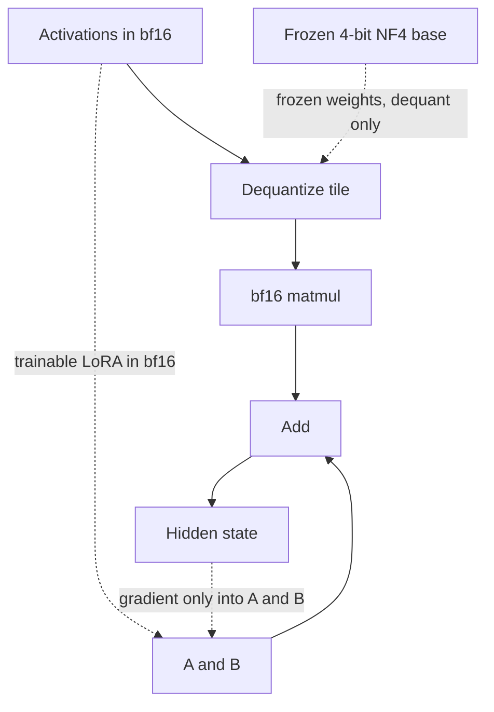

# QLoRA

QLoRA, introduced by Dettmers, Pagnoni, Holtzman, and Zettlemoyer, is LoRA on a frozen base that is stored in 4-bit, with three specific techniques: 4-bit NormalFloat quantization, double quantization of the scale constants, and paged optimizers. The adapters are trained in higher precision. The 4-bit base is not what receives the gradient.

## What is frozen and what is trained

The base weight stays a 4-bit tensor. It is **dequantized to the compute dtype** (typically bfloat16) for the matrix multiply, then the LoRA branch runs in bfloat16:

\[
h = \mathrm{dequant}(W_{\text{4bit}})\, x + \frac{\alpha}{r} B A x.
\]

Gradients update \(A\) and \(B\) only. Optimizer moments exist for the adapter, not for the base. This is the correction to a common misstatement. People say "the model is finetuned in 4-bit." The stored base is 4-bit and frozen. The forward matmul is in 16-bit after dequantization. The trained parameters and their Adam states are 16-bit (often bf16 weights, fp32 optimizer moments). You do not backpropagate an update into the 4-bit codes.

Why not train the base in 4-bit? The quantization grid is coarse. A useful weight update is smaller than a 4-bit bin, and the storage win exists only if the giant matrices have no gradients and no Adam state. LoRA already restricts the update to a low-rank bf16 path. QLoRA keeps that path and shrinks the frozen base.

## NormalFloat 4-bit

Uniform int4 cuts the range into equal steps. Neural network weights are roughly bell-shaped, concentrated near zero, so equal steps waste bins on the tails and under-resolve the center. **NormalFloat (NF4)** places the 16 reconstruction values using quantiles of a normal distribution, so bins are tighter near zero. It is an information-efficient codebook when the values really are approximately normal. It is not the same as int4, nf4 is not "just smaller floats," and it is not a claim that every tensor in the network is exactly standard normal. Implementations also keep a per-block scale so one codebook can cover different magnitudes.

A second common misstatement: quantizing to 4-bit and running LoRA is "QLoRA" in casual speech. The paper's method is the NF4 storage format, double quantization, and paged optimizers, plus LoRA. A library checkbox may enable that stack, or it may only cast weights to int4. Know which one you turned on.

## Double quantization

Block-wise quantization stores a scale (quantization constant) beside each block of weights. With a block of 64 weights and a 32-bit scale, the scales cost \(32/64 = 0.5\) bits per weight on top of the 4-bit payload. **Double quantization** quantizes those scales. The usual sketch: store the first-level scales in 8 bits, and keep a second-level 32-bit scale over a larger group (256 first-level scales in the standard description). The overhead becomes about

\[
\frac{8}{64} + \frac{32}{64 \times 256} \approx 0.127 \text{ bits per weight},
\]

instead of 0.5. The 4-bit payload is unchanged. Double quantization saves the *constants*, not another copy of the matrix. If someone quotes a large end-to-end speedup and attributes it only to double quantization, they have mixed up a small overhead reduction with the win from 16-bit storage down to 4-bit storage.

## Paged optimizers

Gradient checkpointing recomputes activations and can spike memory. **Paged optimizers** (paged AdamW in this line of work) sit on CUDA unified memory: optimizer pages can move to CPU RAM when the GPU allocator would otherwise fail, then move back. This is a stability mechanism for memory spikes, not a faster Adam. It does not reduce the amount of optimizer state; it changes where a spike can land. If the working set never fits even with paging, training becomes a thrash between CPU and GPU. Paging is not a reason to skip a memory estimate.

## Memory sketch

Let \(P\) be the number of base parameters. Order-of-magnitude storage, ignoring activations and the framework:

| Setup | Base weights | Gradients on base | Adam on base | Adapter |
| --- | --- | --- | --- | --- |
| Full finetune, bf16 weights, fp32 Adam | \(\sim 2P\) bytes | \(\sim 2P\) | \(\sim 8P\) (two fp32 moments) | none |
| LoRA, bf16 base | \(\sim 2P\) | 0 | 0 | \(r(d+k)\) per matrix, plus Adam on those only |
| QLoRA, NF4 base | \(\sim 0.5P\) plus scale overhead | 0 | 0 | same adapter cost as LoRA |

Full finetune is on the order of 12 to 16+ bytes per parameter before activations, depending on whether master weights are an extra fp32 copy. QLoRA base storage is a bit above 0.5 bytes per parameter once scales are included. The adapter's Adam state is small because \(r(d+k)\) is small: for \(r = 16\) on a \(4096 \times 4096\) matrix, 131,072 trainable parameters, and Adam at 8 bytes of moments plus a bf16 or fp32 master copy is a few megabytes for that matrix, not gigabytes.

Activations still scale with batch, sequence length, and layers. QLoRA does not make a 32k-token batch free. Checkpointing, shorter sequences, and a smaller batch are still the levers. Dequantization also adds compute and temporary tiles, so a QLoRA step is often slower than a 16-bit LoRA step on the same GPU even though it uses less weight memory.

## QLoRA versus LoRA versus full finetune

- **Full finetune** when the base must change a lot, you have the memory, and you will regression-test old skills. Highest capacity, highest forgetting and overfitting risk, hardest to swap as a small artifact.
- **LoRA in bf16** when the base fits in 16-bit and you want the cleanest adapter math. Merge is exact relative to the bf16 base you trained against: \(W' = W_0 + (\alpha/r) BA\).
- **QLoRA** when the 16-bit base does not fit, or you need the memory for batch and sequence. Quality is often close to 16-bit LoRA on the same pairs; it is not guaranteed identical, because the forward pass sees dequantized weights. Compare on your held-out set.

**Merging after QLoRA.** You dequantize \(W_{\text{4bit}}\) back to bf16 (or fp16), add the scaled adapter, and save that dense matrix. You do not add \(BA\) into the 4-bit codes in place. The merge is exact only with respect to the dequantized base, which is already a quantized approximation of the original checkpoint. Re-quantizing the merged result for serving adds a second quantization error. Say that explicitly if the interviewer asks whether the adapter "writes into the 4-bit weights."

## Failure modes

All LoRA failure modes still apply: rank too small, bad data, forgotten evals. Extra ones: using nf4 versus a mismatched 4-bit type and comparing runs as if they were the same; forgetting that the compute dtype is bf16 and overflowing in fp16; paging that hides an out-of-memory configuration until throughput collapses; and evaluating the merged bf16 model as if it were bit-identical to the unmerged 4-bit training graph. Log trainable parameter count, the quantization type, the compute dtype, and whether the reported metric is merged or unmerged.
