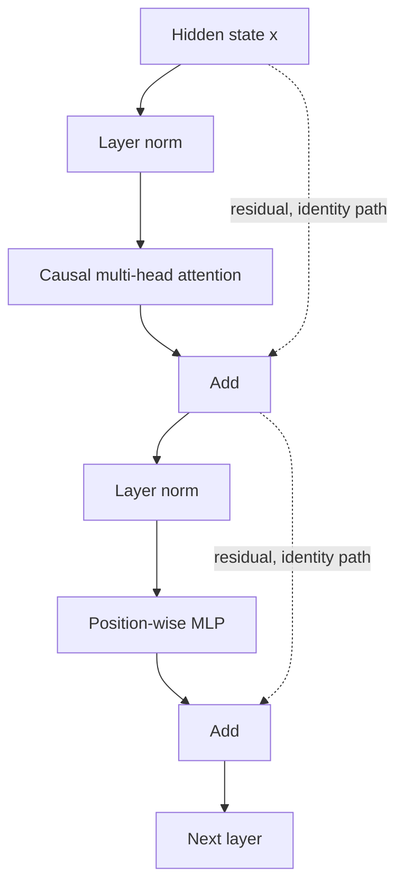

# Deep learning and transformers

This note builds from backpropagation to the transformer blocks used in modern language models. The math is the standard scaled dot-product attention, written in plain notation.

## Backprop, in one picture

A network is a composition of simple functions. Each has a local derivative. **Backpropagation** is the chain rule applied from the loss backward, reusing intermediate values from the forward pass. If \(L\) depends on \(y\) and \(y = f(z)\), then

\[
\frac{\partial L}{\partial z} = \frac{\partial L}{\partial y} \frac{\partial y}{\partial z}.
\]

You do not derive a giant closed form. You multiply Jacobians, one layer at a time. The forward pass stores activations; the backward pass turns those into gradients for the weights. Optimizer step (SGD, AdamW) then moves the weights.

**Vanishing gradients** happen when many of those factors are smaller than one. Sigmoids saturate: their derivative is near zero for large inputs, so early layers get almost no signal. Exploding gradients are the same product with factors larger than one; training diverges. Practical controls are residual connections, careful initialization, layer normalization, gradient clipping, and activations such as GELU or ReLU whose derivatives do not squash the whole range. LSTM and GRU were earlier sequence answers to the same problem. Residuals are the transformer answer: the path \(x + F(x)\) has a derivative that includes \(1\), so gradient can pass even when \(F\) is poorly scaled.

## Attention: queries, keys, values

A token needs to look at other tokens. Attention does that with three projections of the same hidden states \(X\):

- **Query** \(Q = X W_Q\): what this position is looking for.
- **Key** \(K = X W_K\): what each position advertises.
- **Value** \(V = X W_V\): the content to pass along if selected.

Scores are similarities between queries and keys. **Scaled dot-product attention**:

\[
\mathrm{Attention}(Q, K, V) = \mathrm{softmax}\left(\frac{Q K^\top}{\sqrt{d_k}}\right) V.
\]

The scale \(\sqrt{d_k}\) matters. Dot products of \(d_k\)-dimensional vectors with variance-1 entries grow like \(d_k\). Unscaled scores become large, softmax saturates, and gradients vanish. Dividing by \(\sqrt{d_k}\) keeps scores in a range where softmax is not a one-hot spike.

**Causal masking** sets scores for future positions to \(-\infty\) before softmax, so a decoder cannot peek ahead. Encoder self-attention is usually bidirectional. Cross-attention uses queries from one sequence and keys/values from another, which is how an encoder–decoder attends to the source text.

### A numeric example

One query and two keys, with \(d_k = 2\) so \(\sqrt{d_k} \approx 1.41\). Let the query be \(q = [1, 0]\), the keys be \(k_1 = [1, 0]\) and \(k_2 = [0, 1]\), and the values be \(v_1 = [2, 0]\), \(v_2 = [0, 3]\).

Unscaled dots: \(q \cdot k_1 = 1\), \(q \cdot k_2 = 0\). Scaled scores: \(1/1.41 \approx 0.71\), and \(0\). Softmax:

\[
w_1 = \frac{e^{0.71}}{e^{0.71} + e^{0}} \approx \frac{2.03}{2.03 + 1} \approx 0.67, \quad w_2 \approx 0.33.
\]

Output \(\approx 0.67 [2, 0] + 0.33 [0, 3] = [1.34, 0.99]\). The position whose key aligns with the query contributes more of its value. If you forgot the scale and the dots were large, one weight would go to nearly 1 and the other to 0.

## Multi-head attention

One head can specialize in only one similarity. **Multi-head attention** runs \(h\) attentions in parallel with smaller head dimension \(d_k = d_{\text{model}} / h\), concatenates, and mixes with an output matrix \(W_O\):

\[
\mathrm{MultiHead} = \mathrm{Concat}(\mathrm{head}_1, \ldots, \mathrm{head}_h) W_O.
\]

Heads often learn different relations — syntax in one, a name copy in another — but you should not claim a specific head "is" a linguistic feature without evidence. The parameter cost is similar to one full attention of width \(d_{\text{model}}\), split across heads.

## Position

Self-attention is a set operation: permuting tokens permutes outputs. Language is ordered, so the model needs position. **Absolute sinusoidal encodings** add a deterministic function of the index to the token embedding. **Learned absolute embeddings** do the same with a table, up to a trained maximum length. **Rotary position embeddings (RoPE)** rotate query and key so that their dot product depends on relative offset. **ALiBi** adds a distance penalty to attention scores. Relative methods extrapolate to longer contexts more gracefully than a learned absolute table, but they do not grant unlimited context: attention is still quadratic in sequence length, and the model was only trained up to some range.

## Encoder, decoder, and decoder-only

- **Encoder** (BERT-style): bidirectional self-attention. Strong for classification and embeddings. The pretraining task is often masked tokens, not free generation.
- **Encoder–decoder** (T5, original transformer translation): the encoder reads the source; the decoder generates the target with causal self-attention and cross-attention into the encoder.
- **Decoder-only** (GPT and most chat LLMs): a stack of causal blocks. The same network does pretraining and generation. There is no separate encoder; "understanding" and "generation" share weights. Prefix text is just tokens already in the context.

For applied LLM roles, decoder-only is the default architecture to explain.

## A block: residual, norm, MLP

A pre-norm transformer block is:

\[
x \leftarrow x + \mathrm{Attention}(\mathrm{LN}(x)), \quad x \leftarrow x + \mathrm{MLP}(\mathrm{LN}(x)).
\]

**Layer norm** rescales activations within a token, across features, which stabilizes depth. **Pre-norm** (norm inside the residual branch) is easier to train deep than the original post-norm. The **MLP** is a position-wise expansion, often up to \(4 d\) and back, with GELU. Attention mixes *across positions*; the MLP mixes *across features* at one position. Residuals let the block add a small update instead of replacing the stream.

## Why transformers scale

Recurrent nets compute token \(t\) only after token \(t-1\), so the sequence length is a serial chain. Attention over a *fixed* window is parallel: every query–key dot product in a layer can run at once on a GPU. That utilization, plus residual training stability, is why depth and width can grow when data and compute grow. The costs that do not go away:

- Attention time and memory scale as \(O(n^2)\) in sequence length \(n\) for dense attention.
- The model is a statistical next-token machine. Scale improves loss when data and parameters grow together; it does not by itself guarantee truthfulness or calibration.

Interviewers want the mechanism: Q, K, V, why divide by \(\sqrt{d_k}\), what the mask does, what the residual is for, and why a decoder-only stack is the LLM default.
