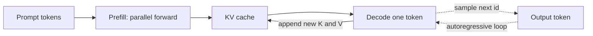

# LLM internals

This note is the inference and training picture behind a decoder-only language model: tokens, the training objective, the cache that makes generation affordable, and why fluent text can still be false.

## Tokenization and BPE

The model does not see characters or words as the atomic unit. It sees **token ids**. **Byte Pair Encoding (BPE)** starts from bytes or characters and repeatedly merges the most frequent adjacent pair into a new symbol, building a vocabulary of a fixed size (often tens of thousands). Common words become one token. Rare words and typos become several. A space may be part of the token (`" hello"` is often different from `"hello"`).

Consequences you should say out loud:

- Numbers, code, and non-English scripts can tokenize into many pieces, so a "4k context" is not 4,000 words.
- The model cannot spell or do arithmetic on characters it never sees as characters, unless the tokenizer happens to split them that way.
- Prompt formatting is token-sensitive. A leading space or a missing newline can change the id sequence the model was trained on.

SentencePiece and Unigram are related alternatives. The interview point is the same: the vocabulary is a learned compression, and all position counts are in tokens.

## Next-token pretraining

Decoder-only pretraining minimizes cross-entropy of the next token. For a sequence \(x_1, \ldots, x_T\),

\[
L = -\sum_{t=1}^{T-1} \log p(x_{t+1} \mid x_{\le t}).
\]

The conditional distribution is a softmax over the vocabulary from the final hidden state. This objective is why the model is good at continuation. It is not an objective for "answer the user" or "be true." Those behaviors are added later.

**Instruction tuning** (supervised finetuning, SFT) continues the same next-token loss, but on prompt–response pairs, often with the loss masked so only response tokens contribute. The base model is a completer. The SFT model is biased toward the format and tone of the demonstrations. Instruction tuning does not create new facts that were absent from the weights; it mostly changes which continuation style is likely. If the demonstrations are narrow, the model imitates that narrow style and can forget other skills.

## Context window

The **context window** is the maximum number of tokens the implementation will feed through the stack at once, set by training length, positional method, and memory. Everything the model can condition on for the next token must be inside that window: system prompt, retrieved passages, conversation, and the answer so far. Tokens that fall off the left are gone. There is no separate long-term memory unless you build one (retrieval, a database, a summary you write back into the window).

Longer context is not free attention over a perfect memory. Models use the middle of a long prompt less reliably than the beginning and the end ("lost in the middle"). A 128k window that you stuff with unranked documents can perform worse than a short window with the right paragraph.

## KV cache, prefill, and decode

In causal attention, the keys and values at position \(t\) depend only on tokens \(\le t\). When you generate token \(t+1\), those past keys and values do not change. The **KV cache** stores them so each new token attends to the cache instead of recomputing the whole prefix.

Two phases:

- **Prefill** processes the prompt in parallel. It is compute-heavy: large matrix multiplies over the whole prompt. Time grows with prompt length, and attention is quadratic in that length.
- **Decode** produces one new token at a time. Each step reads the full cache and appends one new key/value per layer per head. It is often **memory-bandwidth bound**: the GPU waits on reading weights and the growing cache, not on arithmetic. Time grows with output length and with batch size times cache size.

That split is why a short answer on a long prompt and a long answer on a short prompt stress different parts of the system. Cache memory is roughly

\[
2 \times n_{\text{layers}} \times n_{\text{kv heads}} \times d_{\text{head}} \times \text{seq} \times \text{bytes per element}
\]

per sequence (the 2 is K and V). Grouped-query attention reduces \(n_{\text{kv heads}}\) relative to query heads so the cache shrinks. Quantizing the cache (KV cache in 8-bit or 4-bit) is a serving technique with a quality tradeoff.

## Sampling

The model outputs a distribution over the next token. **Greedy** decoding takes the argmax. It is stable and repetitive.

**Temperature** \(T\) divides logits before softmax. \(T < 1\) sharpens the distribution; \(T > 1\) flattens it; \(T \to 0\) approaches greedy. Temperature does not add knowledge. It changes how often you pick unlikely tokens.

**Top-k** keeps the k largest logits. **Top-p** (nucleus) keeps the smallest set of tokens whose cumulative probability reaches \(p\), then renormalizes. Top-p adapts the shortlist to the shape of the distribution: a peaked step stays tight; an uncertain step allows more options. Production chat settings often combine a temperature below 1 with top-p. For extraction and tool arguments, greedy or very low temperature is usually the right default because diversity is a bug.

## Hallucination

A **hallucination** here means a fluent span that is not supported by the source of truth you care about (the world, the documents, or the tool result). Causes that are actually different:

- The next-token objective rewards plausible continuation, not a citation check.
- The fact was rare, wrong, or absent in training data, or it changed after the cutoff.
- The prompt is underspecified, so the model fills gaps the way text usually fills gaps.
- Decoding is hot, so low-probability fabrications get sampled.
- The model was instruction-tuned to answer rather than abstain, so "I don't know" is unlikely.
- Retrieval returned the wrong passage, and the model trusted it, or it ignored the passage and used parametric memory.

There is no single "hallucination rate" independent of the task. Measure unsupported claims on a set you labeled, and separate "wrong retrieval" from "model ignored the context."

## Inference cost, said cleanly

Parameters must be read from memory. A rough lower bound on decode is memory bandwidth: moving the weight matrices (and the cache) for every new token. Batching shares the weight read across requests, which is why serving stacks want concurrent sequences. Prefill can saturate compute; decode often cannot. Quantization shrinks weight traffic. A KV cache that grows with every user and every layer is why long conversations blow GPU memory even when the weight tensors fit.

When you describe a system, separate training cost (a one-time gradient update) from serving cost (prefill plus per-token decode). They fail for different reasons.
