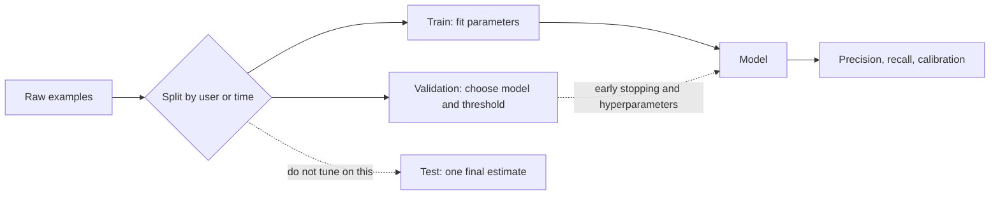

# ML foundations for applied LLM interviews

This note is a working vocabulary for someone who already ships LLM integrations and is interviewing for applied machine learning roles. The goal is to explain *why* a training run behaves the way it does, not to restate a semester of theory.

## Three ways a model gets a signal

**Supervised learning** pairs inputs with labels. A classifier sees an email and a spam bit. A regressor sees features and a number. The loss compares the model's output to that target. Most production ML, and all of instruction tuning, is supervised in this sense: the target is written down.

**Unsupervised learning** has inputs only. Clustering, density estimation, and classical PCA look for structure without a designated label. The risk is that the structure you find is not the structure the product needs.

**Self-supervised learning** builds the target from the input itself. Mask a token and predict it. Predict the next token. Contrast two views of the same image. No human label is required for each example, which is why this is how large language models are pretrained. It is still supervised *optimization* — there is a loss and a target — but the target is generated by a rule, not by an annotator. Interviewers use "self-supervised" to mean that rule-derived target. If you call next-token prediction "unsupervised," say what you mean: no human labels, but a supervised loss on a constructed target.

## Loss, fit, and the bias–variance tradeoff

A loss is a scalar that says how wrong a prediction is. Cross-entropy is the default for classification and next-token prediction: if the model assigns probability \(p\) to the correct class, the loss is \(-\log p\). Mean squared error is the default when the target is a real number. You minimize the average loss on the training set. That average is not the quantity you care about. You care about loss on future data from the same distribution.

**Bias** is error from a model that is too rigid to represent the pattern, even with infinite data. A linear model on a strongly curved relationship has high bias. **Variance** is error from a model that changes a lot when the training sample changes. A deep net that memorizes idiosyncrasies of one dataset has high variance. Total error decomposes, roughly, into bias, variance, and irreducible noise. You rarely estimate the three terms separately in an interview. You use the idea to interpret curves: high training loss and high validation loss suggests bias or under-training; low training loss and high validation loss suggests variance.

**Overfitting** is the variance failure mode. The model fits training noise. Signs: a widening gap between train and validation loss, perfect training accuracy with poor held-out accuracy, or features that only exist because of a data bug. **Underfitting** is the opposite: the model has not captured the signal yet, because it is too small, too constrained, or not trained long enough.

## Regularization

Regularization is any pressure that keeps the model from fitting noise.

- **L2 weight decay** adds \(\lambda \|w\|^2\) to the loss, pulling weights toward zero. In AdamW this is decoupled from the adaptive learning-rate scaling, which is why modern LLM training uses AdamW rather than Adam-with-L2-inside-the-gradient.
- **Dropout** randomly zeros activations in training so no single unit can be a brittle feature. It is less central in large transformer pretraining than it was in small vision nets, but it still appears.
- **Early stopping** halts when validation loss stops improving. The stopping point is itself a hyperparameter, so you must not pick it on the test set.
- **Data and objective constraints** matter more at LLM scale than classical penalties: more diverse data, a held-out eval, and a small learning rate during finetuning are regularization. Freezing most weights, as LoRA does, is regularization by restricting the update to a low-rank subspace.

## Splits and leakage

**Train** is what the optimizer sees. **Validation** is what you use to choose models, learning rates, early stopping, and prompts. **Test** is touched once, at the end, to estimate generalization. If you iterate on the test set, it becomes a second validation set and the number is optimistic.

**Leakage** is information from outside the training distribution sneaking into training, or information from the evaluation examples influencing the model or the decision. Common forms:

- The same document, user, or near-duplicate appears in train and test. For text, exact dedup is not enough; near-duplicates and paraphrases leak too.
- Scaling statistics, vocabularies, or feature selection are fit on the full dataset before the split.
- Time-series splits are random instead of chronological, so the model trains on the future.
- The prompt, the retrieval index, or the few-shot examples contain the answer, or the eval set was in the pretraining corpus. For LLMs this last case is **contamination**. A strong eval score may mean the model memorized the benchmark.

A clean split is a product decision. Define the unit of splitting (document, user, time) to match how the model will be used.

## Precision, recall, F1, and when accuracy lies

For a positive class:

- **Precision** = TP / (TP + FP). Of the items you flagged, how many were right?
- **Recall** = TP / (TP + FN). Of the items that were truly positive, how many did you catch?
- **F1** = the harmonic mean, \(2PR/(P+R)\). It punishes a method that sacrifices one for the other.

Accuracy is the wrong headline when classes are rare. A fraud model that always says "legitimate" can be 99.9% accurate and useless. Pick the operating point from the cost of false positives versus false negatives. Report precision at a fixed recall, or a precision–recall curve, when the positive class is rare.

**Class imbalance** is not only a metric problem. The optimizer sees mostly negatives, so a model can minimize loss by predicting the majority class. Remedies include class weights, resampling, a different loss (focal loss), and threshold tuning *on validation*. Resampling changes the training distribution; remember to undo that when you set the production threshold. More data for the rare class usually beats clever reweighting.

## Calibration

A calibrated model that says 0.8 is right about 80% of the time among examples where it says 0.8. Accuracy and calibration are different. A model can rank examples perfectly and still be overconfident. Cross-entropy rewards calibration somewhat, but modern nets are often overconfident. Temperature scaling on a validation set is a simple fix for classifiers: divide logits by a temperature \(T\) fit to validation log-loss, without changing the ranking. For LLMs, token probabilities are not probabilities of factual correctness. A fluent, high-probability continuation can be false. Do not treat next-token confidence as a calibrated answer probability unless you have measured it.

## Embeddings

An embedding is a vector that places similar things near each other so that a dot product or cosine means "related." A linear layer \(y = Wx\) is a map into such a space. In a transformer, token embeddings are learned vectors, one per vocabulary item, and the residual stream carries a sequence of vectors that later layers rewrite.

The useful intuition: discrete symbols have no geometry. After embedding, "near" is defined, so attention, classifiers, and retrieval can use angles and distances. The risk: nearness follows the training signal. A retrieval embedding trained on click data clusters by clicks, not by truth. Always state what similarity the vector was trained to represent.

## What interviewers are probing

They want you to connect a symptom to a cause. Validation loss rising while training loss falls is overfitting, and the next question is what you regularize or what leaked. A high F1 with a useless product is an operating-point or calibration problem. A jump in benchmark score after "just training longer" may be contamination. Say which split unit you used, which loss matches the decision, and which metric matches the cost of being wrong.
