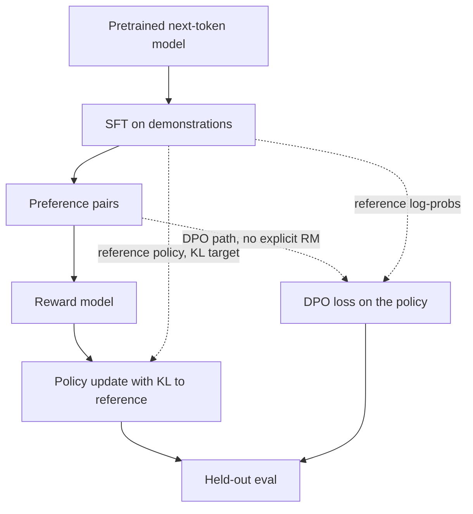

# Evaluation and alignment

Alignment here means steering a pretrained next-token model toward the behavior you will accept in a product: follow the instruction, prefer the better answer, refuse the disallowed one, and abstain when support is missing. The methods differ in what data they require. None of them replace an evaluation you trust.

## Supervised finetuning

**SFT** continues next-token training on demonstrations of the desired behavior. It is the right first alignment step because it is ordinary supervised learning. The model imitates the best (or the only) answer you wrote. Quality is capped by those demonstrations. If every example answers even when the context is insufficient, the SFT model learns to answer anyway. If the format is sloppy, the format stays sloppy. Data quality dominates the optimizer choice.

SFT does not use a preference ranking. If two answers are both acceptable, you typically show one. The model does not learn "A is better than B" unless that comparison appears as text.

## RLHF, at intuition level

**RLHF** (reinforcement learning from human feedback) adds a preference stage.

1. Collect comparisons: for the same prompt, humans (or a careful judge) say which completion is better.
2. Train a **reward model** \(r(x, y)\) to score a prompt–completion pair so that the preferred completion scores higher. This is a separate model, often initialized from the SFT model with a scalar head.
3. Optimize the policy so it produces high-reward completions, with a **KL constraint** toward a reference policy (usually the SFT model).

The KL term matters. Without it, the policy can drift into nonsense that the reward model wrongly scores as excellent, because the reward model is only accurate near the text it was trained on. The usual picture is an objective like expected reward minus \(\beta\) times KL divergence from the reference. PPO is one optimizer for that objective. You do not need the PPO derivation to explain the idea: a reward signal, a frozen-ish reference, and a penalty for leaving the region where the reward is meaningful.

RLHF can learn from "A beats B" without a single gold paragraph. The costs are real: a reward model to train and to fool, an RL stack, and reward hacking (the policy finds a loophole in \(r\), such as length, flattery, or a phrase the judge likes).

## Why DPO skips an explicit reward model

**DPO** (Direct Preference Optimization) starts from the same preference-plus-KL goal and reparameterizes it. The optimal policy under a KL penalty implies a reward of the form

\[
r(x, y) = \beta \log \frac{\pi(y \mid x)}{\pi_{\mathrm{ref}}(y \mid x)} + \text{a term that depends only on } x.
\]

That term cancels in a preference comparison. The Bradley-Terry model of "y_win beats y_lose" then becomes a classification loss on the policy itself: increase the margin between log-probabilities of the winner and the loser, relative to the reference. You train \(\pi\) with a supervised-style loss on pairs. There is no separate reward head and no on-policy RL loop.

What DPO does **not** mean: that preferences are free, that the reference can be omitted, or that the method cannot overfit a small pair set. The implicit reward can still be gamed if your pairs are biased (always prefer the longer answer). You still need the SFT reference to be a decent starting policy. You still evaluate on a set that was not used to build the pairs.

## Hallucination metrics

Define the claim unit first: a sentence, an entity, or an answer that must be entailed by a passage. Then score it.

- **Closed-book factuality** against a trusted key is only as good as the key. Exact match punishes harmless paraphrase and misses a wrong answer that shares a token.
- **Groundedness / attribution**: given a passage, is each claim supported? Unsupported, contradicted, and "not in the passage" are different labels. A model that abstains is not the same error as a model that invents.
- **Citation precision and recall** if the product shows sources: did the cited span support the claim, and were the needed spans cited?
- Automatic NLI or a judge model can pre-label at scale after you measure agreement with humans on this domain. Uncalibrated NLI numbers are not a ship decision.

Report the rate with the denominator. "Hallucination score" without the task mix is not interpretable.

## Golden sets

A **golden set** is a fixed, reviewed collection of inputs and acceptable outputs or rubrics. It should match production: language, length, tool failures, and the fraction of unanswerable items. Build it before you prompt-tune or train. Split a development slice from a final slice. Adding failures you just saw into the set you are optimizing is how a team convinces itself the model improved.

Refresh the set when the product changes. A stale golden set is a silent leak in the other direction: you are no longer measuring the traffic you have.

## LLM-as-judge

A strong model can grade style, instruction following, and some relative preferences. The pitfalls are systematic:

- **Position bias**: the first or the second answer wins too often. Swap order.
- **Verbosity and self-preference**: longer answers, and answers that resemble the judge's own style, score higher.
- **Inability to grade truth** the judge does not know. A fluent falsehood beats a terse fact.
- **Contamination and circularity**: the judge shares the failure mode of the candidate, or was trained on the same rubric text.
- **Unstable rubrics**: a vague "helpfulness" scale moves when the prompt changes, not when the product changes.

Use a judge after measuring agreement with humans (percent agreement or Cohen's kappa on a sample). Use it for pairwise ranking more readily than for absolute scores. Do not let the judge see hidden chain-of-thought as if it were evidence.

## Human evaluation

Humans are the reference for preference and for policy, and they are noisy. Write a guideline with examples of accept, reject, and borderline. Train the raters. Hide model identity. Prefer side-by-side on the same prompt over isolated 1–5 scores. Measure inter-rater agreement before you trust a small gap. Experts are required when the label is medical, legal, or a language the crowd does not speak. Human eval is expensive, so use it to calibrate automatic checks, not to rescore every checkpoint by hand.

## Safety evaluation

Safety is a separate slice, not a vibe inside the helpfulness score. Include disallowed requests, allowed requests that share keywords with disallowed ones (so you see over-refusal), and jailbreak wrappers. Score **compliance** (did it do the harmful thing), **over-refusal** (did it refuse a benign lookalike), and **policy consistency**. Tool-using systems need tests where the harmful step is a tool call, because a polite refusal in text can still emit the call.

A finetune on helpful demonstrations can erase refusals. Put the safety slice in the forgetting checks. If you do not have permission and a process for red-team data, do not improvise harmful content into the training set; evaluate with an approved set and a refusal policy you can describe.

## Why data quality dominates

SFT copies your demonstrations. A reward model or DPO copies your preferences, including length bias and majority taste. A larger rank or a more elaborate optimizer fits those biases more thoroughly. The review that moves quality is the labels: disagreements, unanswerable items marked as answered, leaked solutions, and a single template that will not appear in production. Alignment methods change how you learn from comparisons. They do not invent a standard of correctness you failed to write down.
