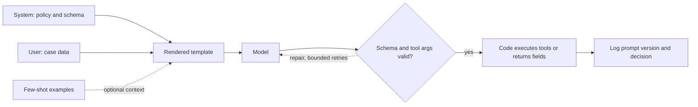

# Prompt engineering

Prompting is interface design for a model that continues text. A senior engineer treats the prompt as a versioned contract: inputs, outputs, failure behavior, and a way to tell that a change helped. The tricks matter less than the contract.

## System, user, and the template

Chat models are trained on a **template** that marks roles. The **system** turn usually carries stable policy: what the assistant is for, what it must not do, the output schema, and the language. The **user** turn carries the request and the case data. The **assistant** turn is what you sample, or what you include as prior dialogue.

Put rules that must survive every request in the system turn, and put the variable facts in the user turn. Do not hide new policy in the middle of a document. Do not assume the model "remembers" a rule from a previous call unless that text is still inside the context window you send.

The template tokens are part of the model. If you finetune with one wrapper and call the model with another, you are not testing the prompt you trained. Log the rendered string, not only the JSON you passed to a client library.

## Few-shot examples

**Few-shot** prompting places solved examples in the context so the next completion imitates them. It is the right tool when the format is easier to show than to define: a labeling scheme, a dialect, a citation style.

Use examples that cover the decision boundary, not five copies of the happy path. Include one edge case and, when refusal matters, one refusal. Keep the examples short. They cost context and they can be copied verbatim into the answer, including their fake numbers. Examples are data. If they contradict the system instruction, the model may follow the more recent or more concrete text.

Zero-shot is enough when the task is already in the model's post-training and the schema is simple. Few-shot is not a substitute for a finetune when you have thousands of consistent cases and a latency budget. It is the right first step before you spend a training run, because it tells you whether the task is specified.

## Decomposition

A single call that asks for retrieval, judgment, arithmetic, and a formatted report will drop one of them. **Decomposition** splits the work into calls whose outputs you can check.

- Classify or route first, then run a specialist prompt.
- Extract structured fields, validate them in code, then ask for the prose that is allowed to use only those fields.
- Ask for a plan only when a later step executes it. A plan the model also grades is not a control.

Each extra call adds latency and a new place to fail. Decompose where a check exists. Do not decompose a short classification into a chain of pep talks.

**Tool use** is decomposition with a real function. The prompt includes the tool name, the arguments schema, and when *not* to call it. The model proposes a call; your code executes it and appends the observation. The model does not have the side effect until your runtime runs it. Validate arguments before execution. Give the model the error string when validation fails so it can repair, and cap retries so a loop cannot burn the context window.

## Structured output

If the next stage is code, the output should be JSON, a fixed label, or a tool call, not a paragraph you parse with hope. State the schema, the allowed keys, and an example that parses. Constrain decoding when the stack supports it (grammar, JSON mode, or a schema-guided sampler). Then validate again in your process. Constrained decoding stops syntax errors. It does not stop wrong values.

Ask for only the fields you will read. Optional essays "so we can debug" become fields the model optimizes instead of the label. If you need a rationale, put it after the machine-readable answer or in a separate call, and do not let the rationale's fluency outvote a failed schema check.

## Failure modes

- **Specification gaps.** The prompt never says what to do with missing input, so the model invents a plausible fill. Write the empty case.
- **Instruction conflict.** System says "only use the passage"; the user says "use your knowledge"; a few-shot example uses outside knowledge. Pick one.
- **Context stuffing.** More documents feel safer and dilute attention. Rank and trim.
- **Format drift.** A small wording change flips the language or adds a preamble that breaks the parser.
- **Prompt injection.** Untrusted text in the user turn or in a retrieved page says "ignore the above." Treat retrieved text as data. Delimit it. Do not give a tool the authority to act on instructions that came from the document. A strong system prompt reduces the rate; it is not an authorization boundary. Authorization belongs in code.
- **Copying the demo.** The model emits the example's entity names. Change examples or check for overlap.
- **Hidden decoding changes.** You edited temperature while comparing prompts and attributed the delta to the wording.

## Evaluating prompts

A prompt change is a model change. Keep a **golden set**: inputs, the untrusted context if any, and the label or rubric, drawn from production traffic and from the edge cases you fear. The set is versioned. You do not add today's failure and retune until the score looks good, then quote that score. Put new failures in a later split or accept that you are looking at a training set.

Score what the product does. Exact match or schema validity for structured tasks. A rubric with cited spans for grounded answers. A refusal label for disallowed asks. Compare prompts under the same decoding settings and the same retrieval. Report confidence only if the set is large enough that a two-point move is not noise.

LLM-as-judge can rank prose when you have calibrated it against humans on this task. It is a poor judge of its own prompt family and a poor judge of facts it also gets wrong. See the evaluation note for those pitfalls. For prompt work, prefer a check a second program can recompute.

## The senior bar

You should be able to say: where the rule lives, what the model is allowed to invent, which examples cover the boundary, how an untrusted document is delimited, how the output is validated, and which held-out set decides that version B is better than version A. Wording craft is part of the job. An unevaluable wording change is not.
