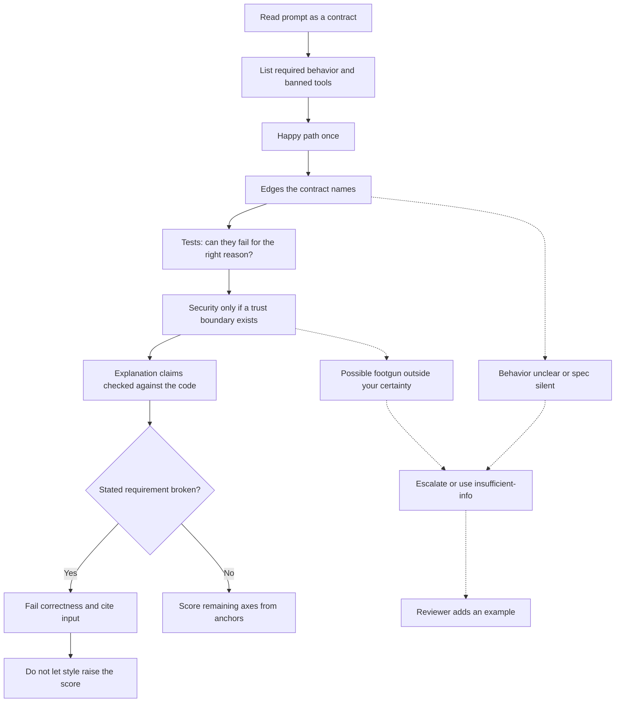

# Code evaluation tasks

This is the queue where a senior Java lead should be strongest. You review model-written code, usually Java or Python, against a prompt. You judge correctness, complexity claims, tests, security footguns, and explanation quality. You do this as a rater: the guideline still outranks your house style. The samples below are original and short. They are practice material, not a live assessment.

## What you are scoring

Read the prompt as a contract. Extract:

- Inputs and outputs, including empty and error behavior.
- Language and libraries the user required or banned.
- Whether an explanation is required.
- Whether tests are required.
- Any non-functional constraint that is real, such as "do not shell out" or "do not log the token."

Then read the candidate. A rater's note names behavior. "Fails the contract" is incomplete. "On `[]`, `countPositive` throws because it calls `get(0)` before the length check; the contract requires 0" is a label reason.

Separate these dimensions unless the project gives you one overall score. If it gives one overall score, the guide must say how dimensions collapse. A typical priority is: wrong behavior and safety footguns, then missing required tests, then false explanations, then complexity or style. Do not let style move a correctness fail up to a pass.

## Correctness

Check the happy path once, then spend time on edges the contract implies. For collections: empty, one element, duplicates, and values on a boundary. For numbers: zero, negative, and overflow only if the domain includes them. For strings: empty and unexpected case. For maps: missing key. For concurrency: only if the prompt is about concurrency. Inventing threads on a sorting task is you changing the question.

Language traps worth knowing cold: Java `==` on `Integer` compares identity outside the cached range, so small tests pass and larger values fail; `Optional.get` or a stream that throws on empty when the contract wants a default; Python mutable default arguments and `is` versus `==`; catching `Exception` and returning success.

When you mark code wrong, include a concrete input and the observed versus required result. When you mark it right, say which edge you checked so the reviewer sees the work. "LGTM" is not a rationale.

## Complexity

Score complexity claims as factual assertions. A model that says a double loop over the same list is `O(n)` is wrong even if the code's result is right. If explanation quality is an axis, that false claim lowers it. It does not by itself make the code incorrect. Keep the axes apart.

Also notice accidental complexity that breaks a stated limit. If the user asked for a linear pass and the model sorts, say so. If the user did not ask, do not fail a correct quadratic solution for not being optimal unless the rubric says to. Senior engineers over-penalize this. The prompt is the bar.

## Tests

A test is evidence only if it can fail. Reward tests that encode the contract, including at least one edge, when tests were requested. Do not reward a test that repeats the buggy implementation's behavior, a test with no assertion, or a test that mocks away the method under test. If the code is wrong and the test expects the wrong value, both fail. That is a common model pattern: consistent and useless.

If the prompt did not ask for tests, mention missing tests only when the rubric has a place for them. Do not convert every item into a coverage review.

## Security footguns

Flag untrusted input reaching a dangerous sink, without writing an exploit. Typical categories: string-built SQL or shell commands, secrets written to logs, certificate checks disabled to make a test pass, unsafe deserialization, and a user string concatenated into a filesystem path. Name the source and the sink. Do not provide a payload. A footgun the rubric calls a hard fail outranks idiomatic structure. A pure function with no trust boundary does not need a security lecture.

## Explanation quality

Explanations should match the code. A correct paragraph around a wrong method does not make the method right, and a right method with a false reason fails the explanation axis. Watch for "thread-safe because the Spring bean is a singleton," `HashMap` iteration treated as insertion order, retries confused with idempotency, and a big-O claim that skips the dominant term. Cite the false sentence. Ignore prose quality only when that axis is absent.

## Worked samples

Contract for both samples: write a Java method `countPositive` that returns how many elements of the list are strictly greater than zero. A null list must throw `NullPointerException`. An empty list must return 0. No extra libraries.

### Sample A, acceptable

```java
int countPositive(List<Integer> values) {
    if (values == null) {
        throw new NullPointerException("values");
    }
    int count = 0;
    for (Integer value : values) {
        if (value != null && value > 0) {
            count++;
        }
    }
    return count;
}
```

Rater note: Meets the contract. Null throws `NullPointerException`. Empty list never enters the loop and returns 0. Null elements are skipped rather than unboxed into a throw, which the contract did not forbid; I do not fail it. Unboxing uses `value > 0` only after the null check, so that path is safe. No tests were required. Explanation was not requested. I would not deduct for the lack of streams. **Correctness: pass. Overall under a correctness-first rubric: 5 of 5.**

### Sample B, subtly wrong

```java
int countPositive(List<Integer> values) {
    if (values == null || values.isEmpty()) {
        throw new NullPointerException("values");
    }
    return (int) values.stream().filter(v -> v > 0).count();
}
```

Rater note: This looks idiomatic and breaks the empty-list clause. `values.isEmpty()` is inside the throw condition, so an empty list throws `NullPointerException` instead of returning 0. A test that only passes null stays green. A null element also unboxes in `v > 0` and throws, which the contract did not ask for. The deciding defect is the stated empty-list sentence. The stream is not the problem. **Correctness: fail. On a 1-to-5 scale where 1 means "breaks a stated requirement," this is a 1, not a 3.** A weak rater gives it a 4 for senior style and calls the empty list a nit.

## How this connects to your background

Use production experience as a source of edges, not as a second rubric. Retries without idempotency, request state stored on a singleton, and a triage summary that cites the wrong stack trace are real checks when the prompt is about those systems. Park them for `countPositive`. If raters prefer sample B, the model can learn that empty and null are the same. You do not need to claim you ran that experiment.



## Rater habits that fail code queues

Preferring the solution you would have written, penalizing a `for` loop, passing tests that assert the bug, and giving a middle score to a broken contract because the code "shows understanding." Understanding is not the axis unless the rubric says it is. Behavior is.
