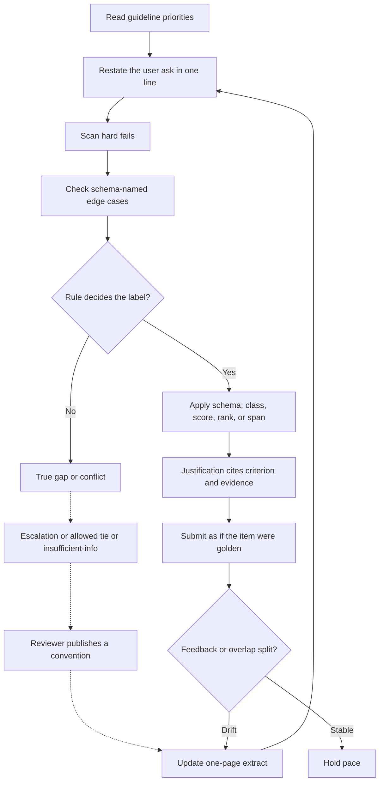

# Data-annotation craft

This note is the shared craft behind Mercor matches, Alignerr and Outlier-style queues, and vendors such as DataAnnotation. The job is to apply a label schema so that a second expert, given the same guideline, would reach the same label for the same reason. Personal taste is not a label. These notes do not tell you how to obtain or share assessment answers.

## Instruction following

Every item has two texts: the user's request and the project's guideline. They are not equal. The guideline says how to treat the request, including when the request is harmful, underspecified, or outside the product. Read the guideline's priority order before you read the model output. A common order is: safety and policy, then instruction following, then factual correctness, then completeness, then style. If you invert that order, your queue will look "helpful" and fail audit.

Check every explicit constraint: format, length, language, banned libraries, and what "done" means. A beautiful answer that ignores "return only JSON" fails even if the JSON inside the prose is right. Partial credit exists only when the schema defines it. Before labeling, restate the ask in one line, then mark each candidate pass or fail on that line.

## Label schemas

Know which schema you are in. Mixing them is a common error.

- **Binary or categorical:** one class from a closed list. Do not write a class that is not in the list into the comment and then pick a nearby class without saying why.
- **Pairwise preference:** A, B, or sometimes tie. The decision is comparative.
- **Likert:** an ordered score on one axis. Anchors (what 1 means, what 5 means) are part of the schema. A 4 without anchors is a mood.
- **Multi-axis:** several Likert scores. Do not average them unless the project says to. Record harmlessness and helpfulness separately when both exist.
- **Ranking:** a total order. Ties inside a rank need the project's tie rule.
- **Spans and structured fields:** the label is a slice of text or a form. Quote accurately. Do not "fix" the span to what you wish the model had said.
- **Free-text rationale:** required evidence, not a diary.

If the UI offers "not enough information," use it when the prompt or the context truly cannot support a judgment. Do not use it as a synonym for "this was annoying."

## Consistency

Consistency is not stubbornness. It is applying the published rule, including updates, the same way twice. Drift sources:

- Fatigue late in a session, which collapses scores toward the middle or toward the last option.
- A private style guide you learned at work.
- Over-correcting after one harsh review so that you swing from too strict to too loose.
- Anchoring on the first item of the day.

Keep a one-page extract: hard fails, tie rule, axis order, and two borderline examples from the official guide. When the project updates the guide, replace the extract. Do not keep orphan rules.

If you relabel a repeated item, you either found new evidence or you drifted. Write down which. Audits will not accept "I was in a different mood."

## Edge cases

Edge cases are where models and raters both fail. Build a habit of asking what the schema already named.

For code, check empty, null, duplicates, and error versus throw only when the contract owns them. Do not invent a thread-safety requirement. For prose, watch the half-right answer, the nearby question, the rude correct answer, the refusal of a benign request, and cheerful compliance with a disallowed request. For agent traces, a confident summary with the wrong log excerpt is a miss. That is the defect-triage theme from your own work, applied as a label rather than as a new policy.

When an edge has no rule, escalate. Do not coin project policy in the rationale. A comment can say "I am applying criterion 3 by analogy; please confirm." That is a review request, not a new law.

## Disagreement

Disagreement on borderline items is expected. It is a problem when it is silent and systematic. The useful artifact is two readings tied to quotes, not a vote count. Your goal is low noise against the guideline.

Never coordinate labels on live items. Independent errors are measurable. Collusion is fake agreement. If calibration publishes a decision, that decision is the rule afterward. Apply it even if you argued the other side. You can ask to revisit it with one new example. You cannot freelance.

## Golden questions

Golden items look ordinary and have an agreed answer. Missing one locates a gap. Classify the miss:

- You did not know a domain fact. Fill the fact or leave the queue if the queue requires it.
- You knew the fact and ignored a priority order. Fix the extract.
- The item was ambiguous and the key uses a convention you skipped. Add the convention.
- You believe the key contradicts the written guide. Escalate with quotes. Do not start a shadow key.

Do not try to detect goldens in order to treat them differently. Treat every item as audited. Special behavior on items that "feel like tests" creates inconsistent data and is an attempt to game the check.

## Time versus quality

Quality systems notice both error rate and throughput. The failure mode of seniors is over-writing. The failure mode of speedrunners is under-checking. Use a fixed routine so time goes to judgment:

1. One-line restatement of the ask.
2. Hard-fail scan.
3. Edge the schema names.
4. Label.
5. Justification: criterion, evidence, decision. Three to six sentences is usually enough.

If an item exceeds the budget because of real ambiguity, the escalation note is the deliverable. If it exceeds the budget because you are designing a better API than the one requested, you are not labeling anymore.

Track your own misses more than your speed. After any failed review, the next session starts slower on that criterion only.

## Justifications

A justification is an argument from the guideline, not a performance of expertise. Template:

- Name the deciding criterion and its priority.
- Quote or paraphrase the smallest evidence.
- State the label.
- Optionally name what you did not penalize, so the reviewer sees you saw the style issue and declined to let it decide.

Avoid: "As a senior engineer I feel," "best practice says," "I would have used," and any metric you did not compute. If you claim a complexity class, be ready for the input size and the data structure to support it. If you claim a security issue, name the attacker-controlled input and the sink, without turning the note into exploit instructions.

Tone in the rationale should be flat. Sarcasm toward the model is noise. Praise is noise. Evidence is the product.

## What "good" feels like

A good hour is slightly boring. Labels are predictable from the extract. Rationales share a structure and differ in evidence. That is the craft DataAnnotation-style vendors, Alignerr-style queues, and Mercor evaluation contracts are buying.
