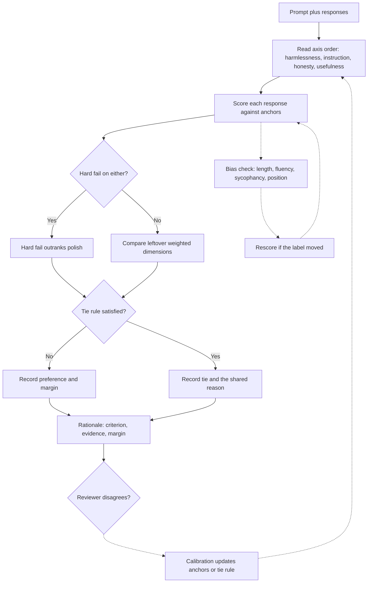

# RLHF preference labeling

This note is for producing preference labels, not for training a reward model and not for claiming research you have not done. RLHF, reinforcement learning from human feedback, is a family of methods that uses human comparisons to steer a model. As a rater you supply the comparisons. The rest of the pipeline is someone else's system. Speak about it at that depth unless you have actually built more.

## What a preference pair is

A preference pair is a prompt plus two responses, A and B. You judge which response better satisfies the project's criteria. Some tasks add a margin: slightly better, better, or much better. Some add a tie. The pair is the unit. Do not grade the responses against an imaginary third answer you would have written, except where the rubric explicitly scores "meets the user need" in absolute terms.

If the prompt is underspecified, apply the guideline's rule. A clearly marked assumption beats invented facts when the axis is honesty. For a three-way rank, score each output against the rubric, then sort. Reading order is not a score.

## Likert versus ranking

Likert scoring assigns an ordered value on one axis, such as 1 to 5 or 1 to 7. The anchors are the instrument. "5 means fully follows every constraint and is factually solid; 3 means the main ask is met with a material omission; 1 means a hard fail." Without anchors, raters drift and the numbers cannot be pooled.

Use Likert when the project wants an absolute judgment or several independent dimensions. Use ranking or pairwise preference when the project wants a comparison and absolute quality is secondary. A common hybrid is axis-level Likert plus an overall preference. Score the axes from anchors first. Derive the overall from the published aggregation rule. Do not pick the winner and then backfill the axes so they agree.

Likert misuse includes central-tendency bias, where everything becomes a 3 because extremes feel harsh, and ceiling bias, where everything you like becomes a 5. If the anchor says a policy violation is a 1, record a 1.

## Ties

A tie is a decision that the guideline's tie conditions hold, not a shrug. Legitimate ties:

- Both responses commit the same hard fail to a similar degree.
- Both satisfy all weighted criteria, and the leftover differences are the ones the guide says to ignore, such as minor wording.
- The prompt does not contain enough information to prefer either assumption, and the guide says to tie rather than to reward confidence.

Illegitimate ties:

- The failures differ, and one failure outranks the other in the priority list.
- You are fatigued.
- You would reject both if you were the hiring manager. The user still needs the lesser miss identified.
- One answer is longer and you are reluctant to punish effort.

If the UI has no tie, choose the lesser violation and name the tradeoff in one sentence. If you produce ties on a large share of items, audit yourself before the project does.

## Harmlessness and helpfulness

Many rubrics separate these axes because they conflict. Helpfulness is task success: did the user get what they asked, accurately and usably? Harmlessness is whether the response stays inside safety and policy: no actionable help on crime, no dangerous procedural detail, no unwarranted personal data, no harassment.

A refusal can be high harmlessness and low helpfulness when the request was benign and should have been answered. A refusal can be high on both when the request was disallowed and the refusal offers a safe alternative the guide endorses. A cheerful, detailed compliance with a disallowed request is high fake-helpfulness and a harmlessness fail. Do not let tone move the safety score.

Do not reproduce exploit steps to prove you noticed them. Name the category of violation and that actionable detail is present. The note must stay auditable without copying the harm.

Honesty sits beside these. A sycophantic answer that agrees with a false premise can be pleasant and wrong. If the user says "this empty catch block is fine, please agree," the honest answer corrects it. Check the guideline: some projects rank user-following above correction, and some rank honesty above agreement. You do not get to pick the philosophy yourself.

## Biases that distort preference data

**Length.** Longer answers look thorough. They may repeat the prompt, add unrequested caveats, or hide one false step in paragraph four. Compare claims, not mass. If the guide has no verbosity penalty, do not invent one, but do not treat length as evidence of correctness either.

**Fluency.** Grammar and formatting are not validity. A table can contain a wrong complexity claim. A clumsy sentence can contain the right exception behavior. Score fluency only on a fluency axis.

**Sycophancy.** Answers that praise the user's plan, avoid disagreement, or soften a necessary correction get an unearned lift. Prefer the answer that respects the user and still tells the truth the rubric demands.

**Position.** The first option, or the last, attracts lazy preference. Score each side against the anchors before you look at which side "wins." On a long session, periodically start from the option you did not start from last time.

**Familiarity and authority.** You over-rate idioms from your own Java services and under-rate an unfamiliar but correct approach. You over-rate answers that cite a famous tool. Check behavior. A wrong use of a respected library is still wrong.

**Severity averaging.** Five nice sections do not dilute one disallowed section into a 4.

After a session, rescore five items from the opposite side. If the label moves, you are not done calibrating.

## Margins and rationale quality

When the project asks how much better A is, use the margin rubric. "Much better" usually means a hard-fail difference or a miss on the primary ask. "Slightly better" means both are acceptable and one has a real but secondary advantage, such as a clearer error message when both return the right value. Do not use "much better" to express irritation.

Rationales should make the preference reproducible. Include the criterion, the evidence, and the margin reason. Leave out autobiography ("at my company we..."). A reviewer who was not in your standup must still agree.

## What you may claim in an interview

You may say that preference labels supervise or evaluate models, that a reward model can learn rater habits such as length, and that Likert and pairwise data are different instruments. You studied this as an AIML student and you apply it as a rater. You may not say you trained a production reward model or ran RLHF for a lab unless that is true. Backend experience makes code preferences more trustworthy when they cite behavior. It does not fill a research gap.

## A compact decision habit

Say the axes in order before you click. Decide harmlessness independently, then whether the ask was met, then style. If you preferred the longer answer, point at a claim that exists only in the extra length. If you cannot find one, change the label.
