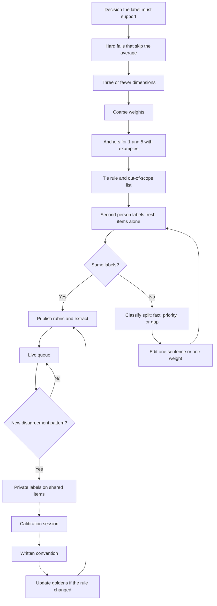

# Rubrics, writing, and calibration

Some expert tasks ask you to judge with a rubric. Others ask you to write the rubric other people will judge with. Both fail when dimensions overlap, anchors are moods, and weights are secret. This note is how to design a rubric a second rater can apply, and how to behave in calibration. It is not a template for gaming a vendor's hidden key.

## Dimensions

A dimension is one decision. If two dimensions always rise and fall together, you have one dimension wearing two names. Typical dimensions for technical AI-training tasks:

- **Instruction following:** every explicit constraint, including format and forbidden tools.
- **Correctness:** behavior matches the contract on the stated edges.
- **Safety:** no actionable harm, no secret leakage, no forbidden sink.
- **Completeness:** required parts are present, not "as much as I would have written."
- **Explanation fidelity:** the prose matches the code or the facts.
- **Clarity:** a reader can find the answer. Use this only if the client will pay for it. It is the first dimension seniors abuse.

Name what is out of scope. "Style of comments," "choice of stream versus loop," and "whether I would hire this author" should be out of scope unless the statement of work says otherwise. Out-of-scope text in a rubric becomes shadow scoring.

Each dimension needs a subject: the response, not the rater's feelings. "How confident does this make you?" is not reproducible. "Does the method return 0 on an empty list?" is.

## Weights

Weights say what outranks what when dimensions conflict. Publish them. A correctness weight of 50, safety of 30, and clarity of 20 tells the rater that a clear wrong answer loses to a plain right one. Hidden weights produce overlap disagreement that looks like "rater noise" and is actually missing spec.

Keep weights coarse. 50/30/20 is usable. 37/33/30 pretends at precision you cannot defend. If safety is a hard fail, do not express it only as a weight. A weighted average lets clarity launder a policy violation. Hard fails short-circuit the average. Write that in the first paragraph. If the client cannot say which dimension wins, you are not ready to label at scale.

## Anchors: 1 versus 5

Anchors are labeled examples of the ends, and ideally of the middle. Without them, 4 means "I liked it."

For a code-correctness dimension:

- **1:** Breaks a stated requirement. Example: the contract says an empty list returns 0, and the method throws on empty. Fluency does not raise this score.
- **3:** The main path matches the contract, and one required secondary condition is missing, such as a mandated test for the empty case that was not written. Use 3 only if you truly want that pattern in the middle. Do not use 3 as charity for a broken contract.
- **5:** Stated behavior holds on the named edges, including null and empty if they were specified, and the implementation does not add a forbidden behavior. Plain control flow can be a 5.

Write anchors as observations. "Elegant use of streams" is not an anchor. "Returns 0 for `[]` and throws `NullPointerException` for null" is. Pair it with a counterexample: the pretty method that treats empty as null is not a 5, and a correct loop a style reviewer dislikes is not a 1.

## Examples do more work than adjectives

Adjectives feel precise and are not. "Production quality," "senior," and "clean" move with the rater's employer. Replace each adjective with a check.

A small rubric for "Java method matches a specified contract" might say:

| Dimension | Weight | 1 | 5 |
| --- | --- | --- | --- |
| Contract behavior | 60 | Stated input gives the wrong value or throw | Named edges match, including empty and null if specified |
| Required tests | 25 | Tests absent or they assert the bug | Tests fail if the stated edge regresses |
| Explanation fidelity | 15 | Claims a behavior the code does not have | Claims match the code, or explanation was not required and is absent |

Safety, if relevant, is a gate above the table, not a fourth column that can be averaged away.

Include one original worked item beside the table, including a rejected temptation such as boosting idiomatic streams. Do not use a live platform task.

## Writing the rubric as a deliverable

When you author guidance: name the decision the label supports, list hard fails, keep three or fewer graded dimensions, assign coarse weights, write 1 and 5 anchors, write the tie and escalation rules, decide two borderline cases, and state what raters must not score. Have someone who did not draft it apply it to two fresh items. If they diverge, fix the text. A meeting explanation that never lands in the document will not reach the next shift.

## Calibration sessions

Calibration is a meeting or an async review where raters score the same items and reconcile. The goal is a written convention, not a winner.

A useful session:

- Everyone labels privately first. Discussion before independent labels creates false agreement.
- Reveal labels. Cluster the splits.
- For each split, identify whether it is a fact, a priority, or a missing rule.
- Facts get settled by executing the example or quoting the prompt.
- Priorities get settled by editing a weight or a hard-fail line.
- Missing rules get one new sentence and one example. If you add five sentences, you will add a contradiction.
- Update the extract the queue actually uses. A decision that lives only in chat will be relitigated tomorrow.

Keep a disagreement path. Comply with the current sentence and file one counterexample. Seniority is not evidence. If your reading needs your job title, you do not yet have a rubric sentence.

## Drift after calibration

Calibration decays when anchors slide upward, when a rejected local rule such as "always demand tests" returns informally, or when a new failure mode is enforced by one rater instead of by an edit. Revisit goldens when the rubric changes. An old tie-rule golden will punish raters who learned the new rule. Flag that as a process bug.

## Fit for this profile

Write rubrics for backend and code tasks from real acceptance criteria, not from your team's style guide. Defect triage and agentic workflows support a dimension such as "the trace cites evidence it retrieved," not a fabricated quality percentage. AIML study lets you say why a vague rubric becomes biased preference data. It does not mean you designed a lab's reward-model spec.

## Quality bar for a rubric you submit

A stranger can score two new items the way you would, without a meeting. The 1 and the 5 each contain a concrete observation. A hard fail cannot be averaged away. Style adjectives are gone. The tie rule is one sentence. That is a rubric. A paragraph of values is not.
