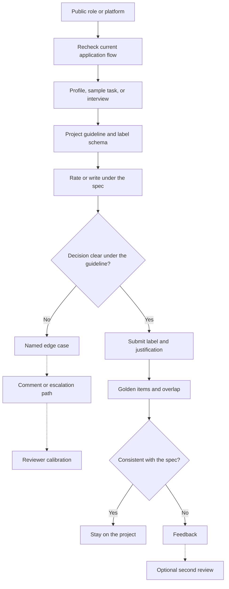

# Remote AI-training work: landscape

Audience: Gowrishankar Sekar, Senior Tech Lead (Java/Spring, AWS) and M.Tech AIML student. The aim is to pass assessments and describe real domain expertise for Mercor, Alignerr, and data-annotation or RLHF-style roles, including the kind of work posted by DataAnnotation and similar vendors. Nothing here is a click-path, an answer key, or a script for misrepresenting identity.

## What the market actually pays for

Remote AI-training work is expert labor that produces a supervision signal. You are not running gradient updates. You rank model outputs, rewrite answers, label domain items, score code, or write rubrics. Someone else's pipeline turns that judgment into training or evaluation data.

Three clusters cover almost every posting you will see.

**Expert marketplaces.** Mercor, on its public description, matches domain experts to short-term AI-training projects and other technical contracts. Matching often includes an interview, a profile review, or a sample task. Duration, rate, and stack are project-specific. A blog post or forum thread is a snapshot, not an offer.

**AI-trainer platforms.** Alignerr is an AI-trainer platform associated with Outlier-style work. People often misspell it "aligner"; the platform name is Alignerr. The work is ranking outputs, writing prompts, and labeling under guidelines. Outlier and vendors such as DataAnnotation post closely related task types even when the employer brand differs. Product names move. The craft does not: instruction following, consistency, and justifications that cite the spec.

**Direct programs.** Labs and annotation vendors hire raters and domain experts on contract. The UI changes. The quality bar does not. Golden questions, rater overlap, and audits exist because a fast, confident, wrong label is expensive.

## What an assessment is measuring

Screeners rarely ask you to derive a new algorithm. They check whether you can:

- Read a guideline and apply it to a case the text only implies.
- Choose the response that satisfies the task when the fluent answer is wrong.
- Write a short justification that names a criterion and points at evidence in the candidate text.
- Flag harm, privacy, and security issues in proportion to the guideline, without a speech.
- Hold a pace that does not skip edge cases.

A senior Java engineer starts ahead on code, APIs, concurrency, and "does this actually work." That lead vanishes if you grade by taste ("I would have used streams") instead of the rubric ("empty input returns the wrong count"). AIML coursework helps you name preference data, reward models, and evaluation failure modes. It does not license a claim that you have shipped a preference-model paper or owned a production fine-tune.

## How the work is structured day to day

A project hands you a guideline, a label schema, and a queue. Each item has a prompt, one or more model outputs, and sometimes a reference or a hidden unit test you are not shown. Your output is a label plus, usually, a rationale.

Schemas vary. Pairwise preference asks which of A or B is better, sometimes with a tie. Likert asks for a score on one or more axes. Ranking asks you to order three or more outputs. Span labeling asks you to mark a field. Code tasks ask you to judge correctness, tests, complexity, or security. Rubric tasks ask you to write the criteria someone else will apply.

Quality systems sit beside the queue. Golden items have an agreed label. Overlap sends the same item to two raters. Disagreement is not automatically a failure: some items are genuinely tied. Disagreement with the guideline, or with a calibrated consensus, is a failure. Reviewers sample rationales because a correct checkbox with a taste-based note still teaches the wrong lesson to the next rater and, downstream, to the model.

Time pressure is real. The professional response is to know which steps are mandatory (read the criterion, check the edge the schema names, cite evidence) and which polish is optional. Skipping the mandatory step to protect an hourly target is how people lose projects.

## Where a backend-plus-AIML profile fits

Eleven years of enterprise Java, Spring, and AWS is directly useful on code evaluation, system-design judgments, defect triage, and reviews of agent traces that call tools. The master's work in progress is useful when you must talk precisely about data, metrics, and limits, and when you must say what you have not done.

Project themes you can discuss honestly: a defect-triage agent, agentic workflows, and enterprise Java services. Describe the problem, your role, the constraints, and what you learned. Do not invent latency numbers, accuracy points, or headcount.

Trust, in this market, is procedural. Reviewers trust labels that would look the same if a second senior engineer applied the same guideline. They do not trust labels that only you, with your private coding style, would produce.

## Honesty about public information

Processes change. Before you apply or sit an assessment, recheck the current application flow on the company's own site: what they ask you to submit, whether there is a sample task or interview, how they describe pay, identity rules, and tool rules. Do not rely on a cached blog, a Discord summary, or this note for button names. Do not share live task content, do not coordinate answers, and do not maintain multiple accounts. Those rules are part of the job, not etiquette layered on top.

## Operating loop

Use the same loop on every platform:

1. Restate the user ask and the success criterion.
2. Apply the schema, including tie, refuse, and not-enough-information when they exist.
3. Justify from the guideline plus evidence in the output.
4. If two careful experts would still split, use the project's comment or escalation path. Do not flip a coin and hide the ambiguity to look fast.

## What to practice

Run four drills before any live assessment. Compare two code answers and score correctness before style. Rank a preference pair in which the longer answer is worse, and write three sentences that cite the failure. Draft a three-dimension rubric with a 1-anchor and a 5-anchor. Write a profile of about 120 words that states backend scope, AIML study status, and the three project themes, with no invented metrics.

That practice is the assessment. The platform is only where it is paid.
