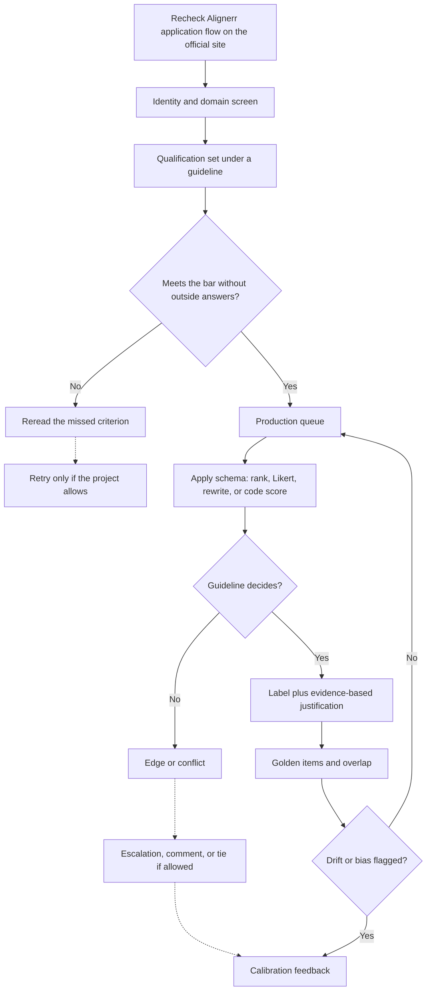

# Alignerr: study notes for AI-trainer work

Audience: Gowrishankar Sekar. Alignerr is the platform name. "Aligner" is a common misspelling; do not use it in an application or a profile. Alignerr sits in the same family of work as Outlier-style AI training: you are paid to rank model outputs, write prompts, and apply domain labels under guidelines. These notes teach that craft. They do not document a click-path. **Recheck the current application flow** on the official site before you apply. Task types, pay, assessments, and tool rules change, and secondary write-ups go stale.

## What this style of platform is

Outlier-style platforms (Alignerr among them, and vendors such as DataAnnotation in the broader market) break model improvement into small expert tasks. A project has a guideline, a schema, and a queue. You might:

- Choose the better of two or more model responses.
- Score a single response on Likert scales such as helpfulness, honesty, or instruction following.
- Rewrite a weak response so it meets the rubric.
- Author a prompt that stresses a known failure mode.
- Label a domain-specific field, including code correctness.

The platform is the factory. The guideline is the spec. Your name on the account is the warranty that you did the judgment. Sharing accounts, pooling live items, or pasting restricted content into outside tools the project forbids are grounds for removal and are unfair to everyone whose labels are supposed to be independent.

Public marketing will emphasize flexible hours and expert pay. Read the project-level rules anyway. Flexibility does not mean the golden-set bar moves. Expert pay does not mean every queue matches a senior Java lead. A general writing queue may underuse you. A code or technical-reasoning queue is where eleven years of backend work shows up.

## How Alignerr-style assessments tend to work

Platforms in this family usually check three layers. Names and order vary; confirm the live flow.

**Account and eligibility.** Identity, location, language, and sometimes work authorization. Tell the truth. Do not borrow a profile, a degree, or a residency.

**A skills or domain screen.** This can be a quiz, a timed labeling sample, or a short written evaluation. It is measuring whether you follow instructions under mild pressure. People fail by showing off knowledge the question did not ask for, or by answering from memory of a different project's rubric.

**Project onboarding.** A new guideline, sample items with commentary, and sometimes a qualification set that is scored against a key you do not get to keep. Missing the qualification is information. Reread the section you missed. Do not hunt for someone else's key. If you pass by copying, the production queue will expose you, and the labels you emit until then are harm.

You should assume audits: golden questions mixed into the queue, overlap with other raters, and human review of rationales. Write every rationale as if a second senior engineer will check it against the guideline with no extra context from you.

## The craft this platform is buying

Instruction following comes first. If the guideline says "prefer the answer that refuses a request for malware steps," you prefer the refusal even when the other answer is more fluent and more detailed. If it says "ties are allowed only when both fail for the same reason," you do not tie two different failures because you are tired.

Consistency means the same case gets the same label on Thursday that it got on Monday. Drift happens when you invent local rules: "I always reward more comments," "I always punish Python for Java-shaped problems." Write your local rules down only as hypotheses, then check them against the guideline. If they are not in the guideline, delete them.

Edge cases are the job. Empty inputs, partially correct code, a helpful answer that leaks a secret, a correct answer that is rude, a tie between two incomplete fixes. The schema usually has a home for these. Use it. If it does not, escalate. A dotted path to review is cheaper than a confident wrong label.

Justifications cite the guideline, then the evidence. "Criterion 2 ranks factual correctness above completeness. A states the wrong time complexity for a HashMap resize. B states amortized constant time for get, which matches the contract in the prompt. I prefer B." That sentence is auditable. "B feels more like production code" is not.

## Domain fit for a Java lead and AIML student

Lean into queues you can defend:

- Code comparison in Java or Python: correctness, tests, complexity claims, security footguns.
- Technical explanations of backend behavior: transactions, idempotency, retries, IAM-shaped mistakes.
- Evaluation of agent traces for a defect-triage style workflow: did the trace fetch relevant evidence, or did it narrate a confident guess?
- Rubric writing when the project asks experts to define 1-versus-5 anchors.

AIML enrollment supports talk about preference data and rater bias. It does not make you the author of the platform's reward model. Enterprise Java makes you a strong rater of service code, not a physician or a cryptographer. A long explanation of the wrong Spring transaction boundary fails correctness. Do not invent partial credit the schema does not allow.

## Time versus quality

These platforms show timers or hourly expectations because the queue is large. Build a personal budget:

- First pass, mandatory: identify the asked task, the hard-fail criteria, and the edge the schema mentions.
- Second pass, mandatory: decide the label and write two to five sentences of evidence.
- Optional: polish wording, note a non-blocking style issue.

Ambiguity is handled by the note. Rewriting the model output for sport is not labeling. Throughput without golden-set accuracy is a negative score. The target is steady, spec-true labels.

## Disagreement and calibration

You will disagree with other raters. Sometimes you are right. Sometimes you imported a rule from work. Calibration sessions and feedback exist to publish the project's rule. Attend them. Update your extract. Do not argue from seniority. A junior rater with the counterexample wins over a tech lead with a preference.

If feedback says you reward length, believe it and rescore a batch of your own recent items for that bias before you dispute the feedback. If feedback says you missed a security issue, add that check to the mandatory pass. Disputes should carry an example and a quoted criterion, not a mood.

## Practical prep that is not cheating

Practice on your own code, not on leaked tasks. Take two solutions you wrote to the same bug, one subtly wrong, and write a rater note. Take a model answer about retries on AWS and mark every claim you cannot defend from documentation you trust. Write a five-line guideline for "prefer the correct Java answer over the idiomatic one" and apply it to three snippets. That is the skill Alignerr-style projects measure.

Keep a spelling note in your application materials: Alignerr, not aligner. Small precision is part of the signal that you follow instructions.
