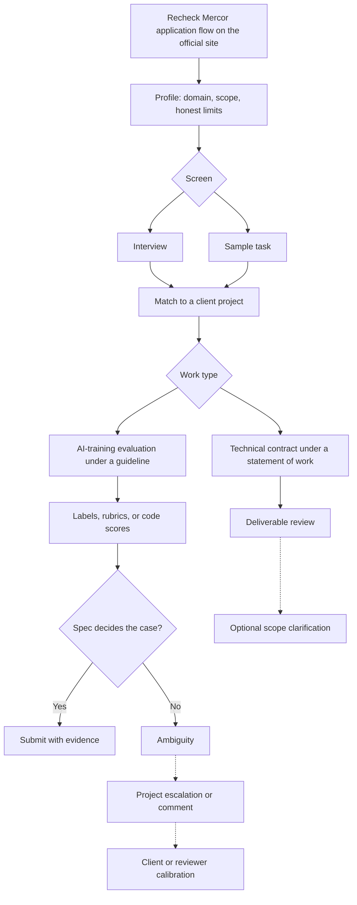

# Mercor: study notes for an expert applicant

Audience: Gowrishankar Sekar. These notes describe what is public and what is a stable professional skill. They are not a walkthrough of Mercor's current buttons, and they are not advice for sharing or pre-solving a live assessment.

## What Mercor is, on the public record

Mercor matches domain experts to short-term work. A large share of that work is AI training: evaluating model outputs, writing or scoring tasks, and other expert review. The same marketplace also lists technical contracts that are closer to ordinary contracting than to labeling. The match is the product. You are not joining a single permanent engineering team by default. You are presenting a profile that a project can select.

Public accounts from Mercor and from applicants consistently mention some form of screening before paid work: an interview, a résumé or profile review, a sample task, or a combination. The exact sequence changes. Treat any 2024 or 2025 forum post as stale until you confirm it. **Recheck the current application flow** on Mercor's own site before you apply: what they collect, whether they ask for a work sample, how they describe interviews, and what they say about identity, location, and tools. Do not reconstruct a click-path from memory or from this file.

## What they are trying to learn about you

A matcher needs three things it can defend to a client.

**Domain truth.** Can you do the work the statement of work names? For you that is Java, Spring, AWS, production backend judgment, and AIML literacy at student-plus-practitioner level. It is not "AI influencer." If the role is code evaluation, they want someone who catches a wrong boundary condition. If the role is a general chat-rater queue, deep Spring experience is only a partial match, and saying so is a strength.

**Communication under a spec.** Expert work dies when the expert substitutes personal taste for the client's rubric. Mercor-style interviews often probe whether you can explain a judgment in plain language a non-author of the code can audit. Short, evidence-first answers outperform architecture monologues.

**Reliability.** Short contracts punish no-shows, inflated résumés, and people who need a week to become calibrated. You want to sound like someone who can read a guideline tonight and produce consistent labels tomorrow, while still escalating real ambiguity.

## How to present the background

Use a layered bio, not a keyword pile.

- Role: Senior Tech Lead. Scope: enterprise Java services, Spring, AWS. Tenure context: about eleven years in backend work. Say "about" only if that matches your CV; do not inflate titles you did not hold.
- Study: M.Tech in AIML, in progress unless and until it is complete. Describe courses and projects you actually did. Do not convert coursework into "I built an alignment stack."
- Themes you can discuss: defect triage agent, agentic workflows, enterprise Java. Talk about the problem, your decisions, and constraints. Skip invented throughput, accuracy, or dollar figures.
- Tools: name what you have operated. If you have not owned SageMaker training jobs, Kubernetes platforms, or a reward-model pipeline, do not let a skills list imply that you have.

A strong profile answers, in the first screen, "what queue should we put this person on?" Code review, backend task design, and evaluation of agent traces are honest answers. Frontier research scientist is not.

## What a sample task is for

If Mercor or a client asks for a sample, the sample is a work trial. It shows how you read instructions, how you handle a partial spec, and whether your critique is reproducible. Typical shapes, described generically because live tasks must not be copied or circulated:

- Compare two technical answers and pick one under a stated criterion.
- Review a short code snippet for correctness and explain the verdict.
- Write a rubric another rater could apply.
- Describe how you would scope a small expert project.

Score your own sample the way an auditor would. Did you answer the question that was asked? Did you name a failure mode with an input? Did you separate style from bugs? Did you stay inside the time box without skipping the conclusion?

Do not workshop a live sample with other applicants, do not post it, and do not store "accepted answers" for the next person. That is misconduct, and it also hides whether you can do the job.

## Interview shape

Expect a conversation that mixes background and a practical probe. The practical probe may be live reasoning about a small design or a small labeling decision. Interviewers are allowed to change the constraint mid-answer to see if you update. Update. Clinging to your first design after the constraint changes is a negative signal in both contracting and annotation.

Prepare three stories with this spine: situation, your decision, the tradeoff, what you would redo. Map one story to production Java, one to a defect-triage or agentic workflow you actually touched, and one to how you learned an AIML idea and where it does not yet apply at work. Keep each story under two minutes. Offer depth if they ask.

Compensation, hours, and contract type are factual questions. Ask them. Do not invent flexibility you do not have, and do not treat a public salary anecdote as your offer.

## How Mercor work relates to labeling craft

Once matched, the day-to-day may still be annotation: preferences, rubrics, code scores. The marketplace brand does not replace the craft. You will still need instruction following, edge-case handling, disagreement discipline, and justifications that cite the guideline. Read the project spec as if it were a ticket with acceptance tests. If the spec and your engineering taste conflict, the spec wins for the label, and you may note the taste separately only if the schema asks for comments.

If a match is ordinary contracting rather than labeling, switch modes. Deliver code or design to the statement of work, with the same honesty about limits. Do not quietly turn a contract into a labeling gig, or the reverse, because the title on the marketplace was vague.

## Failure modes that sink expert applicants

Inflated research claims are the fastest way to lose trust in a room that includes actual researchers. Vague "I led AI transformation" language is the second. A third is treating the interview as a Java quiz you can win with trivia while ignoring the instruction in front of you. A fourth is bad-mouthing annotation as low status. The client is buying judgment. Contempt for the task is a quality risk.

Prepare to say no. If the domain is outside your competence, decline or narrow the claim. A senior lead who says "I would not label clinical advice" is more placeable than one who claims every queue.

## Recheck list

Before you click apply, confirm on the live site: account rules, what the interview covers, whether a sample is timed, how contracts are formed, and any rule about AI assistance. Write those facts down from the source. Retire this note's process details the moment they disagree with the source. Keep the craft: evidence, spec-following, and honest scope.
