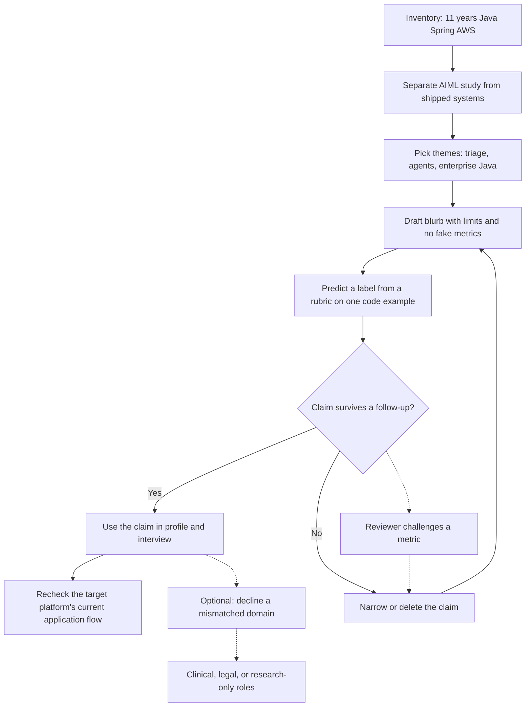

# Domain-expert profile

How to describe Gowrishankar Sekar for Mercor, Alignerr (not "aligner"), and similar data-annotation or RLHF-style roles. The goal is a profile a matcher can staff, and answers that survive a technical follow-up. No contact details belong in this pack. No invented metrics belong in the profile.

## The true stack

Three facts do the work. You are a senior tech lead. Your production depth is backend engineering, about eleven years, centered on Java, Spring, and AWS. You are an M.Tech AIML student, which means study in progress unless you have already finished; say the true status. Everything else is commentary.

Matchers skim for a queue. The queue you can defend is code and technical evaluation: Java and Python behavior, service contracts, tests, security footguns at the source-and-sink level, and rubrics for those tasks. A second queue is careful general preference labeling if you pass that project's own qualification. A queue you should not claim is research RLHF, clinical judgment, or "I have operated every AWS data service."

## What eleven years proves, and what it does not

Eleven years proves you have seen code meet production constraints: null versus empty, partial failure, retries, identity and access mistakes, logs that leak, reviews where style hid a bug. It proves you can explain a defect to someone who must audit your judgment.

It does not prove staff-level skill in every language, a record of published papers, or that your personal review bar is a universal rubric. In annotation, the client's guideline is the bar. Your experience is the reason you can see evidence quickly and the reason you must watch familiarity bias.

Tell a story as situation, one decision you made, the constraint, and a qualitative result. Leave out any number you cannot recompute. A false metric collapses in the follow-up.

## What the AIML program proves, and what it does not

It proves you are learning the vocabulary of data, models, and evaluation with an academic structure, and that you can connect rater behavior to preference data. You can explain pairwise labels, Likert anchors, ties, and biases such as length and sycophancy.

It does not prove you have trained a reward model, run a human-feedback pipeline for a lab, or measured model lift. If an interviewer says "so you do RLHF," the accurate sentence is: "I can do the human labeling side under a rubric. I have not owned the training job." Then stop. Filling the silence with extra claims is how oversell happens.

Course projects can be mentioned when you did them. Describe the assignment, your part, and the limit. Do not upgrade a course project into an industry platform.

## Project themes you can use

Stick to themes you can discuss without fabricated scale.

**Defect triage agent.** You worked on getting evidence in front of a decision: reports, logs, recent changes, duplicates, and a human override. Do not quote precision or time saved unless you measured it. A fluent summary that cites the wrong log line is a failed trace.

**Agentic workflows.** Talk about tool-using flows that show evidence, fail visibly, and avoid unchecked retries. Do not claim you replaced an engineering team.

**Enterprise Java.** Services, Spring boundaries, and AWS concerns you have operated. Use failure modes you reviewed, such as a check-then-act race or a retry that double-submitted work. Skip customer names and dollar impacts you cannot defend.

These three themes are enough for a profile, a sample task, and an interview. A fourth vague theme ("digital transformation") subtracts credibility.

## Sample profile blurb

Use this as a base and edit only where a clause would make it untrue.

> Senior tech lead with about eleven years building and reviewing enterprise backend systems in Java, Spring, and AWS. I am an M.Tech AIML student. I am looking for expert evaluation work: preference labels, rubrics, and code review of model output where correctness, tests, and security footguns matter more than fluency. I can discuss three themes from my own work: defect triage, agentic workflows, and enterprise Java services. I do not present coursework as production model training, and I do not quote metrics I did not measure. Best fit is technical annotation or a short contract in that stack. I am the wrong expert for clinical or legal advice.

That paragraph is staffable. It does not pretend you already work at Mercor or Alignerr.

## "Why should we trust your labels?"

Trust is a method claim.

1. You restate the item as a contract before you score it.
2. You cite the guideline criterion and a concrete piece of evidence, such as an input and the wrong return.
3. You keep axes apart: harmlessness versus helpfulness, correctness versus style, explanation versus behavior.
4. You use ties and escalation only under the written rules.
5. You name the biases you check: length, fluency, sycophancy, position, and familiarity with your own stack.
6. You decline domains you cannot defend.

A matcher trusts you when they can predict your label from the rubric. They do not trust you because the résumé is long. In the interview, offer one original micro-example: the pretty Java method that throws on an empty list when the contract returns 0 scores as a fail. That single example does more than a list of technologies.

## How to talk to each platform without cosplay

Mercor, publicly, matches experts to short-term AI-training and technical contracts, often through an interview or sample. Your blurb should make matching easy: domain, level, honest limits. Ask what the engagement actually is before you assume it is labeling.

Alignerr is an AI-trainer platform associated with Outlier-style ranking, prompt writing, and guideline-based labeling. The common misspelling is "aligner." Using the wrong name in a cover note signals carelessness in a job that is instruction following. Recheck the current application flow on the official site. Do not describe a click-path you remember from a forum.

DataAnnotation and similar vendors want the same craft. Your profile does not need a different personality per site. It needs the same boundaries. Processes, pay, and quizzes change. Your method does not.

## Interview posture

Answer in two minutes, then offer code, a rubric, or one project theme. "I have not done that" is information. Do not share confidential customer data or live task content. Do not label under someone else's identity. If asked for a rate, use a figure you checked that week or ask how the project pays. Do not invent a consulting history.

## Red lines in the written profile

Drop "full-stack AI," "alignment researcher" without publications, "I train LLMs," "expert in all major cloud services," and any percent you cannot walk through. A short skills list you can be quizzed on beats a long one.

## Maintenance

Update the blurb when a fact changes, not when a job post uses a fashionable noun. Every noun should survive five minutes of questions without an invented number.
