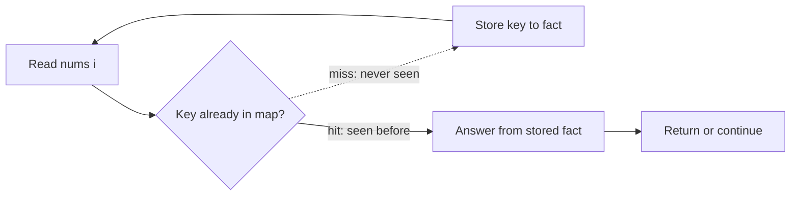

# Arrays and Hashing — Pattern Study

## Problem in your own words

Many array problems ask a question that depends on “have I already seen this value, and where?” A hash map (or hash set) is a memory index: the key is the thing you might look up later, and the value is whatever fact you need to remember about it (that it exists, its index, its count, or a list of partners). Sorting can answer some of the same questions, but a hash table answers membership and frequency in expected constant time per item, so a linear scan plus a table is usually enough.

## Easy analogy

Think of a coat check. You do not walk the whole rack every time someone asks for a jacket. You write the ticket number on a card and hang the coat under that number. Later, the ticket is the key and the coat is the value. An array problem that “remembers what it has seen” is the same idea: the current element is a ticket, and the map already holds the coats from earlier positions.

## Diagram

A scan builds the index as it goes. Lookups that miss, or keys you decide not to keep, are side paths.



ASCII view of the same memory while scanning left to right:

```text
index:   0    1    2    3
value:   2    7    11   15
map:     2→0  7→1  11→2 ...
              ^
              lookup "need 7" hits the stored index
              lookup "need 99" -.-> miss, then insert
```

## Intuition before code

Ask three questions before writing a loop:

1. What is the key? It might be the value itself, the complement `target - x`, a character count, or a frequency.
2. What must the value remember? Existence only (use a set), an index, a count, or a bucket of strings.
3. When is the lookup valid? For pairs, store an element only after you have checked whether its partner is already present, so you never pair an index with itself.

If the answer is “the same multiset of characters,” do not sort the whole input. Build a small signature (26 counts, or a sorted copy of one string) and use that signature as the map key. If the answer is “the k most common,” counts come first; the ranking structure (buckets or a heap) comes second.

## Walkthrough with a tiny input, step by step

Input: `nums = [2, 7, 11, 15]`, question “which earlier index pairs with the current value to make 9?”

- `i = 0`, value `2`. Need `7`. Map is empty. Miss. Store `2 → 0`.
- `i = 1`, value `7`. Need `2`. Hit index `0`. Return `[0, 1]`.

The same skeleton with a set (existence only) detects a duplicate. With counts, it detects an anagram or feeds a frequency bucket.

## Java solution (complete, correct, commented)

The pattern, shown as the two-sum scan. Other problems in this folder swap what the map stores.

```java
import java.util.HashMap;
import java.util.Map;

class Solution {
    public int[] twoSum(int[] nums, int target) {
        // key = value already seen, value = its index
        Map<Integer, Integer> indexOf = new HashMap<>();
        for (int i = 0; i < nums.length; i++) {
            int need = target - nums[i];
            Integer partner = indexOf.get(need);
            if (partner != null) {
                return new int[] { partner, i };
            }
            // store after the lookup so a value is not paired with itself
            indexOf.put(nums[i], i);
        }
        return new int[0];
    }
}
```

## Python solution (complete, correct, commented)

```python
class Solution:
    def twoSum(self, nums: list[int], target: int) -> list[int]:
        # key = value already seen, value = its index
        index_of = {}
        for i, value in enumerate(nums):
            need = target - value
            if need in index_of:
                return [index_of[need], i]
            # store after the lookup so a value is not paired with itself
            index_of[value] = i
        return []
```

No slicing here. Building a `set(nums)` or `sorted(s)` later in this folder copies the whole input; say that cost out loud (`O(n)` extra memory, or `O(n log n)` time for a sort).

## Time and space complexity with why

- Time: `O(n)` expected. One pass, and each hash operation is expected `O(1)`. Worst-case hash chains are `O(n)` per operation, which interviews usually set aside unless asked.
- Space: `O(n)` for the table in the worst case, when every key is distinct.
- A fixed alphabet (26 letters) drops the table to `O(1)` extra memory if you only count characters.

## Pitfalls and how to talk through this in an interview in under 2 minutes

Open with the sentence: “I need random-access memory of what I have already seen, so I will scan once and store each fact in a hash map.” Name the key and the value before any code. Call out the insert-after-lookup order, empty input, and the case where the answer uses the same value twice at two indices. If the keys are strings, mention that hashing a string costs its length. Close with expected `O(n)` time and `O(n)` space, and offer a sort-based backup if they ban hash tables.
