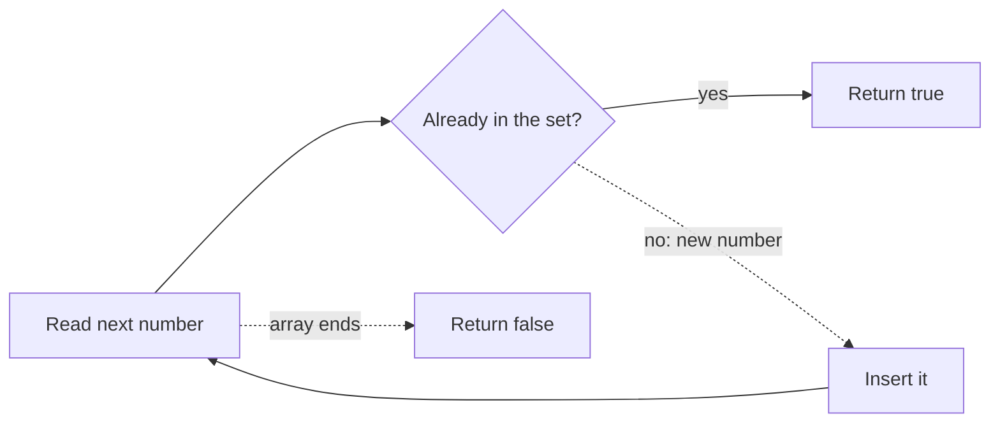

# 217. Contains Duplicate

https://leetcode.com/problems/contains-duplicate/

## Problem in your own words

You are given a list of integers. Return true if any value appears at least twice, and false if every value is unique. The order of the numbers does not matter, and you do not need to say which value repeated or where. A single repeated pair anywhere in the array is enough to answer yes.

## Easy analogy

You are checking tickets at a door and you stamp each number the first time you see it. If a guest hands you a number that already has a stamp, you stop the line. You do not need a second pass over the guest list.

## Diagram



```text
nums:  1   2   3   1
set:   {1} {1,2} {1,2,3}  hit on 1 -> true
```

## Intuition before code

Equality is the only relation that matters, so a hash set is a perfect index of values already seen. `add` tells you whether the value was new. The first time `add` returns false, you are done. Sorting also works: after a sort, any duplicate sits next to itself, but that costs `O(n log n)` and is only the fallback if hashing is disallowed.

## Walkthrough with a tiny input, step by step

Input: `[1, 2, 3, 1]`

- See `1`. Set empty. Insert. Set = `{1}`.
- See `2`. Not present. Insert. Set = `{1, 2}`.
- See `3`. Not present. Insert. Set = `{1, 2, 3}`.
- See `1`. Present. Return `true`.

Input: `[1, 2, 3]` never hits, so the scan finishes and returns `false`.

## Java solution (complete, correct, commented)

```java
import java.util.HashSet;
import java.util.Set;

class Solution {
    public boolean containsDuplicate(int[] nums) {
        Set<Integer> seen = new HashSet<>();
        for (int value : nums) {
            // add returns false when value was already present
            if (!seen.add(value)) {
                return true;
            }
        }
        return false;
    }
}
```

## Python solution (complete, correct, commented)

```python
class Solution:
    def containsDuplicate(self, nums: list[int]) -> bool:
        seen = set()
        for value in nums:
            if value in seen:
                return True
            seen.add(value)
        return False
```

`len(nums) != len(set(nums))` is also correct. Building that set always copies every element, so you pay `O(n)` time and space even when a duplicate appears at index 1. The loop above can return early. No slicing is involved.

## Time and space complexity with why

- Time: `O(n)` expected. Each of the `n` values is hashed once.
- Space: `O(n)` when all values are distinct, because the set stores every one of them. Early exit on a duplicate uses less, but the worst case is still linear.

## Pitfalls and how to talk through this in an interview in under 2 minutes

Say: “I store each value in a set and return as soon as I see one that is already there.” Mention the empty array and the single-element array, both false. Mention that the same value at two different indices is a duplicate even if other values sit between them. If they ask for the indices, switch from a set to a map of value to index. If they ban extra memory, sort and compare neighbors, and state the `O(n log n)` cost. Do not use a boolean array indexed by the number unless the value range is tiny and given.
